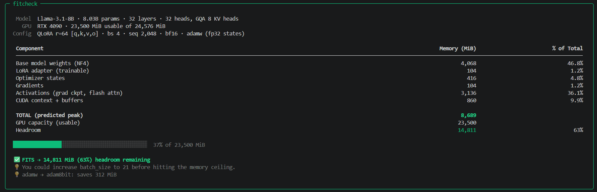
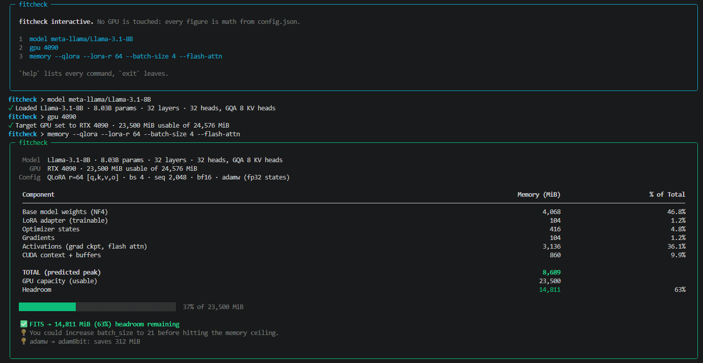
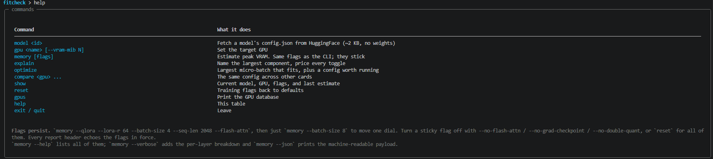
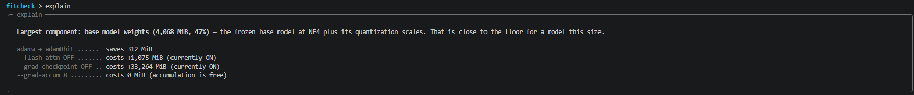
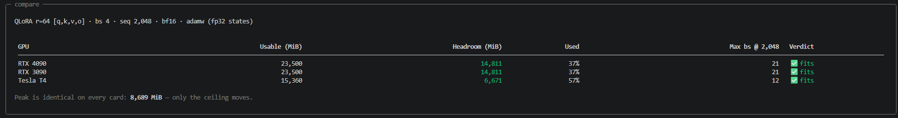

# fitcheck

Predict how much VRAM a LoRA/QLoRA fine-tune will need — before you launch it.

`fitcheck` reads a model's `config.json` from the Hugging Face Hub (~2 KB, never the weights)
and computes peak training memory as a sum of six components: base model weights, LoRA adapter
weights, optimizer states, gradients, activations, and CUDA runtime overhead. Every number is
arithmetic over `hidden_size`, `num_hidden_layers`, `intermediate_size`, `num_key_value_heads`
and your training flags, so no GPU, no CUDA install, and no model download is involved — the
tool runs the same on a laptop as on the machine you're sizing for. You get the total, the
per-component breakdown, a fits/doesn't-fit verdict against a specific card, and the largest
micro-batch that still fits.

> **Accuracy status:** the estimates are analytical and **not yet validated against measured
> ground truth**. The target is ±10%; the validation matrix below is empty until
> `scripts/measure.py` has been run. Treat the numbers as a well-derived prediction, not a
> measurement.

---

## Mode A — one-liner

```bash
fitcheck meta-llama/Llama-3.1-8B --qlora --lora-r 64 --batch-size 4 --seq-len 2048 --optimizer adamw --flash-attn --gpu 4090
```



Exit code is `0` if the config fits, `1` if it doesn't, `2` if the estimate couldn't be run — so
`fitcheck ... && accelerate launch ...` works as a guard in front of a training job.

---

## Mode B — interactive REPL

Run `fitcheck` with no model ID and you get a session instead. Flags typed at the `memory`
prompt stick, so moving one dial doesn't mean retyping the whole line.



`help` lists the command surface:



`explain` names the largest component and prices every toggle by re-running the whole estimate
with one flag flipped. The `+1,075 MiB` for turning Flash Attention off is 1,024 MiB of
attention matrices plus the 5% that CUDA overhead picks up on top — not a hand-summed component
delta. The last line is the one that matters most: gradient accumulation costs **0 MiB**,
because gradients accumulate in place.



`compare` puts the same config on several cards, and leads with the point — the peak is
identical everywhere, only the ceiling moves, so the max micro-batch column is the interesting
one.



Also available: `optimize` (largest micro-batch that fits, plus a config actually worth
running), `show`, `reset`, and `gpus`.

---

## Installation

```bash
pip install fitcheck-llm
```

> ⚠️ **PyPI package pending v0.1.0 release.** `fitcheck-llm` is not published yet, so the line
> above will fail today. Install from source in the meantime:

```bash
git clone https://github.com/Anassbzdd/fitcheck.git
cd fitcheck
pip install -e ".[dev]"
fitcheck --help
```

Python 3.10+. Runtime dependencies are `click`, `rich`, and `huggingface-hub` — no torch, no
CUDA.

Gated repos (Llama, Gemma) need Hub credentials: accept the license on the model page, then
`hf auth login`. Everything else works unauthenticated, and offline once `config.json` is in
the Hub cache.

---

## Usage

### Mode A

```bash
# QLoRA on a 4090 — the shorthand expands to --quant nf4 --precision bf16 --grad-checkpoint
fitcheck meta-llama/Llama-3.1-8B --qlora --lora-r 64 --batch-size 4 --seq-len 2048 --flash-attn

# All seven target modules, 8-bit optimizer, on a 16 GB T4
fitcheck mistralai/Mistral-7B-v0.3 --qlora --lora-r 32 --lora-targets full --optimizer adam8bit --batch-size 2 --seq-len 1024 --flash-attn --gpu t4

# Full fine-tuning in mixed precision (adds the FP32 master weight copy).
# This one reports "doesn't fit" and exits 1 — which is the useful answer.
fitcheck Qwen/Qwen2.5-14B --no-lora --precision bf16 --batch-size 1 --gpu a100-80

# Why is it that big, and what would each knob save?
fitcheck meta-llama/Llama-3.1-8B --qlora --lora-r 64 --batch-size 4 --explain

# A card that isn't in the database
fitcheck meta-llama/Llama-3.1-8B --qlora --vram-mib 32768

# Machine-readable, for CI
fitcheck meta-llama/Llama-3.1-8B --qlora --batch-size 4 --json
```

`--list-gpus` prints the 22-card database. `--verbose` adds the per-layer activation breakdown.
`--no-color` for logs. `-V` for the version. `fitcheck --help` has the full option surface.

### Mode B

```bash
fitcheck                          # bare session
fitcheck --qlora --gpu 4090       # flags without a MODEL_ID seed the session
```

```
model meta-llama/Llama-3.1-8B     # fetch config.json
gpu 4090                          # set the target card
memory --qlora --lora-r 64 --batch-size 4 --flash-attn
memory --batch-size 8             # flags are sticky; only the batch size changes
explain                           # largest component + price of every toggle
optimize                          # a batch size worth running, not just the ceiling
compare 3090 t4 a100-40           # same config, several cards
reset                             # flags back to defaults
```

### Model support

The parser handles dense decoder-only transformers with a gated (SwiGLU-style) MLP — Llama,
Mistral, Qwen2/2.5, Gemma-2/3 and anything config-shaped like them. It reads `head_dim` when the
config declares one rather than assuming `hidden_size / num_attention_heads`, and it never
assumes `intermediate_size == 4 × hidden_size`; both assumptions are wrong on Gemma-2.

Not modelled: MoE architectures (Mixtral, DeepSeek), encoder-decoder models, sliding-window
attention, `torch.compile`, and multi-GPU sharding (FSDP / DeepSpeed ZeRO). See
[SPEC.md § 3.7](docs/SPEC.md) for the full limitations table.

---

## How it compares

| | needs a GPU? | component breakdown? | LoRA / QLoRA training? | empirically validated? |
|:---|:---|:---|:---|:---|
| **fitcheck** | no | yes — all 6 | yes, GQA-aware | **in progress** (see below) |
| [`accelerate estimate-memory`](https://huggingface.co/docs/accelerate/main/en/usage_guides/model_size_estimator) | no | weights + a coarse training multiplier | no | not published |
| [HF Model Memory Usage Space](https://huggingface.co/spaces/hf-accelerate/model-memory-usage) | no | same, in a web UI | no | not published |
| [llm-calc](https://github.com/JimJafar/llm-calc) | no | inference sizing only | no | not published |
| [vram.asmirnov.xyz](https://vram.asmirnov.xyz/) | no | yes, for training | partial | not published |

None of these need a GPU — that isn't the differentiator, and claiming it would be dishonest.
The gaps `fitcheck` fills are LoRA/QLoRA-native accounting (adapter memory, optimizer states
sized to trainable params only, NF4 scale overhead), GQA-aware dimensions for `k_proj`/`v_proj`
and the K/V activations, and a CLI that exits nonzero so CI can gate on it.

The honest differentiator — measured predicted-vs-actual numbers — **does not exist yet**. Until
the matrix below has rows, `fitcheck` is a better-derived estimator than the alternatives, not a
proven one.

## Validation matrix

| Model | Config | Predicted VRAM | Actual VRAM | Error % |
|:---|:---|---:|---:|---:|
| TBD — pending the `scripts/measure.py` ground-truth harness | | | | |

Planned first rows: Llama-3.1-8B on an RTX 4090 (QLoRA r=64, bs=4, seq=2048, FA2),
Mistral-7B-v0.3 on a T4 (QLoRA r=32, bs=2, seq=1024, no FA), and one Qwen or Gemma config.
Measurements come from `torch.cuda.max_memory_allocated()` after one full training step.
If you have a card and want to contribute a row, that harness is the thing to run — it's the
highest-value contribution to this repo right now.

---

## How it works

Peak VRAM is modelled as `W_base + W_lora + S_optim + G_grad + A_act + C_overhead`, one module
per term under [`fitcheck/memory/`](fitcheck/memory/): base weights (param count from config ×
bytes/param, plus NF4 scale overhead), LoRA adapters (`r × (d_in + d_out)` per target, with
`k_proj`/`v_proj` narrowed to `num_kv_heads × head_dim` under GQA), optimizer states (trainable
params only — 8 bytes/param for AdamW, whose states stay FP32 even when you train in BF16),
gradients, activations, and CUDA overhead. `estimator.py` orchestrates the six and returns a
`MemoryReport`.

Activations are the hard term and the one worth reading about: `A_layer` sums the twelve tensors
autograd saves per decoder layer, Flash Attention deletes the `O(s²)` softmax matrix outright,
and gradient checkpointing swaps `L × A_layer` for `L × γbsh + A_layer`. `max_batch_size` is
found by bisecting the whole estimator and flooring, never by extrapolating from one point —
CUDA overhead is itself a function of activation memory, so the slope isn't constant.

See [SPEC.md](docs/SPEC.md) for the full memory model, and
[Blueprint.md](docs/Blueprint.md) for the derivations.

---

## Contributing

Fork, branch off `main`, open a PR. Please keep changes to one memory component per PR where
possible — the modules are deliberately independent so a formula can be argued about in
isolation.

The bar for a merge:

- `pytest --cov=fitcheck --cov-report=term-missing -m "not network"` is green. Currently 233
  offline tests, with 100% line coverage on all six `memory/` modules; ≥80% there is the
  floor. The `-m "not network"` filter skips the one test that hits the real Hub.
- Any change to a formula updates its module, its test, and `docs/SPEC.md` in the same PR. The
  Llama-3.1-8B golden numbers in the SPEC appendix are the reference set — if a change moves
  them, say so explicitly in the PR description.
- Type hints and docstrings on public functions, dataclasses for configs, MiB returned as
  `float`. Linting and type checking aren't wired up yet; if you want to add `ruff` and `mypy`
  configs, that's a welcome PR on its own.

There's no `CONTRIBUTING.md` yet — one should be added, and it should start by absorbing this
section.

The most useful thing you can contribute right now is a measured row for the validation matrix.

---

## License

MIT. See [LICENSE](LICENSE).
