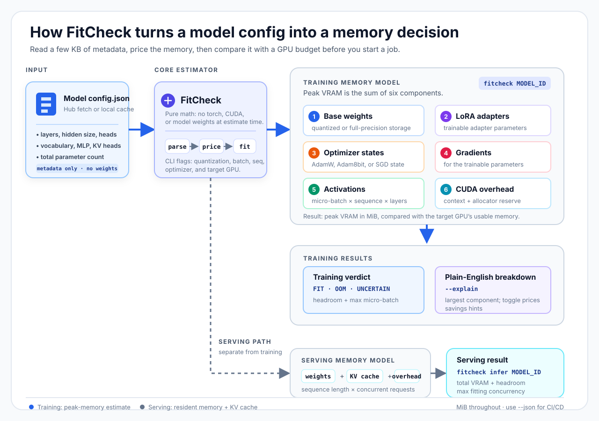
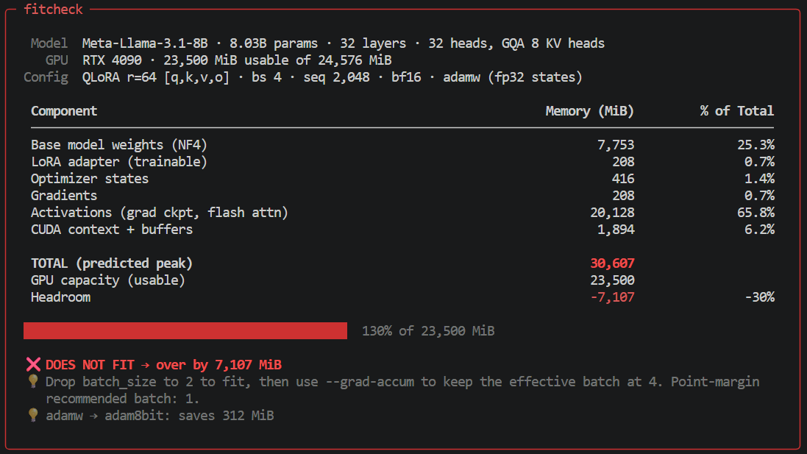

<p align="center">
  
</p>

<h1 align="center">FitCheck</h1>

<p align="center">
  Estimate LLM memory before you start a GPU job.
</p>

<p align="center">
  <a href="https://github.com/Anassbzdd/fitcheck/actions/workflows/ci.yml"></a>
  <a href="https://pypi.org/project/fitcheck-llm/"></a>
  <a href="https://github.com/Anassbzdd/fitcheck/blob/main/LICENSE"></a>
</p>

## What FitCheck does

FitCheck estimates whether a LoRA, QLoRA, or full fine-tuning configuration is likely to fit on a selected GPU before training starts. It reads the model's Hugging Face `config.json` and parameter-count metadata; it never downloads model weights, imports PyTorch, or needs CUDA at estimate time.

The estimate includes base weights, LoRA adapters, optimizer states, gradients, activations, and CUDA/allocator overhead. The result is a MiB total, a component breakdown, a fit verdict, and the largest micro-batch that fits. An inference mode also estimates resident weights and KV-cache memory.

<p align="center">
  
</p>

## Who it is for

FitCheck is for ML students, researchers, and startup engineers choosing a GPU or checking a training job in CI. It helps catch an obvious OOM before a long download, a paid GPU session, or a teammate's time is wasted.

It is a sizing tool, not a throughput benchmark or a guarantee that an unmeasured workload will not OOM.

## Quick start

```bash
pip install fitcheck-llm
```

```bash
fitcheck NousResearch/Meta-Llama-3.1-8B --qlora --lora-r 64 --batch-size 4 --seq-len 2048 --optimizer adamw --flash-attn --gpu 4090
```

<p align="center">
  
</p>

The runtime uses Click, Rich, and `huggingface-hub`; it does not require `torch` or CUDA. Gated Hugging Face models still need normal Hub access, for example `hf auth login`.

## Web app

Try the [live FitCheck Space](https://huggingface.co/spaces/mlanvvs/fitcheck).

The root `app.py` is ready to run as a Hugging Face Gradio Space. It runs estimates on the CPU, including when hosted on ZeroGPU. To run it locally, install the web extra and start the app:

```bash
pip install -e ".[web]"
python app.py
```

The web app uses the same training, serving, and advisor calculations as the CLI. It reads model metadata and does not download weights or require a GPU.
Choose a GPU preset to use its saved capacity, or choose **Custom GPU** and enter the card's total VRAM in MiB. A custom card uses 95% of that total as usable capacity.

## What you can do

FitCheck supports four related workflows:

| Workflow | How to use it | What it gives you |
|:---|:---|:---|
| **Training estimate** | `fitcheck MODEL_ID [OPTIONS]` | Peak VRAM, component breakdown, fit/safety verdict, and the largest fitting micro-batch. |
| **Serving estimate** | `fitcheck infer MODEL_ID` | Resident weights, KV-cache cost per request/token, total serving memory, and the largest fitting concurrency. |
| **Config advisor** | `fitcheck advise MODEL_ID --seq-lens 1024,2048` | A sweep over batch size, sequence length, and LoRA rank: frontier configs, axis ceilings, memory prices, and runnable commands. |
| **Interactive session** | Run `fitcheck` without a model ID | Keep a model, GPU, and flags loaded while trying several estimates. |

The training, inference, and advisor commands support `--json` for CI/CD. Training also supports `--explain` for a plain-English breakdown and savings hints, `--verbose` for the per-layer activation detail, `--list-gpus` to inspect the GPU database, and `--vram-mib` for a custom usable-memory budget.

Inside the interactive session, the available tasks are:

| Command | Purpose |
|:---|:---|
| `model <id>` / `gpu <name>` | Load a model config or select the target GPU. |
| `memory [flags]` | Run or update the training estimate; flags persist between commands. |
| `infer [flags]` | Run a serving estimate with its own persistent serving flags. |
| `advise [flags]` / `sweep` | Sweep the training axes; `--seq-lens` is required the first time. |
| `explain` | Name the largest memory component and price each available toggle. |
| `optimize` | Recommend a practical batch/config, not only the theoretical ceiling. |
| `compare <gpu> ... [--infer]` | Compare the current training or serving config across GPUs. |
| `show` / `reset` / `gpus` | Inspect state, restore defaults, or print the GPU database. |
| `help` / `exit` | Show the command list or leave the session. |

## What the output means

```text
Peak VRAM = weights + LoRA + optimizer + gradients + activations + overhead
```

- The component table shows what is using the memory.
- The verdict compares the estimate with the selected GPU's usable MiB.
- `max micro-batch` is found by running the full estimator at different batch sizes, not by dividing free memory by one component.
- `UNCERTAIN` means the point estimate fits, but the measured safety reserve is not large enough to call it safe.
- In CLI mode, exit code `0` means the request fits, `1` means it does not fit or is uncertain, and `2` means the estimate could not run. For `advise`, `0` means at least one swept configuration fits. The REPL keeps verdicts inside the session and exits `0`.

`--precision` is the compute dtype. `--quant` is the base-model storage format. They are separate settings: QLoRA, for example, uses an NF4 base with BF16 compute.

## Accuracy evidence

The beta evidence is measured and reproducible, not a universal accuracy promise. The archive contains **79 archived runs**: **49 fitted**, **57 calibration/repeat rows scored**, and **10 legacy rows** excluded from fitting. The project ships **four T4 profiles** for eager/flash-like attention crossed with unquantized/NF4 storage.

Reproduce the calibration summary with:

```bash
python -m fitcheck.calibrate data/measurements/manifest.json --check --role calibration --role repeat
```

```text
group                     runs    worst     mean
t4/eager/nf4              16      13.9%     3.2%
t4/eager/none             12       7.3%     2.6%
t4/flash/nf4              17       6.4%     2.6%
t4/flash/none             12       2.8%     0.9%

worst process-tier error with the shipped constants: 13.9%
```

For the 57 calibration/repeat rows:

| Tier | Worst absolute error | Mean absolute error |
|:---|---:|---:|
| **tensors** — the five physical formulas | **4.6%** | 0.7% |
| **process** — the full total, what the verdict uses | **13.9%** | 2.4% |

The separate final holdout has **12 rows**: tensor error is **±1.4%**, process MAE is **5.4%**, and the worst under-prediction is **−15.3%**. Boundary verdicts were **12/12 correct** against the 14,000 MiB T4 safety budget. The accuracy holdout covers one Tesla T4 (sm_75), NF4, FP16 compute, LoRA r=16 on `[q,k,v,o]` (without double quantization), batch size 1, AdamW with FP32 states, gradient checkpointing, and sequence length 1024. It has six eager rows and six rows using SDPA's memory-efficient backend as a flash-like path. The six models are Qwen/Qwen2.5-7B-Instruct, Qwen/Qwen2.5-Coder-1.5B-Instruct, deepseek-ai/deepseek-coder-1.3b-instruct, meta-llama/Llama-3.2-1B-Instruct, meta-llama/Llama-3.2-3B-Instruct, and mistralai/Mistral-7B-Instruct-v0.3. This is not validation on a second GPU or real FlashAttention-2.

<details>
<summary>Measurement provenance</summary>

All 79 archived rows are one Tesla T4 (sm_75). The measured CUDA context is `140.875 MiB on 69 of them and 141.0 MiB on the other ten`.

| Session | Rows | PyTorch | Transformers | PEFT |
|:---|---:|:---|:---|:---|
| `t4-2026-09-01` | 10 | torch 2.10.0+cu128 | transformers 5.0.0 | peft 0.19.1 |
| `t4-2026-09-15` | 40 | torch 2.14.0+cu130 | transformers 5.17.0 | peft 0.20.0 |
| `t4-2026-09-16` | 17 | torch 2.10.0+cu128 | transformers 5.0.0 | peft 0.19.1 |
| `t4-2026-09-21` | 12 | torch 2.10.0+cu128 | transformers 5.0.0 | peft 0.19.1 |

</details>

## Honest limits

- Hardware evidence is limited to one Tesla T4 (`sm_75`). BF16 and real FlashAttention-2 are not validated; the flash-like path uses SDPA's memory-efficient backend on that card.
- The fitted `C_overhead` profiles cover only T4 × {eager, flash-like} × {none, NF4}. Other GPUs, INT8, checkpointing-off training, and inference use the conservative default profile: 500 MiB plus 5%.
- INT8 activation behavior has only one measured model, and serving decode transients are not modelled. Treat INT8 and high-concurrency inference estimates as lower-confidence results.
- The formulas target dense decoder-only models with a gated MLP. MoE, multimodal, encoder-decoder, sliding-window, compiled, and multi-GPU configurations are refused or outside the supported model.
- A cached `config.json` is enough to estimate offline, but an uncached model still needs Hugging Face access. FitCheck does not validate your exact training stack or prove that a run will not OOM.

## Go deeper

- [Technical specification](docs/SPEC.md) — formulas, CLI contracts, validation rules, and limitations.
- [Measurement archive](data/measurements/README.md) — row format, roles, and reproducibility.
- [Contributing](CONTRIBUTING.md) — how to add measurements and regenerate fitted profiles.

The repository currently has **877 offline tests** in the standard suite, **7 tests marked `network`**, and **100% line coverage on all seven `memory/` modules**. An additional 13 measurement-harness tests run when `torch` is installed.

## License

MIT. See [LICENSE](LICENSE).
