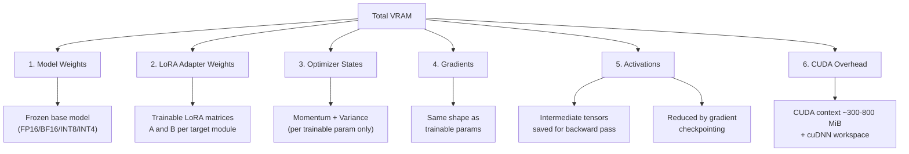

# `fitcheck` — Deep Dive & Prerequisites

## What is `fitcheck`?

Imagine this scenario — it happens to every ML practitioner:

> You want to fine-tune Qwen2.5-14B with QLoRA on your RTX 4090 (24GB). You set `batch_size=4`, `lora_r=64`, `seq_len=2048`, BF16 precision, gradient checkpointing on. You launch the job... wait 3 minutes for the model to load... and then: **`CUDA OutOfMemoryError`**. You lower batch size to 2, try again, wait 3 more minutes... still OOM. You lower to 1, try again... it works, but now you've wasted 10 minutes and you're not sure if you could have squeezed in `batch_size=2` with a smaller LoRA rank.

`fitcheck` eliminates this entire cycle. One command, no GPU, no model download, under two seconds:
it tells you whether the config fits, where every MiB went, and the largest micro-batch that still
fits — the three questions that ten-minute loop was going to answer eventually anyway.

**Before you ever touch a GPU**, it offers two seamless interfaces:

### Mode A: Power-User One-Liner (CLI Flags)

```bash
$ fitcheck meta-llama/Llama-3.1-8B --qlora --lora-r 64 --batch-size 4 --seq-len 2048 --optimizer adamw --flash-attn --gpu 4090

╭─────────────────────────── fitcheck ───────────────────────────╮
│ Model: Llama-3.1-8B (32 layers, 32 heads, GQA 8 KV heads)     │
│ GPU:   RTX 4090 (23,500 MiB usable)                           │
├────────────────────────────────────────────────────────────────┤
│ Component               │ Memory (MiB) │ % of Total            │
│─────────────────────────┼──────────────┼───────────────────────│
│ Base model weights      │              │                       │
│   └─ NF4 + unquant fp32 │    7,753     │  25.3%                │
│ LoRA adapter (trainable)│      208     │   0.7%                │
│ Optimizer states        │      416     │   1.4%                │
│ Gradients               │      208     │   0.7%                │
│ Activations (grad ckpt) │   20,128     │  65.8%                │
│   └─ of which logits    │   16,032     │  52.4%                │
│ CUDA context + buffers  │    1,894     │   6.2%                │
│─────────────────────────┼──────────────┼───────────────────────│
│ TOTAL (predicted peak)  │   30,607     │                       │
│ GPU capacity            │   23,500     │                       │
│ Headroom                │   -7,107     │                       │
├────────────────────────────────────────────────────────────────┤
│ ❌ DOES NOT FIT — over by 7,107 MiB                            │
│                                                                │
│ 💡 Drop batch_size to 2 to fit. The logits term is 52% of the  │
│    budget, and grad checkpointing does not reduce it.          │
╰────────────────────────────────────────────────────────────────╯
```

### Mode B: Interactive Terminal REPL (`fitcheck`)

For an interactive exploratory workflow, just run `fitcheck` with no arguments to enter the terminal shell:

```
$ fitcheck
Welcome to fitcheck interactive terminal. Type a command or 'help'.

> model meta-llama/Llama-3.1-8B
✓ Loaded Llama-3.1-8B (32 layers, 32 heads, GQA 8 KV heads)

> gpu 4090
✓ Target GPU set to NVIDIA RTX 4090 (23,500 MiB usable)

> memory --qlora --lora-r 64 --batch-size 4 --seq-len 2048 --flash-attn
[Renders the full memory breakdown table above]

> explain
💡 Explanation:
- Activations (20,128 MiB) are the largest component at 65.8% — and 16,032 MiB of that
  is the logits: four FP32 copies of the (b, s, V) tensor, which a 128k vocabulary makes
  enormous. Neither gradient checkpointing nor Flash Attention reduces it.
- Base model weights (7,753 MiB) come second at 25.3% — the NF4-quantized 8.03B base,
  its FP32 quantization scales, and the embeddings and LM head that bitsandbytes does
  not quantize and peft upcasts to FP32.
- Gradient checkpointing is ON: you store two hidden-state tensors per layer
  (4,096 MiB) plus the larger of the LM-head hump (16,032 MiB) and one layer's full
  activations (1,088 MiB) — a max, not a sum, because those two never coexist.
- Flash Attention is ON but saves nothing here: the LM-head hump wins that max either
  way. It would start paying at longer sequences.
- LoRA adds 208 MiB of trainable weights and 416 MiB of AdamW states. Optimizer states
  cost 8 bytes/param even though you train in BF16 — AdamW keeps momentum and variance
  in FP32 by default.

  adamw -> adam8bit ......... saves    312 MiB
  --flash-attn OFF .......... costs      0 MiB   (currently ON)
  --grad-checkpoint OFF ..... costs +32,256 MiB  (currently ON)
  --grad-accum 8 ............ costs      0 MiB   (accumulation is free)

> optimize
🎯 Best configuration for RTX 4090:
- Max batch size: 2 (at seq_len 2048)
- Recommended: batch_size=2, grad_accum=8 for effective batch 16. Accumulation is free,
  so this buys the same effective batch with none of the memory.

> compare --gpu 3090
⚖️ Comparison: RTX 4090 (24GB) vs RTX 3090 (24GB)
- Both give the same peak (30,607 MiB) — and neither card fits it.

> exit
Goodbye!
```

**No GPU was used to produce this output.** It's pure math.

---

## How Does It Compare to Existing Tools?

Before building, it's critical to understand the competitive landscape and **clearly articulate why `fitcheck` is different**:

| Tool | What it does | Limitations |
|:---|:---|:---|
| [`accelerate estimate-memory`](https://huggingface.co/docs/accelerate) | Estimates VRAM for full model loading | **No LoRA/QLoRA support.** No activation estimation. No optimizer states. Only computes weight memory. |
| [HF Model Memory Calculator](https://huggingface.co/spaces/hf-accelerate/model-memory-usage) | Gradio Space for inference memory | **Inference only.** No training components (activations, optimizer, gradients). |
| [llm-calc](https://github.com/JimJafar/llm-calc) | Browser calculator: does this model + quantization fit my RAM, with a context-length slider | **Inference sizing.** No training components at all — no optimizer, gradients, or activations. No LoRA/QLoRA. |
| [Model Memory Estimator](https://vram.asmirnov.xyz/) | Web calculator for training memory | Decent but **no GQA-aware formulas**, limited architecture support, no CLI. |

### `fitcheck`'s differentiators:

1. **Component-level breakdown** — not just "it fits" or "it doesn't", but *why* and *where* the memory goes
2. **LoRA/QLoRA-native** — models adapter memory, reduced optimizer states, and quantization overhead correctly
3. **GQA-aware** — properly accounts for reduced KV heads in modern models (Llama 3, Mistral, Qwen, Gemma)
4. **Architecture-specific** — reads `config.json` directly, uses actual `intermediate_size` instead of assuming `4h`
5. **Actionable advice** — "you can increase batch_size to X" or "switch to 8-bit optimizer to save Y MiB"
6. **CLI-first** — designed for the terminal workflow where ML engineers actually work, and
   `--json` + an exit code (0 fits / 1 doesn't / 2 error) so CI can gate a training job on it
7. **Calibration mode** *(roadmap — Phase 3, not in v0.1)* — run 1 real forward pass to compute a correction factor for future estimates

> [!IMPORTANT]
> Your README must include this comparison table. When someone asks "how is this different from X?", they should get a clear answer immediately. This is what separates a tool that gets adoption from one that gets ignored.

---

## How Does It Work Internally?

`fitcheck` decomposes GPU memory during training into **6 components** and computes each one analytically:



Let me walk through each component with real math:

### Component 1: Base Model Weights

This is the simplest. You load the model's `config.json` from HuggingFace and calculate:

$$\text{Weight Memory} = \text{num\_parameters} \times \text{bytes\_per\_param}$$

Using the real Llama-3.1-8B count, $P = 8{,}030{,}261{,}248$:

| Precision        | Bytes per param | $P \times$ bytes | In MiB     |
| :--------------- | :-------------: | ---------------: | ---------: |
| FP32             |        4        |   32,121,044,992 | 30,633 MiB |
| FP16 / BF16      |        2        |   16,060,522,496 | 15,317 MiB |
| INT8 (LLM.int8)  |        1        |    8,030,261,248 |  7,658 MiB |
| INT4 (QLoRA NF4) |       0.5       |    4,015,130,624 |  3,829 MiB |

> [!WARNING]
> Note that none of these are the round numbers you may expect ("8B params in BF16 = 16 GB"). $16$ GB is
> $16{,}000$ MB but $15{,}259$ MiB, and the true figure here is $15{,}317$ MiB because the model is 8.03B
> params, not 8.00B. Two small unit/rounding habits compound into a ~5% error. Compute in **bytes**, convert
> to **MiB** once.

> [!NOTE]
> For QLoRA, the base model is quantized to 4-bit but there's overhead from the quantization constants (one **FP32** scale factor per block of 64 weights). This adds ~0.0625 bytes/param on top.
>
> **Corrected 2026-08-31 after the first real measurement.** Two things this section originally got wrong, both confirmed to the MiB on a Kaggle T4 (Mistral-7B-v0.3):
> 1. The scales are **FP32**, not FP16 — twice what was assumed here.
> 2. **Not every parameter gets quantized.** bitsandbytes quantizes only the transformer `nn.Linear` weights; `embed_tokens`, `lm_head` and the layernorms are left alone, and peft's `prepare_model_for_kbit_training` then upcasts them to FP32. For Llama-3.1-8B that is 1.05B parameters at 4 B/param = 4,009 MiB, where a flat 0.5 B/param model charged 501 MiB.
>
> Together these take $W_{base}$ from the 4,068 MiB this document used to claim to **7,753 MiB**. The measured Mistral split was NF4 linears 3,328 + scales 416 + unquantized FP32 1,129 MiB, against a formula prediction of 3,328 + 416 + 1,129 — exact.
>
> With **double quantization**, the scales themselves are quantized, cutting this overhead by roughly
> three quarters on paper. `fitcheck` models both modes, but `--qlora` leaves double quant **off** —
> the `bitsandbytes` recipe usually turns it on, so fitcheck's default is the more expensive of the two
> readings. Pass `--double-quant` to model it, and note that the estimate only ever moves *down* when
> you do. The implementation currently applies a flat ×0.5 there where the derivation gives ×0.254, so
> it over-states double-quant scales by ~102 MiB on this model — over-counting, which is the safe
> direction, and unmeasured either way. See SPEC Component 1, "Known simplification — the double-quant
> factor".

### Component 2: LoRA Adapter Weights

LoRA inserts two small matrices $A \in \mathbb{R}^{r \times d_{in}}$ and $B \in \mathbb{R}^{d_{out} \times r}$ for each target module (typically `q_proj`, `k_proj`, `v_proj`, `o_proj`, and sometimes `gate_proj`, `up_proj`, `down_proj`).

$$\text{LoRA params per module} = r \times (d_{in} + d_{out})$$

> [!WARNING]
> **GQA changes the dimensions of K and V projections.** In models with Grouped Query Attention (most modern LLMs), `k_proj` and `v_proj` have a smaller output dimension:
>
> - `q_proj`: $d_{in} = h,\quad d_{out} = h$ (unchanged)
> - `k_proj`: $d_{in} = h,\quad d_{out} = n_{kv} \times d_k$ (smaller!)
> - `v_proj`: $d_{in} = h,\quad d_{out} = n_{kv} \times d_k$ (smaller!)
> - `o_proj`: $d_{in} = h,\quad d_{out} = h$ (unchanged)
>
> For Llama 3.1-8B with 32 Q heads and 8 KV heads: `k_proj` and `v_proj` have $d_{out} = 8 \times 128 = 1024$, not 4096. Failing to account for this **over-estimates LoRA memory by 23%** on that shape — 256 MiB claimed against 208 MiB real, worked through in Step 2 below.

The general formula accounting for GQA:

$$\text{Total LoRA params} = L \times r \times \sum_{m \in \text{targets}} (d_{in}^{(m)} + d_{out}^{(m)})$$

These are stored in $\gamma_{adapter}$, the dtype the trainable parameters are actually held in:

$$\text{LoRA Memory} = \text{Total LoRA params} \times \gamma_{adapter}$$

$$\gamma_{adapter} = \begin{cases} 4 \text{ bytes (FP32)} & \text{the base is quantized} \\ \gamma \text{ (the compute dtype)} & \text{the base is not} \end{cases}$$

> [!WARNING]
> **On a quantized base the adapters are FP32, whatever `--precision` says.** It is tempting to reason
> that adapters are trainable, therefore they follow the compute dtype, therefore QLoRA trains BF16
> adapters on a 4-bit base — and that is the version of the story everyone tells. What actually
> happens is that peft's `prepare_model_for_kbit_training` upcasts every trainable parameter to FP32,
> the same call that upcasts the embeddings and LM head in Component 1. It never consults
> `--precision`.
>
> So the golden config's adapters cost **208 MiB, not 104**, and the gradients that follow them cost
> 208 rather than 104 as well (Component 4). Believing the BF16 version under-counts a QLoRA run by
> 208 MiB — small next to the activations, but low, and low is the direction that OOMs someone.
>
> The 4-bit base with higher-precision adapters is still the asymmetry that makes the method work.
> The adapters are simply further up than the folklore suggests.

### Component 3: Optimizer States

The optimizer **only stores states for trainable parameters** (the LoRA adapters in a QLoRA setup):

| Optimizer | Bytes per trainable param | What it stores |
|:---|:---:|:---|
| AdamW (FP32 states) | 8 | momentum (FP32) + variance (FP32) |
| AdamW (BF16 states) | 4 | momentum (BF16) + variance (BF16) |
| AdamW 8-bit (bitsandbytes) | 2 | momentum (INT8) + variance (INT8) |
| SGD with momentum | 4 | momentum (FP32) |
| SGD (no momentum) | 0 | nothing |

$$\text{Optimizer Memory} = \text{trainable\_params} \times \text{bytes\_per\_param\_for\_optimizer}$$

> [!IMPORTANT]
> **Subtlety 1 — AdamW state dtype:** Even though LoRA trains in BF16, **AdamW stores its states in FP32 by default**. This means optimizer states are 8 bytes/param, not 4. This catches a lot of people off guard. (This is about the *states*, `m` and `v` — not about master weights, which are Subtlety 2.)
>
> **Subtlety 2 — Full fine-tuning master copy:** When full fine-tuning (not LoRA) with mixed precision (BF16/FP16 forward + FP32 optimizer), the optimizer also keeps a **FP32 master copy** of all trainable parameters. This adds another 4 bytes/param. For LoRA/QLoRA this is negligible (only LoRA params), but for full fine-tuning the FP32 shadow costs *twice what the BF16 weights themselves cost* — 2 bytes/param of weights carrying 4 bytes/param of master copy. `fitcheck` must handle both cases.
>
> **The "mixed precision" qualifier is load-bearing.** A master weight is the FP32 shadow of a parameter held in lower precision. Under `--precision fp32` the parameters already *are* FP32 — there is no shadow, and $W_{base}$ has already paid those 4 bytes/param. Adding the copy there double-counts by 4 bytes/param (**30,633 MiB** on an 8B model). Both correct paths land at 16 bytes/param for full FT + AdamW; a rule that makes them disagree is wrong. Exact condition and the invariant table: SPEC.md Component 3.

### Component 4: Gradients

During backward, PyTorch allocates a `.grad` tensor for each trainable parameter. Same shape, **same
dtype as the parameter** — so this term tracks $\gamma_{adapter}$ from Component 2, not the compute
dtype:

$$\text{Gradient Memory} = \text{trainable\_params} \times \gamma_{adapter}$$

The distinction only bites when the two differ, which is exactly the QLoRA case: bf16 compute, FP32
adapters, and therefore **FP32 gradients**. Read this term off `--precision` and you halve it on every
QLoRA run. Under full fine-tuning there is no upcast and $\gamma_{adapter} = \gamma$, so the simpler
reading is right there.

With gradient accumulation, gradients are **not** multiplied by the accumulation steps — they're accumulated in-place into the same tensor.

### Component 5: Activations (The Hard One)

This is where it gets interesting. During the forward pass, PyTorch saves intermediate tensors (activations) that are needed to compute gradients in the backward pass.

**The right way to count this is to walk the layer and ask, at every op: what does its backward need?** Here
is `LlamaDecoderLayer`, annotated. Let $\gamma$ = bytes per activation element (2 for BF16/FP16, 4 for FP32):

```python
residual = x                              # (1) SAVED — RMSNorm backward needs its input
h1 = input_layernorm(x)                   # (2) SAVED — input to q/k/v_proj (one tensor, three Linears)
q  = rope(q_proj(h1))                     # (3) SAVED by attention backward
k  = rope(k_proj(h1))                     #     SAVED — smaller under GQA
v  = v_proj(h1)                           #     SAVED — smaller under GQA
attn_out = attention(q, k, v)             # (4) SAVED — attention's `out` AND o_proj's input (same storage)
x  = residual + o_proj(attn_out)          # (5) SAVED — MLP-norm backward needs its input
h2 = post_attention_layernorm(x)          # (6) SAVED — input to gate_proj and up_proj
g, u = gate_proj(h2), up_proj(h2)         #     SAVED ×2 — SiLU and multiply backward
x  = x + down_proj(silu(g) * u)           #     SAVED ×1 — down_proj's input
```

| # | Saved tensor                    | Shape                 | Size (bytes)                         | Why autograd keeps it                  |
| :-| :------------------------------ | :-------------------- | :----------------------------------- | :------------------------------------- |
| 1 | Layer input (pre-attn-norm)     | $(b, s, h)$           | $\gamma bsh$                         | RMSNorm backward needs its input       |
| 2 | Attn-norm output                | $(b, s, h)$           | $\gamma bsh$                         | Input to `q/k/v_proj` — shared by 3    |
| 3 | Q projection output (post-RoPE) | $(b, n_h, s, d_k)$    | $\gamma bs \cdot n_hd_k$             | $n_h d_k = h$ for Llama-shaped models  |
| 4 | Attention output                | $(b, s, n_hd_k)$      | $\gamma bs \cdot n_hd_k$             | Also `o_proj`'s input — same storage   |
| 5 | Post-attn residual sum          | $(b, s, h)$           | $\gamma bsh$                         | MLP-norm backward needs its input      |
| 6 | MLP-norm output                 | $(b, s, h)$           | $\gamma bsh$                         | Input to `gate_proj` and `up_proj`     |
|   | **subtotal**                    |                       | $\mathbf{\gamma bs(4h + 2n_hd_k)}$   | $= \gamma bs \cdot 6h$ when $n_hd_k = h$ |
| 7 | K projection output             | $(b, n_{kv}, s, d_k)$ | $\gamma bsh \cdot \frac{n_{kv}}{n_h}$ | **Reduced by GQA**                    |
| 8 | V projection output             | $(b, n_{kv}, s, d_k)$ | $\gamma bsh \cdot \frac{n_{kv}}{n_h}$ | **Reduced by GQA**                    |
| 9 | Attention score matrix          | $(b, n_h, s, s)$      | $\mathbf{9\gamma bn_hs^2}$           | **Removed by Flash Attention** — nine copies, not one |
| 10| Gate proj output (pre-SiLU)     | $(b, s, d_{ff})$      | $\gamma bs \cdot d_{ff}$             | Saved for SiLU backward                |
| 11| Up proj output                  | $(b, s, d_{ff})$      | $\gamma bs \cdot d_{ff}$             | Saved for element-wise multiply        |
| 12| Down proj input (SiLU(gate)×up) | $(b, s, d_{ff})$      | $\gamma bs \cdot d_{ff}$             | Saved for down_proj backward           |

> [!TIP]
> **What is *not* saved is as instructive as what is.** Three things you might expect in the table and won't
> find:
> - **Pre-RoPE Q and K.** RoPE's backward needs only `cos`/`sin`, not its input, so the pre-rotation tensors
>   are freed as soon as the rotated ones exist. You pay for Q once, not twice.
> - **`o_proj`'s output.** A Linear's backward needs its *input* ($x$ for $\partial W$) and its *weight*
>   ($W$ for $\partial x$) — never its own output. This is why row 4 is `o_proj`'s input, not its output.
> - **The residual additions.** Addition's backward is the identity: it routes the incoming gradient to both
>   branches unchanged and stores nothing. Residual connections are free.
>
> Flash Attention's `logsumexp` — $(b, n_h, s)$ in FP32 — *is* saved, but at ~1 MiB per layer here it is
> rounding error next to the terms above.

**General formula per layer (no gradient checkpointing):**

$$A_{layer} = \gamma bs\left[6h + 2h \cdot \frac{n_{kv}}{n_h} + 3 \cdot d_{ff}\right] + 9\gamma bn_hs^2 \cdot \mathbb{1}[\text{no Flash Attn}]$$

Where:
- $s$ = sequence length
- $b$ = **micro-batch size** (not effective batch — see Component note below)
- $h$ = hidden dimension
- $n_h$ = number of attention heads (query heads)
- $n_{kv}$ = number of key-value heads (= $n_h$ for MHA, < $n_h$ for GQA)
- $d_{ff}$ = FFN intermediate size (read from `intermediate_size` in `config.json`)
- $d_k$ = head dimension — read from `head_dim` in `config.json` when present, else $h / n_h$
- $\gamma$ = bytes per activation element, from the **compute** precision (2 for BF16/FP16, 4 for FP32)

> [!NOTE]
> **The $6h$ form quietly assumes $n_h d_k = h$.** Rows 3 and 4 are really $n_h d_k$ wide and rows 7–8
> are $n_{kv}d_k$ wide, so the bracket without any assumption is
> $4h + 2n_hd_k + 2n_{kv}d_k + 3d_{ff}$. Substitute $n_hd_k = h$ and you get the $6h$ form back exactly
> — which is why every number in this document is unaffected. It matters for Gemma-2-9B, where
> $16 \times 256 = 4096$ against $h = 3584$, so the $6h$ form counts its Q and attention-output tensors
> 12.5% short. Teach the $6h$ form, implement the other one.

> [!WARNING]
> **Don't hardcode $\gamma = 2$.** It is tempting, because BF16 training is the overwhelmingly common case and
> every row of the table above then starts with a literal `2`. But under `--precision fp32` every one of those
> rows doubles, and a hardcoded 2 silently halves your activation estimate — on the config where activations
> dominate most. Derive $\gamma$ from the compute dtype, always.

> [!NOTE]
> **Don't assume $d_{ff} = 4h$.** Modern models use varying FFN sizes (values below read from each
> model's published `config.json`):
> - Llama 3.1-8B: $d_{ff} = 14336 = 3.5h$
> - Mistral-7B-v0.3: $d_{ff} = 14336 = 3.5h$
> - Qwen2.5-14B: $d_{ff} = 13824 = 2.7h$
> - Gemma 2-9B: $d_{ff} = 14336 = 4.0h$
> - Gemma 2-27B: $d_{ff} = 36864 = 8.0h$ (twice the "textbook" width)
>
> Note Gemma 2-9B: it *is* exactly $4h$ — and that is the trap, not the exception. The ratio ranges from
> $2.7h$ to $8h$ across four current families, so a hardcoded `4h` is right occasionally and wrong by up
> to 2× otherwise, with nothing in the model name to tell you which. Always read `intermediate_size`.
> Getting it wrong moves the FFN term, which is the largest single block of activation memory: 10–30%
> error on typical configs, more on Gemma 2-27B.

> [!WARNING]
> **Flash Attention changes this dramatically — sometimes.** With Flash Attention the score matrix
> $(b, n_h, s, s)$ is **never materialized in HBM**: the kernel works in tiles and recomputes them
> during the backward pass. That removes the $O(s^2)$ term outright, making attention $O(s)$ in memory.
>
> **Row 9 is $9\gamma$, not $\gamma$.** Eager attention builds that tensor about nine times at the
> compute dtype across forward and backward: forward is the raw scores, the masked copy, the FP32
> softmax (which costs $2\gamma$) and the cast back — five; backward is grad-out, the FP32 softmax
> backward ($2\gamma$) and grad-scores — four. This was measured rather than counted from source:
> run the same config under eager and under a tiled kernel, difference the peaks, and what remains is
> the matrix's true cost. On TinyLlama at $b{=}2, s{=}2048$ that came to **2,758 MiB**, where a single
> copy predicts 512.
>
> **But under gradient checkpointing it often saves nothing.** The score matrix is transient inside one
> layer's recompute, and $A_{act}$ takes the *max* of that hump and the LM-head hump. For a
> large-vocabulary model the LM head usually wins, so deleting the matrix moves the peak by zero —
> measured at 16 MiB out of 5,297 on SmolLM2. Flash starts paying for *memory* only once the sequence
> is long enough for $A_{layer}$ to overtake $A_{logits}$. It buys speed either way.
>
> `fitcheck` therefore has two code paths, `--flash-attn` ON vs OFF — but the flag really means "is the
> $s^2$ matrix resident or not", and any tiled kernel answers no. SPEC.md §3.8 has the kernel table.

> [!IMPORTANT]
> **Micro-batch vs. effective batch size.** The memory-relevant quantity is the **micro-batch size** (what goes through a single forward/backward pass), not the effective batch size. Gradient accumulation does **not** increase memory — it accumulates gradients in-place across micro-batches. `fitcheck` should accept both `--batch-size` (micro-batch) and `--grad-accum-steps`, but only use the micro-batch for memory estimation. The effective batch size should be displayed for informational purposes.

**With gradient checkpointing:**

Every checkpointing scheme is the same one-parameter family. Split $L$ layers into $k$ segments, store
the input to each segment, and recompute one segment at a time during backward:

$$A(k) = k \cdot \gamma bsh + \frac{L}{k} \cdot A_{layer}$$

The strategies are just choices of $k$ — and for the worked example ($L = 32$, $\gamma bsh = 64$ MiB,
$A_{layer} = 1{,}088$ MiB) they land nowhere near where the folklore says. **These are stack-only
numbers**: they exclude $A_{logits}$, and they assume the textbook one tensor per checkpoint
boundary, which measurement later revised to two (see below):

| $k$ | Strategy | $A_{act}$ | Used by |
|:---|:---|---:|:---|
| $\sqrt{L} \approx 5.66$ | "checkpoint every $\sqrt{L}$ layers" | **6,517 MiB** | Academic papers |
| $L = 32$ | **checkpoint every layer** | **3,136 MiB** — measured: 5,184 | HuggingFace `transformers` |
| $\sqrt{L \cdot A_{layer}/\gamma bsh} \approx 23$ | true minimum of $A(k)$ | **2,986 MiB** | nobody, and it barely matters |

> [!NOTE]
> **The $\sqrt{L}$ result is real but lives in a different regime.** It minimizes $A(k)$ only when a
> layer's full activations cost about the same as a layer's input. Here they cost **17×** as much
> ($1{,}088$ vs $64$ MiB), which pushes the true optimum up to $k \approx 23$ and leaves every-layer
> checkpointing within **5%** of it. So the practical default is not a compromise — it is very nearly
> optimal *and* it is what the framework actually does. Modelling $\sqrt{L}$ instead would over-estimate
> the golden config by more than 2×.

`fitcheck` uses the **practical default** (checkpoint every layer), which is what
`model.gradient_checkpointing_enable()` does in HuggingFace Transformers.

But measurement changed what "store the input to each layer" costs. The theory above assumes one
$(b,s,h)$ tensor survives per boundary. Non-reentrant checkpointing — `use_reentrant=False`, which is
what `transformers` uses — keeps **two**: the layer input it saved, and the recomputed output that the
autograd graph still references. Twenty measured runs pin the multiplier at 2; a 1 gives 10.4%
worst-case error and a 3 gives 9.8%, against 4.8% for 2.

And the stack is not the whole story. $A_{logits}$ (Component 5b, next) sits outside it, and it does
**not** coexist with a layer's recompute — the FP32 logits are freed as backward walks down from the
LM head, long before it reaches a decoder layer. So the peak takes whichever hump is larger:

$$A_{act} = 2L\gamma bsh + \max\left(A_{logits},\ A_{layer}\right)$$

> [!IMPORTANT]
> **Peak memory is a maximum over time, not a sum.** `torch.cuda.max_memory_allocated()` reports the
> highest the water level ever reached, and a training step is not one moment. Two big humps —
> the LM head plus loss during forward, and one layer's recompute during backward — happen at
> different times, so adding them prices a peak that never occurred. Think of a room where ten people
> arrive in the morning and ten different people arrive in the evening: you need ten chairs, not
> twenty. Summing them is what produced a 36% error in v0.1.1. `scripts/measure.py` resets the peak
> counter between phases to show which hump actually wins; see SPEC.md §3.8.

For the golden config the stack costs $2 \times 32 \times 64 = 4{,}096$ MiB, and the max picks
$A_{logits} = 16{,}032$ over $A_{layer} = 1{,}088$, giving $A_{act} = 20{,}128$ MiB.

#### Component 5b: The logits — the term this document originally forgot

Everything above describes the transformer *stack*. It stops at the last layer's output. But a
causal LM then projects that output through the LM head, producing a tensor of shape
$(b, s, V)$ — one score per vocabulary token, per position. For Llama-3.1-8B at $b=4$, $s=2048$,
$V = 128{,}256$ that is **1.05 billion elements**, and the loss is computed in FP32:

$$A_{logits} = 4 \times 4\text{ bytes} \times bsV$$

The factor of four is the number of logits-sized tensors alive at the backward peak:

| # | Tensor | Why it exists |
| :- | :--- | :--- |
| 1 | `logits` | the LM head output itself |
| 2 | `shift_logits.contiguous()` | a causal LM shifts by one position, and `.contiguous()` copies |
| 3 | `log_softmax` output | saved by `cross_entropy` for its own backward |
| 4 | gradient w.r.t. logits | the incoming gradient in backward |

Two properties make this term dangerous to omit:

- **Gradient checkpointing does not touch it.** The logits live outside the checkpointed layer
  stack, so the one knob people reach for when they run out of memory does nothing here.
- **Flash Attention does not touch it either.** It is not an attention tensor.

It also scales with $V$, which varies far more across model families than $h$ or $L$ do —
32,768 for Mistral, 128,256 for Llama-3, 152,064 for Qwen2.5. For a large-vocabulary model at a
healthy batch size this is frequently the **single largest** entry in the whole budget:
16,032 MiB of the golden config's 30,607 MiB total — and, because $A_{act}$ takes a max, it is also
what makes Flash Attention worthless at that shape.

> [!WARNING]
> **Calibration status: confirmed out-of-sample.** The factor of four was originally fitted against
> a single 32,768-vocab measurement. It has since been checked on two 152k-vocab models where the
> logits are 85–93% of $A_{act}$ — Qwen2.5-7B and Qwen2.5-1.5B — and both predict to within 0.5%.
> Four copies is right for the vanilla path.
>
> The caveat that remains is the *stack*, not the number: training setups that use chunked or fused
> cross-entropy — Unsloth, Liger Kernel, `cut-cross-entropy` — deliberately avoid materialising these
> copies and will use dramatically less. `fitcheck` models the vanilla `transformers` + `peft` path
> only, and has no way to know which stack you are using.


### Component 6: CUDA Overhead

- **CUDA context**: ~300-800 MiB just for initializing CUDA (loading the driver, cuDNN, cuBLAS)
- **Memory fragmentation**: PyTorch's caching allocator reserves blocks; actual usable memory is ~91-97% of reported VRAM, depending on the card
- **Workspace buffers**: cuBLAS/cuDNN allocate temporary workspace for GEMM/convolution operations

This is modeled as a constant + small percentage:

$$\text{Overhead} \approx 500\text{ MiB} + 0.05 \times (W_{base} + A_{act})$$

The percentage tracks $W_{base}$ specifically, not $W_{base} + W_{lora}$ — the adapters are too small to
move it, and pinning the definition keeps the term reproducible.

## Code Architecture

```
fitcheck/
├── __init__.py              # version, public API
├── __main__.py              # python -m fitcheck entry point
├── cli.py                   # click commands & option groups
├── repl.py                  # Interactive REPL (Mode B)
├── config_parser.py         # HuggingFace config.json → ModelConfig dataclass
├── estimator.py             # Orchestrator: calls all 6 components, returns MemoryReport
├── memory/
│   ├── __init__.py          # re-exports all estimate_* functions
│   ├── weights.py           # Component 1
│   ├── lora.py              # Component 2
│   ├── optimizer.py         # Component 3
│   ├── gradients.py         # Component 4
│   ├── activations.py       # Component 5
│   ├── overhead.py          # Component 6
│   └── inference.py         # Component 7 — serving (v0.2), not in the training equation
├── gpu_db.py                # GPU name → GpuSpec(name, vram_mib, usable_mib)
├── display.py               # rich tables, panels, verdicts, explain text
├── advisor.py               # Phase 2: parameter sweep (stub in MVP)
├── calibrate.py             # Phase 3: real measurement (stub in MVP)
└── utils.py                 # bytes↔MiB, precision→bytes lookup
tests/
├── conftest.py              # shared fixtures (Llama, Mistral, Qwen configs)
├── test_config_parser.py
├── test_gpu_db.py
├── test_weights.py
├── test_lora.py
├── test_optimizer.py
├── test_gradients.py
├── test_activations.py
├── test_overhead.py
├── test_inference.py
└── test_end_to_end.py       # full pipeline: config → report → verdict
scripts/                     # NOT installed with the package
├── measure.py               # ground-truth harness: real GPU, real training step
└── requirements-measure.txt # torch / peft / bitsandbytes live here, not in pyproject
```

> [!IMPORTANT]
> **`scripts/measure.py` is the other half of the project.** Everything in `fitcheck/` is
> arithmetic; `measure.py` is how you find out whether the arithmetic is true. It imports
> `fitcheck`, loads the real model on a real GPU, runs a real training step, and compares.
> The dependency is strictly one-way — `fitcheck` never imports `torch`, because an estimate
> must cost a few KB of `config.json` and no GPU. Read SPEC.md §3.8 before using it; the three
> comparison tiers and the phase-resolved peaks are the parts that make a result meaningful.

> [!NOTE]
> Each memory component in `memory/` is its own module with a single clear formula. This makes it easy to test, debug, and improve each component independently. When someone files a bug saying "your activation estimate is off for Gemma 2", you go straight to `activations.py`.

---

## Worked Example: The Math in Action

Let's compute memory for **Llama-3.1-8B + QLoRA on an RTX 4090**:

**Config:**
- Model: 8.03B params, 32 layers, $h = 4096$, $d_{ff} = 14336$, 32 Q heads, 8 KV heads (GQA), $d_k = 128$
- LoRA: $r = 64$, targets = `[q_proj, k_proj, v_proj, o_proj]`
- Precision: BF16 training, NF4 base model
- Optimizer: AdamW (FP32 states)
- Batch size: 4, Sequence length: 2048
- Gradient checkpointing: ON
- Flash Attention: ON

---

**Step 1 — Base weights (NF4):**

Work in bytes, convert to MiB exactly once at the end. The base splits in two: only the transformer
`nn.Linear` weights are packed, and the embeddings, LM head and norms are left alone by
`bitsandbytes` and then upcast to FP32 by peft.

$$P_{skip} = 2Vh + (2Lh + h) = 1{,}050{,}673{,}152 + 266{,}240 = 1{,}050{,}939{,}392$$

$$P_q = P - P_{skip} = 8{,}030{,}261{,}248 - 1{,}050{,}939{,}392 = 6{,}979{,}321{,}856$$

$$P_q \times 0.5\text{ bytes} = 3{,}489{,}660{,}928\text{ bytes} = 3{,}328.00\text{ MiB}$$

$$Q_{overhead} = P_q \times \tfrac{4}{64}\text{ bytes} = 436{,}207{,}616\text{ bytes} = 416.00\text{ MiB}$$

$$P_{skip} \times 4\text{ bytes} = 4{,}203{,}757{,}568\text{ bytes} = 4{,}009.02\text{ MiB}$$

$$W_{base} = 8{,}129{,}626{,}112\text{ bytes} = \mathbf{7{,}753.02\text{ MiB}}$$

(one **FP32** absmax scale per block of 64 packed weights)

> [!WARNING]
> **The two mistakes this step exists to prevent.** A flat $P \times 0.5$ over the whole model gives
> 3,829 MiB and misses the 4,009 MiB FP32 slice entirely; FP16 scales give 239 MiB instead of 416.
> Together they produce the **4,068.45 MiB** this document published until 2026-08-31 — 47% low, and
> low is the direction that OOMs the user. Both were confirmed to the MiB against a measured
> Mistral-7B-v0.3 storage breakdown on a Kaggle T4.

> [!WARNING]
> **MiB is not MB, and this is exactly where people get burned.** That same number is
> $8{,}129{,}626{,}112$ bytes $= 8{,}130$ **MB** $= 7{,}753$ **MiB** — a 4.9% gap. GPU vendors advertise in GB
> ($10^9$), PyTorch reports in MiB ($1024^2$), and every intermediate step above is tempting to round in the
> wrong unit. Quoting 8,130 as "MiB" would be enough on its own to flip a fits/doesn't-fit verdict for a
> config sitting near the edge of a 24 GB card. **`fitcheck` reports MiB everywhere; convert once, at the
> boundary.**

---

**Step 2 — LoRA adapter (GQA-aware):**

Account for the different output dimensions in GQA:

| Module | $d_{in}$ | $d_{out}$ | LoRA params per layer |
|:---|:---:|:---:|:---:|
| `q_proj` | 4096 | 4096 | $64 \times (4096 + 4096) = 524{,}288$ |
| `k_proj` | 4096 | **1024** | $64 \times (4096 + 1024) = 327{,}680$ |
| `v_proj` | 4096 | **1024** | $64 \times (4096 + 1024) = 327{,}680$ |
| `o_proj` | 4096 | 4096 | $64 \times (4096 + 4096) = 524{,}288$ |

$$\text{LoRA params per layer} = 524{,}288 + 327{,}680 + 327{,}680 + 524{,}288 = 1{,}703{,}936$$

$$\text{Total LoRA params} = 32 \times 1{,}703{,}936 = 54{,}525{,}952 \approx 54.5\text{M params}$$

The base is NF4 here, so peft's `prepare_model_for_kbit_training` holds the adapters in **FP32**,
not the bf16 compute dtype:

$$\text{LoRA memory} = 54{,}525{,}952 \times 4\text{ bytes} = 218{,}103{,}808\text{ bytes} = \mathbf{208\text{ MiB}}$$

(On an *unquantized* base the adapters follow `--precision` and this would be 104 MiB. The
quantization axis decides, not the compute one.)

> [!NOTE]
> **Compare with the naïve (wrong) calculation:** If you assumed $d_{out} = 4096$ for all projections (ignoring GQA), you'd get $67\text{M}$ params and $128\text{ MiB}$ — **a 23% over-estimate.** This is why `fitcheck` must read the actual weight shapes from `config.json`.

---

**Step 3 — Optimizer states (AdamW FP32):**

$$54.5\text{M} \times 8\text{ bytes} = 416\text{ MiB}$$

(2 states × 4 bytes/state × 54.5M trainable params)

---

**Step 4 — Gradients:**

A `.grad` matches its parameter's dtype, and Step 2 put the adapters in FP32, so the gradients are
FP32 too — not the 2 bytes the bf16 compute dtype would suggest:

$$54{,}525{,}952 \times 4\text{ bytes} = 218{,}103{,}808\text{ bytes} = \mathbf{208\text{ MiB}}$$

---

**Step 5 — Activations (grad checkpoint ON, Flash Attention ON):**

Using the general formula with $d_{ff} = 14336$ (from Llama 3.1-8B `config.json`):

**Per-layer activations (Flash Attention removes the $s^2$ term), with $\gamma = 2$ for BF16:**

$$A_{layer} = \gamma bs\left[6h + 2h \cdot \frac{n_{kv}}{n_h} + 3 \cdot d_{ff}\right]$$

$$= 2 \times 4 \times 2048 \times \left[6 \times 4096 + 2 \times 4096 \times \frac{8}{32} + 3 \times 14336\right]$$

$$= 16{,}384 \times \left[24{,}576 + 2{,}048 + 43{,}008\right]$$

$$= 16{,}384 \times 69{,}632 = 1{,}140{,}850{,}688 \text{ bytes} = 1{,}088\text{ MiB}$$

**With gradient checkpointing (checkpoint every layer):**

Two hidden-state tensors survive per checkpoint boundary — the layer input, and the recomputed output
the autograd graph still holds:

$$2L \times \gamma bsh = 2 \times 32 \times 2 \times 4 \times 2048 \times 4096 = 4{,}294{,}967{,}296\text{ bytes} = 4{,}096\text{ MiB}$$

Then the peak adds whichever transient hump is larger — the LM head, or one layer's recompute:

$$A_{layer} = 1{,}088\text{ MiB} \qquad A_{logits} = 16{,}032\text{ MiB}$$

$$A_{act} = 4{,}096 + \max(16{,}032,\ 1{,}088) = \mathbf{20{,}128\text{ MiB}}$$

> [!NOTE]
> **Without Flash Attention, nothing changes here.** The eager score matrix is
> $9\gamma bn_hs^2 = 9 \times 1{,}024 = 9{,}216$ MiB per layer, which takes $A_{layer}$ from 1,088 to
> **10,304** MiB — still below the 16,032 MiB LM-head hump, so the `max` picks the same branch and
> $A_{act}$ stays at 20,128. Flash Attention saves **0 MiB** at this shape. That is the 128k vocabulary
> talking, not a bug, and it is the kind of thing you only find by taking a max instead of a sum.
>
> **Without checkpointing it is a different world:** $32 \times 10{,}304 + 16{,}032 = 345{,}760$ MiB
> eager, or $32 \times 1{,}088 + 16{,}032 = 50{,}848$ MiB with Flash. Neither fits a 4090 — which is the
> real lesson: at bs=4 / seq=2048, checkpointing is not optional on a consumer card.

> [!NOTE]
> **Accuracy of this component, measured.** Across the ten runs in `fitcheck.ipynb`, $A_{act}$ measured
> by subtraction lands within **4.6%** of this formula (mean 0.9%). That is the term this document once
> called "±10-15%, to be calibrated later" — it has now been calibrated, and the calibration is what
> produced the $\max$, the $2L$ and the $9\gamma$. See SPEC.md §3.8 for how it was measured.

---

**Step 6 — CUDA overhead:**

Apply the formula rather than guessing a round number:

$$C_{overhead} = 500 + 0.05 \times (W_{base} + A_{act}) = 500 + 0.05 \times (7{,}753.02 + 20{,}128) = \mathbf{1{,}894.05\text{ MiB}}$$

---

**Total:**

| Component | Memory (MiB) | % of Total |
|:---|---:|---:|
| Base model weights (NF4 + unquantized FP32) | 7,753.02 | 25.3% |
| LoRA adapter (FP32) | 208.00 | 0.7% |
| Optimizer states (AdamW FP32) | 416.00 | 1.4% |
| Gradients (FP32) | 208.00 | 0.7% |
| Activations (grad ckpt + Flash Attn) | 20,128.00 | 65.8% |
| &nbsp;&nbsp;of which: logits | 16,032.00 | 52.4% |
| CUDA overhead | 1,894.05 | 6.2% |
| **TOTAL (predicted peak)** | **30,607.07** | |

$$7{,}753.02 + 208 + 416 + 208 + 20{,}128 + 1{,}894.05 = \mathbf{30{,}607.07\text{ MiB}}$$

**RTX 4090 usable VRAM: ~23,500 MiB → ❌ DOES NOT FIT**, over by 7,107 MiB (−30%). The same
configuration at bs=1 costs 14,756 MiB and fits. The largest component is the logits term, which
neither gradient checkpointing nor Flash Attention reduces — see Component 5b.

**Max batch size — by search, not extrapolation:**

Write the total as a function of $b$. Every activation term is linear in $b$, so with the `max` sitting
on the logits branch:

$$A_{act}(b) = \underbrace{1{,}024b}_{2L\gamma sh} + \underbrace{4{,}008b}_{A_{logits}} = 5{,}032\,b$$

$$\text{total}(b) = \underbrace{8{,}585.02}_{W+W_{lora}+S+G} + 5{,}032b + \underbrace{500 + 0.05(7{,}753.02 + 5{,}032b)}_{C_{overhead}(b)} = 9{,}472.67 + 5{,}283.60\,b$$

$$9{,}472.67 + 5{,}283.60\,b \le 23{,}500 \;\Rightarrow\; b \le 2.655 \;\Rightarrow\; \boxed{b_{max} = 2}$$

Note the two slopes. Activations grow at 5,032 MiB per batch unit, but the **total** grows at
5,283.60 — the extra 251.60 is $C_{overhead}$ following $A_{act}$ upward. Divide your headroom by the
activation slope and you over-estimate how many batches fit, in the optimistic direction.

> [!WARNING]
> That result is $2.655$. Round it and you hand the user a config that OOMs on the first step; floor it
> and you are correct. **Always floor.** Optimistic errors are the only kind that actually cost the user
> anything in an OOM-avoidance tool.

> [!NOTE]
> **Why bisection and not this algebra.** Inside one branch of the `max` the total really is linear in
> $b$, so a two-point extrapolation would be exact — an earlier draft of this document claimed otherwise
> and was wrong. The reason `fitcheck` still bisects is that $\text{total}(b)$ is **piecewise** linear:
> it has a kink wherever the `max` flips from the LM-head hump to the layer hump, which happens as $b$
> and $s$ grow (the eager $s^2$ term flips it sooner). Extrapolating across that kink gives the wrong
> answer. Re-running the whole estimator under bisection is correct regardless of the shape of the
> curve, and stays correct as components are added or the overhead model changes.

---

## Validation Plan

Accuracy is the make-or-break metric for `fitcheck`. If the estimates are more than ~15% off, people
won't trust it. As of v0.1.2 this is no longer a plan — it has been done, and it moved the formulas.

### Measured results

Ten runs, reproducible from `fitcheck.ipynb`, all on one Tesla T4 (sm_75) in FP16 with QLoRA r=32
[q,k,v,o], AdamW FP32 states and gradient checkpointing on. "Predicted" and "Actual" are the
**tensors tier**: the six-component total minus $C_{overhead}$, against `max_memory_allocated()`.

| Model | Config | Kernel | Predicted | Actual | Error |
|:---|:---|:---|---:|---:|---:|
| TinyLlama-1.1B | bs=2, seq=512 | eager | 1,834 | 1,849 | −0.8% |
| TinyLlama-1.1B | bs=2, seq=1024 | eager | 2,778 | 2,876 | **−3.4%** |
| TinyLlama-1.1B | bs=2, seq=2048 | eager | 6,702 | 6,655 | +0.7% |
| TinyLlama-1.1B | bs=2, seq=512 | SDPA (no s²) | 1,834 | 1,847 | −0.7% |
| TinyLlama-1.1B | bs=2, seq=1024 | SDPA (no s²) | 2,510 | 2,528 | −0.7% |
| TinyLlama-1.1B | bs=2, seq=2048 | SDPA (no s²) | 3,862 | 3,897 | −0.9% |
| SmolLM2-1.7B | bs=4, seq=1024 | eager | 5,280 | 5,297 | −0.3% |
| SmolLM2-1.7B | bs=4, seq=1024 | SDPA (no s²) | 5,280 | 5,281 | −0.0% |
| Qwen2.5-1.5B | bs=2, seq=1024 | eager | 6,810 | 6,831 | −0.3% |
| Qwen2.5-1.5B | bs=2, seq=1024 | SDPA (no s²) | 6,810 | 6,823 | −0.2% |

| tier | max abs error | mean abs error |
|:---|---:|---:|
| tensors (the five physical formulas) | **3.4%** | 0.8% |
| $A_{act}$ measured by subtraction | 4.6% | 0.9% |
| process (full total, what the verdict uses) | **14.7%** | 5.5% |
| allocator | 20.2% | 9.5% |

**Read it as: the physics is validated, $C_{overhead}$ is not.** The last three tiers differ from the
first only by the overhead model, and that is where all the remaining error lives.

### What these runs changed

They were not a rubber stamp. Three things in Component 5 were wrong and the measurements found each:

1. $A_{act}$ **summed** the LM-head hump and the layer recompute. They never coexist — it is a `max`.
2. The checkpoint store was $L\gamma bsh$; it is **$2L\gamma bsh$**.
3. The eager score matrix was billed at $\gamma$; it is **$9\gamma$**.

Worst-case error across the wider development set of twenty runs fell from **36.1% to 4.8%**.

### Still unmeasured

- **Any GPU other than this T4.** No Ampere or newer card, so no BF16 and no real Flash Attention 2 —
  the flash path is validated only through SDPA's memory-efficient backend as a stand-in.
- **The no-checkpointing branch.** $L \times A_{layer} + A_{logits}$ is derived, never measured.
- **`--quant none`, `--quant int8`, full fine-tuning, FP32 compute.** All are code paths with no
  ground-truth row.
- **Sequences beyond 2048.** The $9\gamma$ coefficient multiplies an $s^2$ term, so extrapolation
  error grows with $s$.

### How to measure ground truth

Do not hand-roll it — `scripts/measure.py` does this properly, and SPEC.md §3.8 explains why each part
matters (three tiers, phase-resolved peaks, component spot-checks, the eager-vs-SDPA contrast):

```bash
python scripts/measure.py TinyLlama/TinyLlama-1.1B-Chat-v1.0 \
    --qlora --precision fp16 --lora-r 32 --batch-size 2 --seq-len 1024 --gpu t4
```

It prints prediction vs measurement at all three tiers, a per-component spot-check, and a markdown row
ready to paste into the README matrix. The three traps it exists to avoid:

- comparing the full total against `max_memory_allocated()`, which cannot see the CUDA context;
- reading the CUDA context before any kernel has run, which under-states it;
- assuming peak memory is a sum of components rather than a maximum over time.

### Accuracy targets

| Phase | Target error | Status |
|:---|:---|:---|
| MVP (v0.1) | ±10%, unvalidated | superseded |
| Validated (v0.2) | ±10% against ≥3 real measurements | **met on the tensors tier (3.4%)**; the process tier is 14.7%, all of it $C_{overhead}$ |
| Calibrated (v1.0) | ±5% | needs a fragmentation model that keys off the attention kernel, and a second GPU |

---

## PyPI Name & Branding

> [!IMPORTANT]
> **Use the PyPI package name `fitcheck-llm`** to publish. The command line entry point is mapped to `fitcheck`, keeping the product name as **Fitcheck**.

---

## 📚 Prerequisites — Everything You Need to Know Before Starting

### Category 1: GPU & CUDA Fundamentals

| # | Topic | What to know | Why it matters for `fitcheck` |
|:--|:------|:------------|:------------------------------|
| 1 | **GPU memory hierarchy** | HBM (VRAM) vs. SRAM (on-chip) vs. registers. What lives where during training. | You're estimating HBM usage specifically. SRAM matters for understanding why Flash Attention changes the memory model. |
| 2 | **CUDA context overhead** | What happens when you call `torch.cuda.init()`. How much memory the driver, cuDNN, and cuBLAS pre-allocate. | You need a realistic constant for the "overhead" component. |
| 3 | **PyTorch's caching allocator** | How `torch.cuda.memory_allocated()` vs `torch.cuda.memory_reserved()` differ. What "fragmentation" means. The `expandable_segments` feature. | You need to know the difference between "memory used by tensors" and "memory held by PyTorch's allocator" to set realistic headroom. |
| 4 | **GPU spec sheets** | VRAM capacities of common GPUs (T4=16GB, 3090=24GB, 4090=24GB, A100=40/80GB, H100=80GB, L4=24GB). Actual usable memory vs. advertised. | You're building a GPU database. Usable VRAM is 91-97% of advertised — consumer cards with a display attached sit at the bottom of that range, headless datacenter cards at the top. |

---

### Category 2: PyTorch Memory Internals

| # | Topic | What to know | Why it matters for `fitcheck` |
|:--|:------|:------------|:------------------------------|
| 5 | **Tensor storage model** | How `torch.Tensor` wraps a `Storage` object. How `.view()`, `.reshape()`, `.contiguous()` affect memory. When tensors share storage vs. allocate new memory. | Determines whether operations create new memory or alias existing memory. |
| 6 | **Autograd graph & saved tensors** | What `ctx.save_for_backward()` does. Which tensors PyTorch saves during the forward pass and why. How `saved_tensors_hooks` can intercept this. | The forward pass saves intermediate tensors for the backward pass. This is the "activation memory" you're estimating. |
| 7 | **Gradient checkpointing internals** | How `torch.utils.checkpoint.checkpoint()` works: discards activations during forward, recomputes them layer-by-layer during backward. Memory vs. compute tradeoff. The **practical default** is checkpointing every layer. | You need to model the memory savings: from "all layers' activations" to "all layers' inputs + one layer's activations at a time." |
| 8 | **The two memory counters, and what neither means** | `max_memory_allocated()` = bytes in live tensors. `max_memory_reserved()` = bytes the caching allocator holds from the driver. Neither is “VRAM used by the process” — that also includes the CUDA context, which no PyTorch counter sees. `memory_snapshot()` for the detail. | This is your **ground truth**, and comparing the wrong number against the wrong prediction makes a correct formula look broken. `fitcheck` compares at three tiers for exactly this reason — SPEC.md §3.8. |
| 8b | **Peak memory is a maximum over time** | `max_memory_allocated()` is the highest the water level ever reached during a step, not a total of everything allocated. Tensors that exist at different moments never add up. | The single biggest modelling trap. Summing the LM-head hump and the layer-recompute hump — which never coexist — is what produced a 36% error in v0.1.1, and fixing it to a `max` is most of the fix. |
| 9 | **Mixed precision & AMP** | How `torch.amp.autocast` works. Which ops run in FP16/BF16 vs. FP32. The "master weights" concept. | Affects which precision each tensor is stored in, which directly changes your memory calculation. |

---

### Category 3: Transformer Architecture Math

| # | Topic | What to know | Why it matters for `fitcheck` |
|:--|:------|:------------|:------------------------------|
| 10 | **Parameter counting from config** | Given a HuggingFace `config.json` (with `hidden_size`, `num_hidden_layers`, `intermediate_size`, `num_attention_heads`, `vocab_size`), compute the exact parameter count. Know the formula for each sub-module (embedding, attention, MLP, LayerNorm, LM head). | This is the input to your weight memory calculation. You can't just trust `model.num_parameters()` because you're not loading the model. |
| 11 | **Multi-Head Attention (MHA) memory** | The shapes of Q, K, V, attention weights, and output tensors. How `(b, n_h, s, d_k)` tensors are formed and stored. | Each of these is a saved tensor for backward. You need their exact sizes. |
| 12 | **Grouped Query Attention (GQA)** | How GQA reduces KV heads (e.g., Llama 3.1: 32 Q heads, 8 KV heads). How this changes the shapes of K and V tensors **and** the dimensions of `k_proj`/`v_proj` linear layers. | GQA models save less K/V activation memory **and** have smaller LoRA adapters on K/V projections. Your formulas must account for `num_kv_heads ≠ num_attention_heads`. |
| 13 | **Flash Attention memory model** | Why standard attention is $O(s^2)$ in memory (materializes the full attention matrix) and Flash Attention is $O(s)$ (computes attention tile-by-tile in SRAM, never writes the full matrix to HBM). | This changes your activation estimate **dramatically** for long sequences. You need two code paths: flash vs. non-flash. |
| 14 | **FFN / SwiGLU architecture** | How the feed-forward block works in modern models (gate + up + down projections with SiLU). What intermediate tensors are saved. The FFN `intermediate_size` varies by model (not always `4h`). | The FFN block is often the largest contributor to activation memory. `intermediate_size` must be read from config, not assumed. |
| 15 | **Embedding & LM head** | Whether the model ties embedding and LM head weights. The shape of the embedding table: `(vocab_size, hidden_size)`. | Affects parameter count and weight memory. Tied weights = shared storage = count once. |

---

### Category 4: LoRA / PEFT Memory Math

| # | Topic | What to know | Why it matters for `fitcheck` |
|:--|:------|:------------|:------------------------------|
| 16 | **LoRA decomposition** | $W = W_0 + BA$ where $B \in \mathbb{R}^{d_{out} \times r}$, $A \in \mathbb{R}^{r \times d_{in}}$. Trainable params = $r \times (d_{in} + d_{out})$ per adapted module. | This is the core formula for LoRA adapter memory. |
| 17 | **QLoRA specifics** | NF4 quantization: 4 bits per weight + FP16 quantization scales (1 per block of 64). Double quantization (optional). How `bitsandbytes` loads the model. | QLoRA base model memory isn't simply `params × 0.5 bytes` — there's overhead from quantization constants. |
| 18 | **Which modules get adapted** | Default targets vary by model family. Common: `q_proj, v_proj` (minimal) or `q_proj, k_proj, v_proj, o_proj, gate_proj, up_proj, down_proj` (full). **Dimensions differ for GQA models.** | The number of target modules directly multiplies your LoRA param count. |
| 19 | **LoRA alpha & dropout** | `lora_alpha` is a scaling factor (doesn't affect memory). `lora_dropout` adds a small memory overhead during training. | Knowing what does and doesn't affect memory prevents wrong estimates. |

---

### Category 5: Optimizer Internals

| # | Topic | What to know | Why it matters for `fitcheck` |
|:--|:------|:------------|:------------------------------|
| 20 | **Adam / AdamW state variables** | Adam stores **two states per parameter**: first moment (momentum, $m$) and second moment (variance, $v$). Both are same shape as the parameter. Default: FP32. | Optimizer states = $2 \times \text{trainable\_params} \times 4$ bytes. This is often the second-largest memory consumer after activations. |
| 21 | **8-bit optimizers (bitsandbytes)** | `bnb.optim.AdamW8bit` stores $m$ and $v$ in INT8 with dynamic quantization. Memory = $2 \times 1$ byte per param. | Changes the optimizer multiplier from 8 bytes to 2 bytes per param. |
| 22 | **SGD memory footprint** | SGD with momentum stores 1 state (momentum buffer) per param. SGD without momentum stores nothing. | Useful for comparison and for users who choose SGD. |
| 23 | **Paged optimizers** | `bitsandbytes` paged optimizers can offload states to CPU RAM when GPU is full, then page them back in. | An advanced feature for the advisor mode: "you could fit this if you use paged AdamW." |

---

### Category 6: Training Techniques That Affect Memory

| # | Topic | What to know | Why it matters for `fitcheck` |
|:--|:------|:------------|:------------------------------|
| 24 | **Gradient accumulation** | Accumulates gradients over $N$ micro-batches before calling `optimizer.step()`. Does **not** increase memory (same `.grad` tensor is accumulated in-place). Effective batch size = micro_batch × accum_steps. | Common misconception: people think gradient accumulation costs more memory. It doesn't. `fitcheck` should make this clear. |
| 25 | **Micro-batch vs. effective batch** | The memory-relevant quantity is the **micro-batch size** (what goes through a single forward/backward), not the effective batch size. | Your activation formula uses micro-batch size, not effective batch size. Getting this wrong would give bad estimates. |
| 26 | **`torch.compile` memory overhead** | Compilation itself uses memory (for tracing, guards, code caching). Compiled kernels may fuse operations, changing which intermediates are saved. | Stretch goal for v2: estimate the memory delta of `torch.compile`. |
| 27 | **Activation offloading** | Some frameworks can offload activations to CPU during forward and reload during backward. | Advisor mode: suggest this as a memory-saving strategy. |
| 28 | **Attention kernels: eager vs SDPA vs FlashAttention** | Same math, different code. `eager` builds the $(b,n_h,s,s)$ score matrix in HBM; `F.scaled_dot_product_attention` picks a backend (`MATH` builds it, `EFFICIENT_ATTENTION` and `FLASH_ATTENTION` do not); FlashAttention-2 is a separate library needing sm_80+. Tiled kernels recompute tiles in backward instead of storing the matrix. | `--flash-attn` really means “is the $s^2$ matrix resident or not”, and any tiled kernel answers no. It is also how the $9\gamma$ coefficient was measured — run the same config under both kernels and difference the peaks. |
| 29 | **GQA and `repeat_kv`** | Under GQA several query heads share one K/V head. The math still needs K and V at every query head, so they are either copied (`repeat_kv`) or broadcast (`enable_gqa=True`, PyTorch 2.5+). Not every kernel supports the broadcast. | It shrinks rows 7 and 8 of the saved-tensor table, and it is why the SDPA control runs needed a shim before grouped-query models would run at all. |

---

### Category 7: Python Tooling (For Building the CLI)

| # | Topic | What to know | Why it matters for `fitcheck` |
|:--|:------|:------------|:------------------------------|
| 28 | **`huggingface_hub` API** | `hf_hub_download()`, `model_info()`, how to fetch a model's `config.json` without downloading the full weights. | You need to read model architecture params without loading the model (that would require a GPU). |
| 29 | **`click` (CLI framework)** | Decorators for commands, options, arguments, help text, option groups. | The user-facing interface. Clean CLI UX is critical for adoption. |
| 30 | **`rich` (terminal formatting)** | Tables, panels, colored text, progress bars, live displays. | The output needs to look beautiful in the terminal. This is what makes people screenshot it and share it on Twitter. |
| 31 | **PyPI packaging** | `pyproject.toml`, `setup.cfg`, versioning, building wheels, publishing with `twine` or `flit`. | `pip install fitcheck-llm` must work on day one. |
| 32 | **`pytest` for validation** | Writing tests that compare your estimates against known ground-truth measurements. | You need a test suite: "for Llama-3.1-8B with config X, the predicted memory should be within ±10% of measured Y." |

---

## Suggested Study Order

> [!TIP]
> You already know many of these from your QLoRA and autograd work. Star (⭐) the ones you need to study fresh, and skip the rest.

```
Week 0 (before coding):
├── 1.  GPU memory hierarchy (skim — 1 hour)
├── 10. Parameter counting from config (derive on paper — 2 hours)
├── 11. MHA memory shapes (derive on paper — 2 hours)  
├── 12. GQA differences — key for activation AND LoRA formulas (derive — 2 hours)
├── 14. SwiGLU FFN shapes, note intermediate_size varies (derive — 1 hour)
├── 16. LoRA math (you already know this — review 30 min)
├── 17. QLoRA quantization overhead (derive — 1 hour)
├── 20. Adam state sizes (you already know this — review 30 min)
└── 13. Flash Attention memory model (study — 2-3 hours)
         ↑ this is the most important one to get right

Week 1 (while building MVP):
├── 28. huggingface_hub API (learn by doing — 1 hour)
├── 29. click CLI framework (learn by doing — 1 hour)
├── 30. rich terminal formatting (learn by doing — 2 hours)
├── 2.  CUDA context overhead (measure empirically — 1 hour)
├── 3.  Caching allocator basics (read PyTorch docs — 1 hour)
└── 7.  Gradient checkpointing internals (deep study — 2 hours)

Week 2 (validation & inference mode):
├── Inference mode: KV cache math (derive — 1 hour)
├── 8.  memory_snapshot for ground truth (hands-on — 2 hours)
├── 31. PyPI packaging (learn by doing — 1 hour)
└── 32. pytest validation suite (learn by doing — 2 hours)
```

---

## Quick Reference: The Master Formula

The entire project boils down to computing this sum accurately:

$$\boxed{\text{Peak VRAM} = W_{base} + W_{lora} + S_{optim} + G_{grad} + A_{act}(s, b, h, L, n_{kv}, d_{ff}, \gamma, \text{ckpt}, \text{flash}) + C_{overhead}}$$

Where:
- $W_{base}$ = base model weight memory (function of param count + **storage** precision + quantization overhead)
- $W_{lora}$ = LoRA adapter memory (function of rank, targets, layers, **GQA head dimensions**, and $\gamma_{adapter}$ — FP32 whenever the base is quantized, the compute precision otherwise)
- $S_{optim}$ = optimizer states (function of trainable params + optimizer type + **master weight copy for full FT**)
- $G_{grad}$ = gradient memory (function of trainable params + $\gamma_{adapter}$ — a `.grad` matches its parameter's dtype, so QLoRA gradients are FP32)
- $\gamma$ = bytes per activation element, from the **compute** precision (2 for BF16/FP16, 4 for FP32)
- $A_{act}$ = activation memory — **this is the hard one:**

$$A_{act} = \begin{cases} L \times A_{layer} + A_{logits} & \text{no gradient checkpointing} \\ 2L\gamma bsh + \max(A_{logits},\ A_{layer}) & \text{gradient checkpointing (every layer)} \end{cases}$$

$$A_{layer} = \gamma bs\left[6h + 2h \cdot \frac{n_{kv}}{n_h} + 3 \cdot d_{ff}\right] + 9\gamma bn_hs^2 \cdot \mathbb{1}[\text{no Flash Attn}] \qquad A_{logits} = 16\, bsV$$

> [!IMPORTANT]
> **Under checkpointing that is a `max`, not a sum, and the store is $2L$, not $L$.** The LM-head hump
> and one layer's recompute are both transient and never overlap, so pricing both prices a peak that
> never happened. Non-reentrant checkpointing keeps two $(b,s,h)$ tensors per boundary, not one. And
> eager attention builds the score matrix about nine times, not once. All three were found by
> measurement, and together they took worst-case error from 36.1% to 4.8% — see the Validation Plan.

- $C_{overhead}$ = CUDA context + fragmentation + workspace buffers $\approx 500\text{ MiB} + 5\%$

> [!IMPORTANT]
> The $6h$ is six distinct $(b,s,h)$ tensors — layer input, attn-norm output, Q, attention output,
> post-attn residual sum, mlp-norm output. Earlier drafts of these documents carried $5h$ in the formula and
> a table that summed to $4h$; both were wrong, and the mismatch between them is what exposed the bug.
> **If a formula and its derivation table disagree, the formula is not the thing to trust — recount.**

Each of these is a formula you can derive on paper, implement in code, and validate against a real GPU measurement. That's the whole project.
