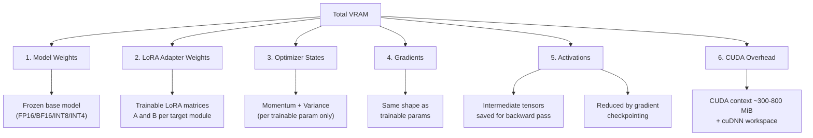

# `fitcheck` — Deep Dive & Prerequisites

## What is `fitcheck`?

Imagine this scenario — it happens to every ML practitioner:

> You want to fine-tune Qwen2.5-14B with QLoRA on your RTX 4090 (24GB). You set `batch_size=4`, `lora_r=64`, `seq_len=2048`, BF16 precision, gradient checkpointing on. You launch the job... wait 3 minutes for the model to load... and then: **`CUDA OutOfMemoryError`**. You lower batch size to 2, try again, wait 3 more minutes... still OOM. You lower to 1, try again... it works, but now you've wasted 10 minutes and you're not sure if you could have squeezed in `batch_size=2` with a smaller LoRA rank.

`fitcheck` eliminates this entire cycle. One command, no GPU, no model download, under two seconds:
it tells you whether the config fits, where every MiB went, and the largest micro-batch that still
fits — the three questions that ten-minute loop was going to answer eventually anyway.

**Before you ever touch a GPU**, it offers two seamless interfaces:

### Mode A: Power-User One-Liner (CLI Flags)

```bash
$ fitcheck meta-llama/Llama-3.1-8B --qlora --lora-r 64 --batch-size 4 --seq-len 2048 --optimizer adamw --flash-attn --gpu 4090

╭─────────────────────────── fitcheck ───────────────────────────╮
│ Model: Llama-3.1-8B (32 layers, 32 heads, GQA 8 KV heads)     │
│ GPU:   RTX 4090 (23,500 MiB usable)                           │
├────────────────────────────────────────────────────────────────┤
│ Component               │ Memory (MiB) │ % of Total            │
│─────────────────────────┼──────────────┼───────────────────────│
│ Base model weights      │              │                       │
│   └─ NF4 quantized      │    4,068     │  46.8%                │
│ LoRA adapter (trainable)│      104     │   1.2%                │
│ Optimizer states        │      416     │   4.8%                │
│ Gradients               │      104     │   1.2%                │
│ Activations (grad ckpt) │    3,136     │  36.1%                │
│ CUDA context + buffers  │      860     │   9.9%                │
│─────────────────────────┼──────────────┼───────────────────────│
│ TOTAL (predicted peak)  │    8,689     │                       │
│ GPU capacity            │   23,500     │                       │
│ Headroom                │   14,811     │                       │
├────────────────────────────────────────────────────────────────┤
│ ✅ FITS — 63% headroom remaining                              │
│                                                                │
│ 💡 You could increase batch_size to 21 before hitting the      │
│    memory ceiling. Switching to adam8bit would free 312 MiB.   │
╰────────────────────────────────────────────────────────────────╯
```

### Mode B: Interactive Terminal REPL (`fitcheck`)

For an interactive exploratory workflow, just run `fitcheck` with no arguments to enter the terminal shell:

```
$ fitcheck
Welcome to fitcheck interactive terminal. Type a command or 'help'.

> model meta-llama/Llama-3.1-8B
✓ Loaded Llama-3.1-8B (32 layers, 32 heads, GQA 8 KV heads)

> gpu 4090
✓ Target GPU set to NVIDIA RTX 4090 (23,500 MiB usable)

> memory --qlora --lora-r 64 --batch-size 4 --seq-len 2048 --flash-attn
[Renders the full memory breakdown table above]

> explain
💡 Explanation:
- Base model weights (4,068 MiB) are the largest single component at 46.8% — the
  NF4-quantized 8.03B base plus its quantization scales. Near the floor for this model.
- Activations (3,136 MiB) come second at 36.1%. Gradient checkpointing is active, so
  you store 32 layer inputs (2,048 MiB) plus one layer's full activations (1,088 MiB)
  instead of all 32 (34,816 MiB) — which is exactly what demotes them to second.
- Flash Attention is ON: avoided 1,024 MiB per layer of quadratic attention matrices.
- LoRA adapter adds only 104 MiB of trainable weights and 416 MiB of AdamW states (FP32).
  Optimizer states cost 8 bytes/param even though you train in BF16 — AdamW keeps
  momentum and variance in FP32 by default.

  adamw -> adam8bit ......... saves    312 MiB
  --flash-attn OFF .......... costs +1,075 MiB   (currently ON)
  --grad-checkpoint OFF ..... costs +33,264 MiB  (currently ON)
  --grad-accum 8 ............ costs      0 MiB   (accumulation is free)

> optimize
🎯 Best configuration for RTX 4090:
- Max batch size: 21 (at seq_len 2048)
- Recommended: batch_size=8, grad_accum=2 for effective batch 16 with 47% safety headroom.

> compare --gpu 3090
⚖️ Comparison: RTX 4090 (24GB) vs RTX 3090 (24GB)
- Both fit this configuration identically (Peak 8,689 MiB).

> exit
Goodbye!
```

**No GPU was used to produce this output.** It's pure math.

---

## How Does It Compare to Existing Tools?

Before building, it's critical to understand the competitive landscape and **clearly articulate why `fitcheck` is different**:

| Tool | What it does | Limitations |
|:---|:---|:---|
| [`accelerate estimate-memory`](https://huggingface.co/docs/accelerate) | Estimates VRAM for full model loading | **No LoRA/QLoRA support.** No activation estimation. No optimizer states. Only computes weight memory. |
| [HF Model Memory Calculator](https://huggingface.co/spaces/hf-accelerate/model-memory-usage) | Gradio Space for inference memory | **Inference only.** No training components (activations, optimizer, gradients). |
| [llm-calc](https://github.com/JimJafar/llm-calc) | Browser calculator: does this model + quantization fit my RAM, with a context-length slider | **Inference sizing.** No training components at all — no optimizer, gradients, or activations. No LoRA/QLoRA. |
| [Model Memory Estimator](https://vram.asmirnov.xyz/) | Web calculator for training memory | Decent but **no GQA-aware formulas**, limited architecture support, no CLI. |

### `fitcheck`'s differentiators:

1. **Component-level breakdown** — not just "it fits" or "it doesn't", but *why* and *where* the memory goes
2. **LoRA/QLoRA-native** — models adapter memory, reduced optimizer states, and quantization overhead correctly
3. **GQA-aware** — properly accounts for reduced KV heads in modern models (Llama 3, Mistral, Qwen, Gemma)
4. **Architecture-specific** — reads `config.json` directly, uses actual `intermediate_size` instead of assuming `4h`
5. **Actionable advice** — "you can increase batch_size to X" or "switch to 8-bit optimizer to save Y MiB"
6. **CLI-first** — designed for the terminal workflow where ML engineers actually work, and
   `--json` + an exit code (0 fits / 1 doesn't / 2 error) so CI can gate a training job on it
7. **Calibration mode** *(roadmap — Phase 3, not in v0.1)* — run 1 real forward pass to compute a correction factor for future estimates

> [!IMPORTANT]
> Your README must include this comparison table. When someone asks "how is this different from X?", they should get a clear answer immediately. This is what separates a tool that gets adoption from one that gets ignored.

---

## How Does It Work Internally?

`fitcheck` decomposes GPU memory during training into **6 components** and computes each one analytically:



Let me walk through each component with real math:

### Component 1: Base Model Weights

This is the simplest. You load the model's `config.json` from HuggingFace and calculate:

$$\text{Weight Memory} = \text{num\_parameters} \times \text{bytes\_per\_param}$$

Using the real Llama-3.1-8B count, $P = 8{,}030{,}261{,}248$:

| Precision        | Bytes per param | $P \times$ bytes | In MiB     |
| :--------------- | :-------------: | ---------------: | ---------: |
| FP32             |        4        |   32,121,044,992 | 30,633 MiB |
| FP16 / BF16      |        2        |   16,060,522,496 | 15,317 MiB |
| INT8 (LLM.int8)  |        1        |    8,030,261,248 |  7,658 MiB |
| INT4 (QLoRA NF4) |       0.5       |    4,015,130,624 |  3,829 MiB |

> [!WARNING]
> Note that none of these are the round numbers you may expect ("8B params in BF16 = 16 GB"). $16$ GB is
> $16{,}000$ MB but $15{,}259$ MiB, and the true figure here is $15{,}317$ MiB because the model is 8.03B
> params, not 8.00B. Two small unit/rounding habits compound into a ~5% error. Compute in **bytes**, convert
> to **MiB** once.

> [!NOTE]
> For QLoRA, the base model is quantized to 4-bit but there's overhead from the quantization constants (one FP16 scale factor per block of 64 weights). This adds ~0.03125 bytes/param on top. For this 8B model that's 239 MiB of quantization overhead, giving **4,068 MiB** rather than the naïve 3,829 MiB.
>
> With **double quantization**, the scales themselves are quantized, reducing this overhead by ~50% (to ~120 MiB). `fitcheck` models both modes, but `--qlora` leaves double quant **off** — the `bitsandbytes` recipe usually turns it on, so fitcheck's default is the more expensive of the two readings. Pass `--double-quant` to model it, and note that the estimate only ever moves *down* when you do.
>
> One assumption worth knowing you are making: the scale is counted as **FP16**. `bitsandbytes` actually keeps `absmax` in FP32 when double quant is off, which would cost 479 MiB rather than 239 MiB here. v0.1 keeps FP16 — see SPEC Component 1, "Known simplification — scale dtype", and TASKS 6.3.

### Component 2: LoRA Adapter Weights

LoRA inserts two small matrices $A \in \mathbb{R}^{r \times d_{in}}$ and $B \in \mathbb{R}^{d_{out} \times r}$ for each target module (typically `q_proj`, `k_proj`, `v_proj`, `o_proj`, and sometimes `gate_proj`, `up_proj`, `down_proj`).

$$\text{LoRA params per module} = r \times (d_{in} + d_{out})$$

> [!WARNING]
> **GQA changes the dimensions of K and V projections.** In models with Grouped Query Attention (most modern LLMs), `k_proj` and `v_proj` have a smaller output dimension:
>
> - `q_proj`: $d_{in} = h,\quad d_{out} = h$ (unchanged)
> - `k_proj`: $d_{in} = h,\quad d_{out} = n_{kv} \times d_k$ (smaller!)
> - `v_proj`: $d_{in} = h,\quad d_{out} = n_{kv} \times d_k$ (smaller!)
> - `o_proj`: $d_{in} = h,\quad d_{out} = h$ (unchanged)
>
> For Llama 3.1-8B with 32 Q heads and 8 KV heads: `k_proj` and `v_proj` have $d_{out} = 8 \times 128 = 1024$, not 4096. Failing to account for this **over-estimates LoRA memory by 23%** on that shape — 128 MiB claimed against 104 MiB real, worked through in Step 2 below.

The general formula accounting for GQA:

$$\text{Total LoRA params} = L \times r \times \sum_{m \in \text{targets}} (d_{in}^{(m)} + d_{out}^{(m)})$$

These are stored in the **compute precision** — the same $\gamma$ that drives gradients and
activations, not a constant:

$$\text{LoRA Memory} = \text{Total LoRA params} \times \gamma \qquad (\gamma = 2 \text{ for BF16/FP16},\ 4 \text{ for FP32})$$

The adapters are trained, so they follow `--precision`, never the base model's `--quant`. In QLoRA the
base is 4-bit and the adapters are still BF16; that asymmetry is the whole point of the method.

### Component 3: Optimizer States

The optimizer **only stores states for trainable parameters** (the LoRA adapters in a QLoRA setup):

| Optimizer | Bytes per trainable param | What it stores |
|:---|:---:|:---|
| AdamW (FP32 states) | 8 | momentum (FP32) + variance (FP32) |
| AdamW (BF16 states) | 4 | momentum (BF16) + variance (BF16) |
| AdamW 8-bit (bitsandbytes) | 2 | momentum (INT8) + variance (INT8) |
| SGD with momentum | 4 | momentum (FP32) |
| SGD (no momentum) | 0 | nothing |

$$\text{Optimizer Memory} = \text{trainable\_params} \times \text{bytes\_per\_param\_for\_optimizer}$$

> [!IMPORTANT]
> **Subtlety 1 — AdamW state dtype:** Even though LoRA trains in BF16, **AdamW stores its states in FP32 by default**. This means optimizer states are 8 bytes/param, not 4. This catches a lot of people off guard. (This is about the *states*, `m` and `v` — not about master weights, which are Subtlety 2.)
>
> **Subtlety 2 — Full fine-tuning master copy:** When full fine-tuning (not LoRA) with mixed precision (BF16/FP16 forward + FP32 optimizer), the optimizer also keeps a **FP32 master copy** of all trainable parameters. This adds another 4 bytes/param. For LoRA/QLoRA this is negligible (only LoRA params), but for full fine-tuning the FP32 shadow costs *twice what the BF16 weights themselves cost* — 2 bytes/param of weights carrying 4 bytes/param of master copy. `fitcheck` must handle both cases.
>
> **The "mixed precision" qualifier is load-bearing.** A master weight is the FP32 shadow of a parameter held in lower precision. Under `--precision fp32` the parameters already *are* FP32 — there is no shadow, and $W_{base}$ has already paid those 4 bytes/param. Adding the copy there double-counts by 4 bytes/param (**30,633 MiB** on an 8B model). Both correct paths land at 16 bytes/param for full FT + AdamW; a rule that makes them disagree is wrong. Exact condition and the invariant table: SPEC.md Component 3.

### Component 4: Gradients

During backward, PyTorch allocates a `.grad` tensor for each trainable parameter. Same shape, same dtype as the parameter — so this term scales with the **compute** precision, exactly like activations:

$$\text{Gradient Memory} = \text{trainable\_params} \times \gamma \qquad (\gamma = 2 \text{ for BF16/FP16},\ 4 \text{ for FP32})$$

With gradient accumulation, gradients are **not** multiplied by the accumulation steps — they're accumulated in-place into the same tensor.

### Component 5: Activations (The Hard One)

This is where it gets interesting. During the forward pass, PyTorch saves intermediate tensors (activations) that are needed to compute gradients in the backward pass.

**The right way to count this is to walk the layer and ask, at every op: what does its backward need?** Here
is `LlamaDecoderLayer`, annotated. Let $\gamma$ = bytes per activation element (2 for BF16/FP16, 4 for FP32):

```python
residual = x                              # (1) SAVED — RMSNorm backward needs its input
h1 = input_layernorm(x)                   # (2) SAVED — input to q/k/v_proj (one tensor, three Linears)
q  = rope(q_proj(h1))                     # (3) SAVED by attention backward
k  = rope(k_proj(h1))                     #     SAVED — smaller under GQA
v  = v_proj(h1)                           #     SAVED — smaller under GQA
attn_out = attention(q, k, v)             # (4) SAVED — attention's `out` AND o_proj's input (same storage)
x  = residual + o_proj(attn_out)          # (5) SAVED — MLP-norm backward needs its input
h2 = post_attention_layernorm(x)          # (6) SAVED — input to gate_proj and up_proj
g, u = gate_proj(h2), up_proj(h2)         #     SAVED ×2 — SiLU and multiply backward
x  = x + down_proj(silu(g) * u)           #     SAVED ×1 — down_proj's input
```

| # | Saved tensor                    | Shape                 | Size (bytes)                         | Why autograd keeps it                  |
| :-| :------------------------------ | :-------------------- | :----------------------------------- | :------------------------------------- |
| 1 | Layer input (pre-attn-norm)     | $(b, s, h)$           | $\gamma bsh$                         | RMSNorm backward needs its input       |
| 2 | Attn-norm output                | $(b, s, h)$           | $\gamma bsh$                         | Input to `q/k/v_proj` — shared by 3    |
| 3 | Q projection output (post-RoPE) | $(b, n_h, s, d_k)$    | $\gamma bs \cdot n_hd_k$             | $n_h d_k = h$ for Llama-shaped models  |
| 4 | Attention output                | $(b, s, n_hd_k)$      | $\gamma bs \cdot n_hd_k$             | Also `o_proj`'s input — same storage   |
| 5 | Post-attn residual sum          | $(b, s, h)$           | $\gamma bsh$                         | MLP-norm backward needs its input      |
| 6 | MLP-norm output                 | $(b, s, h)$           | $\gamma bsh$                         | Input to `gate_proj` and `up_proj`     |
|   | **subtotal**                    |                       | $\mathbf{\gamma bs(4h + 2n_hd_k)}$   | $= \gamma bs \cdot 6h$ when $n_hd_k = h$ |
| 7 | K projection output             | $(b, n_{kv}, s, d_k)$ | $\gamma bsh \cdot \frac{n_{kv}}{n_h}$ | **Reduced by GQA**                    |
| 8 | V projection output             | $(b, n_{kv}, s, d_k)$ | $\gamma bsh \cdot \frac{n_{kv}}{n_h}$ | **Reduced by GQA**                    |
| 9 | Attention weights (softmax)     | $(b, n_h, s, s)$      | $\gamma bn_hs^2$                     | **Removed by Flash Attention**         |
| 10| Gate proj output (pre-SiLU)     | $(b, s, d_{ff})$      | $\gamma bs \cdot d_{ff}$             | Saved for SiLU backward                |
| 11| Up proj output                  | $(b, s, d_{ff})$      | $\gamma bs \cdot d_{ff}$             | Saved for element-wise multiply        |
| 12| Down proj input (SiLU(gate)×up) | $(b, s, d_{ff})$      | $\gamma bs \cdot d_{ff}$             | Saved for down_proj backward           |

> [!TIP]
> **What is *not* saved is as instructive as what is.** Three things you might expect in the table and won't
> find:
> - **Pre-RoPE Q and K.** RoPE's backward needs only `cos`/`sin`, not its input, so the pre-rotation tensors
>   are freed as soon as the rotated ones exist. You pay for Q once, not twice.
> - **`o_proj`'s output.** A Linear's backward needs its *input* ($x$ for $\partial W$) and its *weight*
>   ($W$ for $\partial x$) — never its own output. This is why row 4 is `o_proj`'s input, not its output.
> - **The residual additions.** Addition's backward is the identity: it routes the incoming gradient to both
>   branches unchanged and stores nothing. Residual connections are free.
>
> Flash Attention's `logsumexp` — $(b, n_h, s)$ in FP32 — *is* saved, but at ~1 MiB per layer here it is
> rounding error next to the terms above.

**General formula per layer (no gradient checkpointing):**

$$A_{layer} = \gamma bs\left[6h + 2h \cdot \frac{n_{kv}}{n_h} + 3 \cdot d_{ff}\right] + \gamma bn_hs^2 \cdot \mathbb{1}[\text{no Flash Attn}]$$

Where:
- $s$ = sequence length
- $b$ = **micro-batch size** (not effective batch — see Component note below)
- $h$ = hidden dimension
- $n_h$ = number of attention heads (query heads)
- $n_{kv}$ = number of key-value heads (= $n_h$ for MHA, < $n_h$ for GQA)
- $d_{ff}$ = FFN intermediate size (read from `intermediate_size` in `config.json`)
- $d_k$ = head dimension — read from `head_dim` in `config.json` when present, else $h / n_h$
- $\gamma$ = bytes per activation element, from the **compute** precision (2 for BF16/FP16, 4 for FP32)

> [!NOTE]
> **The $6h$ form quietly assumes $n_h d_k = h$.** Rows 3 and 4 are really $n_h d_k$ wide and rows 7–8
> are $n_{kv}d_k$ wide, so the bracket without any assumption is
> $4h + 2n_hd_k + 2n_{kv}d_k + 3d_{ff}$. Substitute $n_hd_k = h$ and you get the $6h$ form back exactly
> — which is why every number in this document is unaffected. It matters for Gemma-2-9B, where
> $16 \times 256 = 4096$ against $h = 3584$, so the $6h$ form counts its Q and attention-output tensors
> 12.5% short. Teach the $6h$ form, implement the other one.

> [!WARNING]
> **Don't hardcode $\gamma = 2$.** It is tempting, because BF16 training is the overwhelmingly common case and
> every row of the table above then starts with a literal `2`. But under `--precision fp32` every one of those
> rows doubles, and a hardcoded 2 silently halves your activation estimate — on the config where activations
> dominate most. Derive $\gamma$ from the compute dtype, always.

> [!NOTE]
> **Don't assume $d_{ff} = 4h$.** Modern models use varying FFN sizes (values below read from each
> model's published `config.json`):
> - Llama 3.1-8B: $d_{ff} = 14336 = 3.5h$
> - Mistral-7B-v0.3: $d_{ff} = 14336 = 3.5h$
> - Qwen2.5-14B: $d_{ff} = 13824 = 2.7h$
> - Gemma 2-9B: $d_{ff} = 14336 = 4.0h$
> - Gemma 2-27B: $d_{ff} = 36864 = 8.0h$ (twice the "textbook" width)
>
> Note Gemma 2-9B: it *is* exactly $4h$ — and that is the trap, not the exception. The ratio ranges from
> $2.7h$ to $8h$ across four current families, so a hardcoded `4h` is right occasionally and wrong by up
> to 2× otherwise, with nothing in the model name to tell you which. Always read `intermediate_size`.
> Getting it wrong moves the FFN term, which is the largest single block of activation memory: 10–30%
> error on typical configs, more on Gemma 2-27B.

> [!WARNING]
> **Flash Attention changes this dramatically.** With Flash Attention, the attention weight matrix $(b, n_h, s, s)$ is **never materialized in HBM**. This removes the $O(s^2)$ term, making attention $O(s)$ in memory. For a batch of 4 with seq_len=2048 and 32 heads, this saves $2 \times 4 \times 32 \times 2048^2 = 1{,}073{,}741{,}824$ bytes $= 1{,}024$ MiB **per layer** — 32,768 MiB across all 32 layers without checkpointing. `fitcheck` must have two code paths: `--flash-attn` ON vs OFF.

> [!IMPORTANT]
> **Micro-batch vs. effective batch size.** The memory-relevant quantity is the **micro-batch size** (what goes through a single forward/backward pass), not the effective batch size. Gradient accumulation does **not** increase memory — it accumulates gradients in-place across micro-batches. `fitcheck` should accept both `--batch-size` (micro-batch) and `--grad-accum-steps`, but only use the micro-batch for memory estimation. The effective batch size should be displayed for informational purposes.

**With gradient checkpointing:**

Every checkpointing scheme is the same one-parameter family. Split $L$ layers into $k$ segments, store
the input to each segment, and recompute one segment at a time during backward:

$$A(k) = k \cdot \gamma bsh + \frac{L}{k} \cdot A_{layer}$$

The strategies are just choices of $k$ — and for the worked example ($L = 32$, $\gamma bsh = 64$ MiB,
$A_{layer} = 1{,}088$ MiB) they land nowhere near where the folklore says:

| $k$ | Strategy | $A_{act}$ | Used by |
|:---|:---|---:|:---|
| $\sqrt{L} \approx 5.66$ | "checkpoint every $\sqrt{L}$ layers" | **6,517 MiB** | Academic papers |
| $L = 32$ | **checkpoint every layer** | **3,136 MiB** | HuggingFace `transformers` |
| $\sqrt{L \cdot A_{layer}/\gamma bsh} \approx 23$ | true minimum of $A(k)$ | **2,986 MiB** | nobody, and it barely matters |

> [!NOTE]
> **The $\sqrt{L}$ result is real but lives in a different regime.** It minimizes $A(k)$ only when a
> layer's full activations cost about the same as a layer's input. Here they cost **17×** as much
> ($1{,}088$ vs $64$ MiB), which pushes the true optimum up to $k \approx 23$ and leaves every-layer
> checkpointing within **5%** of it. So the practical default is not a compromise — it is very nearly
> optimal *and* it is what the framework actually does. Modelling $\sqrt{L}$ instead would over-estimate
> the golden config by more than 2×.

`fitcheck` should use the **practical default** (checkpoint every layer), which is what `model.gradient_checkpointing_enable()` does in HuggingFace Transformers. This stores only the *input* to each transformer layer ($L$ tensors of shape $(b, s, h)$) plus **one layer's worth** of full activations at a time (recomputed during backward):

$$A_{checkpointed} = L \times \gamma bsh + A_{layer}$$

> [!NOTE]
> The $L \times \gamma bsh$ term is row 1 of the saved-tensor table — the layer input — stored once per layer.
> So under checkpointing you are paying for row 1 twice for the single layer being recomputed. That
> double-count is one tensor out of twelve, and it errs toward over-estimating, which is the safe direction.

### Component 6: CUDA Overhead

- **CUDA context**: ~300-800 MiB just for initializing CUDA (loading the driver, cuDNN, cuBLAS)
- **Memory fragmentation**: PyTorch's caching allocator reserves blocks; actual usable memory is ~91-97% of reported VRAM, depending on the card
- **Workspace buffers**: cuBLAS/cuDNN allocate temporary workspace for GEMM/convolution operations

This is modeled as a constant + small percentage:

$$\text{Overhead} \approx 500\text{ MiB} + 0.05 \times (W_{base} + A_{act})$$

The percentage tracks $W_{base}$ specifically, not $W_{base} + W_{lora}$ — the adapters are too small to
move it, and pinning the definition keeps the term reproducible.

## Code Architecture

```
fitcheck/
├── __init__.py              # version, public API
├── __main__.py              # python -m fitcheck entry point
├── cli.py                   # click commands & option groups
├── repl.py                  # Interactive REPL (Mode B)
├── config_parser.py         # HuggingFace config.json → ModelConfig dataclass
├── estimator.py             # Orchestrator: calls all 6 components, returns MemoryReport
├── memory/
│   ├── __init__.py          # re-exports all estimate_* functions
│   ├── weights.py           # Component 1
│   ├── lora.py              # Component 2
│   ├── optimizer.py         # Component 3
│   ├── gradients.py         # Component 4
│   ├── activations.py       # Component 5
│   └── overhead.py          # Component 6
├── gpu_db.py                # GPU name → GpuSpec(name, vram_mib, usable_mib)
├── display.py               # rich tables, panels, verdicts, explain text
├── advisor.py               # Phase 2: parameter sweep (stub in MVP)
├── calibrate.py             # Phase 3: real measurement (stub in MVP)
└── utils.py                 # bytes↔MiB, precision→bytes lookup
tests/
├── conftest.py              # shared fixtures (Llama, Mistral, Qwen configs)
├── test_config_parser.py
├── test_gpu_db.py
├── test_weights.py
├── test_lora.py
├── test_optimizer.py
├── test_gradients.py
├── test_activations.py
├── test_overhead.py
└── test_end_to_end.py       # full pipeline: config → report → verdict
```

> [!NOTE]
> Each memory component in `memory/` is its own module with a single clear formula. This makes it easy to test, debug, and improve each component independently. When someone files a bug saying "your activation estimate is off for Gemma 2", you go straight to `activations.py`.

---

## Worked Example: The Math in Action

Let's compute memory for **Llama-3.1-8B + QLoRA on an RTX 4090**:

**Config:**
- Model: 8.03B params, 32 layers, $h = 4096$, $d_{ff} = 14336$, 32 Q heads, 8 KV heads (GQA), $d_k = 128$
- LoRA: $r = 64$, targets = `[q_proj, k_proj, v_proj, o_proj]`
- Precision: BF16 training, NF4 base model
- Optimizer: AdamW (FP32 states)
- Batch size: 4, Sequence length: 2048
- Gradient checkpointing: ON
- Flash Attention: ON

---

**Step 1 — Base weights (NF4):**

Work in bytes, convert to MiB exactly once at the end:

$$P \times 0.5\text{ bytes} = 8{,}030{,}261{,}248 \times 0.5 = 4{,}015{,}130{,}624\text{ bytes} = 3{,}829.13\text{ MiB}$$

$$Q_{overhead} = P \times \tfrac{2}{64}\text{ bytes} = 250{,}945{,}664\text{ bytes} = 239.32\text{ MiB}$$

$$W_{base} = 4{,}266{,}076{,}288\text{ bytes} = \mathbf{4{,}068.45\text{ MiB}}$$

(one FP16 scale per block of 64 weights)

> [!WARNING]
> **MiB is not MB, and this is exactly where people get burned.** That same number is
> $4{,}266{,}076{,}288$ bytes $= 4{,}266$ **MB** $= 4{,}068$ **MiB** — a 4.9% gap. GPU vendors advertise in GB
> ($10^9$), PyTorch reports in MiB ($1024^2$), and every intermediate step above is tempting to round in the
> wrong unit. Quoting 4,266 as "MiB" would be enough on its own to flip a fits/doesn't-fit verdict for a
> config sitting near the edge of a 24 GB card. **`fitcheck` reports MiB everywhere; convert once, at the
> boundary.**

---

**Step 2 — LoRA adapter (GQA-aware):**

Account for the different output dimensions in GQA:

| Module | $d_{in}$ | $d_{out}$ | LoRA params per layer |
|:---|:---:|:---:|:---:|
| `q_proj` | 4096 | 4096 | $64 \times (4096 + 4096) = 524{,}288$ |
| `k_proj` | 4096 | **1024** | $64 \times (4096 + 1024) = 327{,}680$ |
| `v_proj` | 4096 | **1024** | $64 \times (4096 + 1024) = 327{,}680$ |
| `o_proj` | 4096 | 4096 | $64 \times (4096 + 4096) = 524{,}288$ |

$$\text{LoRA params per layer} = 524{,}288 + 327{,}680 + 327{,}680 + 524{,}288 = 1{,}703{,}936$$

$$\text{Total LoRA params} = 32 \times 1{,}703{,}936 = 54{,}525{,}952 \approx 54.5\text{M params}$$

$$\text{LoRA memory} = 54.5\text{M} \times 2\text{ bytes} = 104\text{ MiB}$$

> [!NOTE]
> **Compare with the naïve (wrong) calculation:** If you assumed $d_{out} = 4096$ for all projections (ignoring GQA), you'd get $67\text{M}$ params and $128\text{ MiB}$ — **a 23% over-estimate.** This is why `fitcheck` must read the actual weight shapes from `config.json`.

---

**Step 3 — Optimizer states (AdamW FP32):**

$$54.5\text{M} \times 8\text{ bytes} = 416\text{ MiB}$$

(2 states × 4 bytes/state × 54.5M trainable params)

---

**Step 4 — Gradients:**

$$54.5\text{M} \times 2\text{ bytes} = 104\text{ MiB}$$

---

**Step 5 — Activations (grad checkpoint ON, Flash Attention ON):**

Using the general formula with $d_{ff} = 14336$ (from Llama 3.1-8B `config.json`):

**Per-layer activations (Flash Attention removes the $s^2$ term), with $\gamma = 2$ for BF16:**

$$A_{layer} = \gamma bs\left[6h + 2h \cdot \frac{n_{kv}}{n_h} + 3 \cdot d_{ff}\right]$$

$$= 2 \times 4 \times 2048 \times \left[6 \times 4096 + 2 \times 4096 \times \frac{8}{32} + 3 \times 14336\right]$$

$$= 16{,}384 \times \left[24{,}576 + 2{,}048 + 43{,}008\right]$$

$$= 16{,}384 \times 69{,}632 = 1{,}140{,}850{,}688 \text{ bytes} = 1{,}088\text{ MiB}$$

**With gradient checkpointing (checkpoint every layer):**

Stored inputs for all 32 layers:

$$L \times \gamma bsh = 32 \times 2 \times 4 \times 2048 \times 4096 = 2{,}147{,}483{,}648\text{ bytes} = 2{,}048\text{ MiB}$$

Plus one layer's full activations recomputed during backward:

$$A_{layer} = 1{,}088\text{ MiB}$$

$$\text{Total activations} = 2{,}048 + 1{,}088 = \mathbf{3{,}136\text{ MiB}}$$

> [!NOTE]
> **Without Flash Attention**, the attention matrix term $\gamma bn_hs^2 = 2 \times 4 \times 32 \times 2048^2 = 1{,}073{,}741{,}824$ bytes $= 1{,}024$ MiB **per layer** would be added to $A_{layer}$, taking it to 2,112 MiB. With grad checkpointing, total activations would go from 3,136 to 4,160 MiB. **Without checkpointing it is far worse:** $32 \times 2{,}112 = 67{,}584$ MiB, against $32 \times 1{,}088 = 34{,}816$ MiB with Flash Attention. Neither fits a 4090 — which is the real lesson: at bs=4/seq=2048, checkpointing is not optional on a consumer card.

> [!NOTE]
> **Activation formula accuracy note:** The exact tensors saved by autograd depend on the specific PyTorch / HuggingFace implementation (fused kernels, in-place ops, etc.). The formula above is a principled estimate derived from the standard computation graph. In practice, actual memory may differ by ±10-15%. Phase 3's calibration mode will measure real peak memory and compute a correction factor per architecture.

---

**Step 6 — CUDA overhead:**

Apply the formula rather than guessing a round number:

$$C_{overhead} = 500 + 0.05 \times (W_{base} + A_{act}) = 500 + 0.05 \times (4{,}068.45 + 3{,}136) = \mathbf{860.22\text{ MiB}}$$

---

**Total:**

| Component | Memory (MiB) | % of Total |
|:---|---:|---:|
| Base model weights (NF4) | 4,068.45 | 46.8% |
| LoRA adapter | 104.00 | 1.2% |
| Optimizer states (AdamW FP32) | 416.00 | 4.8% |
| Gradients | 104.00 | 1.2% |
| Activations (grad ckpt + Flash Attn) | 3,136.00 | 36.1% |
| CUDA overhead | 860.22 | 9.9% |
| **TOTAL (predicted peak)** | **8,688.67** | |

$$4{,}068.45 + 104 + 416 + 104 + 3{,}136 + 860.22 = \mathbf{8{,}688.67\text{ MiB}}$$

**RTX 4090 usable VRAM: ~23,500 MiB → ✅ FITS** with 14,811 MiB (63%) headroom.

**Max batch size — by search, not extrapolation:**

The tempting move is to divide: activations are 3,136 MiB at $b=4$, so 784 MiB per batch unit, so
$\lfloor 14{,}811 / 784 \rfloor = 18$ more. That is *close* but structurally wrong, because $C_{overhead}$ is
itself a function of $A_{act}(b)$ — growing $b$ grows the overhead term too. Write the total as a function of
$b$ and the coupling becomes explicit:

$$\text{total}(b) = \underbrace{4{,}692.45}_{W+S+G} + 784b + \underbrace{500 + 0.05(4{,}068.45 + 784b)}_{C_{overhead}(b)} = 5{,}395.87 + 823.2\,b$$

$$5{,}395.87 + 823.2\,b \le 23{,}500 \;\Rightarrow\; b \le 21.99 \;\Rightarrow\; \boxed{b_{max} = 21}$$

> [!WARNING]
> That result is $21.99$. Round it and you hand the user a config that OOMs on the first step; floor it and
> you are correct. **Always floor.** This is also why the naïve 784 MiB/batch slope is dangerous rather than
> merely imprecise — it is the *optimistic* direction, and optimistic errors in an OOM-avoidance tool are the
> only kind that actually cost the user anything.

`fitcheck` finds this by **re-running the whole estimator under bisection** rather than by algebra, so the
answer stays correct even as components are added or the overhead model changes. That is exactly the kind of
calculation `fitcheck` automates — and exactly the kind people get wrong by hand.

---

## Validation Plan

Accuracy is the make-or-break metric for `fitcheck`. If the estimates are more than ~15% off, people won't trust it. Here's how to validate:

### Validation Matrix (Ship This in Your README)

| Model | GPU | Config | Predicted (MiB) | Actual (MiB) | Error (%) |
|:---|:---|:---|---:|---:|---:|
| Llama-3.1-8B | RTX 4090 | QLoRA r=64, bs=4, seq=2048, FA2 | 8,689 | TBD | TBD |
| Llama-3.1-8B | RTX 4090 | QLoRA r=16, bs=1, seq=4096, FA2 | TBD | TBD | TBD |
| Mistral-7B-v0.3 | T4 16GB | QLoRA r=32, bs=2, seq=1024, no FA | TBD | TBD | TBD |
| Qwen2.5-14B | A100-40GB | QLoRA r=64, bs=4, seq=2048, FA2 | TBD | TBD | TBD |
| Gemma-2-9B | RTX 3090 | LoRA r=16, bs=2, seq=512, FA2 | TBD | TBD | TBD |
| Llama-3.1-70B | A100-80GB | QLoRA r=16, bs=1, seq=2048, FA2 | TBD | TBD | TBD |

> [!TIP]
> Fill this table by running actual training jobs with `torch.cuda.max_memory_allocated()` and comparing against `fitcheck`'s predictions. Even 5 validated rows will massively boost credibility. **Nothing builds trust faster than showing "predicted X, measured X±5%".**

### How to Measure Ground Truth

```python
import torch
from transformers import AutoModelForCausalLM, AutoTokenizer
from peft import get_peft_model, LoraConfig

# ... setup model and training ...

# After one full training step:
peak_mib = torch.cuda.max_memory_allocated() / (1024 ** 2)
reserved_mib = torch.cuda.max_memory_reserved() / (1024 ** 2)
print(f"Peak allocated: {peak_mib:.0f} MiB")
print(f"Peak reserved:  {reserved_mib:.0f} MiB")

# For detailed breakdown:
print(torch.cuda.memory_summary())
```

### Accuracy Targets

| Phase | Target Error | How |
|:---|:---|:---|
| MVP (v0.1) | ±20%, **unvalidated** | Analytical formulas only — shipped with an honest banner, not with proof |
| Validated (v0.2) | ±10% | Formulas tuned against ≥3 real measurements (SPEC §4, bullet 7) |
| Calibrated (v1.0) | ±5% | Per-architecture correction factors from calibration mode |

---

## PyPI Name & Branding

> [!IMPORTANT]
> **Use the PyPI package name `fitcheck-llm`** to publish. The command line entry point is mapped to `fitcheck`, keeping the product name as **Fitcheck**.

---

## 📚 Prerequisites — Everything You Need to Know Before Starting

### Category 1: GPU & CUDA Fundamentals

| # | Topic | What to know | Why it matters for `fitcheck` |
|:--|:------|:------------|:------------------------------|
| 1 | **GPU memory hierarchy** | HBM (VRAM) vs. SRAM (on-chip) vs. registers. What lives where during training. | You're estimating HBM usage specifically. SRAM matters for understanding why Flash Attention changes the memory model. |
| 2 | **CUDA context overhead** | What happens when you call `torch.cuda.init()`. How much memory the driver, cuDNN, and cuBLAS pre-allocate. | You need a realistic constant for the "overhead" component. |
| 3 | **PyTorch's caching allocator** | How `torch.cuda.memory_allocated()` vs `torch.cuda.memory_reserved()` differ. What "fragmentation" means. The `expandable_segments` feature. | You need to know the difference between "memory used by tensors" and "memory held by PyTorch's allocator" to set realistic headroom. |
| 4 | **GPU spec sheets** | VRAM capacities of common GPUs (T4=16GB, 3090=24GB, 4090=24GB, A100=40/80GB, H100=80GB, L4=24GB). Actual usable memory vs. advertised. | You're building a GPU database. Usable VRAM is 91-97% of advertised — consumer cards with a display attached sit at the bottom of that range, headless datacenter cards at the top. |

---

### Category 2: PyTorch Memory Internals

| # | Topic | What to know | Why it matters for `fitcheck` |
|:--|:------|:------------|:------------------------------|
| 5 | **Tensor storage model** | How `torch.Tensor` wraps a `Storage` object. How `.view()`, `.reshape()`, `.contiguous()` affect memory. When tensors share storage vs. allocate new memory. | Determines whether operations create new memory or alias existing memory. |
| 6 | **Autograd graph & saved tensors** | What `ctx.save_for_backward()` does. Which tensors PyTorch saves during the forward pass and why. How `saved_tensors_hooks` can intercept this. | The forward pass saves intermediate tensors for the backward pass. This is the "activation memory" you're estimating. |
| 7 | **Gradient checkpointing internals** | How `torch.utils.checkpoint.checkpoint()` works: discards activations during forward, recomputes them layer-by-layer during backward. Memory vs. compute tradeoff. The **practical default** is checkpointing every layer. | You need to model the memory savings: from "all layers' activations" to "all layers' inputs + one layer's activations at a time." |
| 8 | **`torch.cuda.memory_snapshot()`** | How to capture and read memory snapshots. What the output format looks like. | This is your **ground truth** for validating your estimates. You'll compare predicted vs. actual using this. |
| 9 | **Mixed precision & AMP** | How `torch.amp.autocast` works. Which ops run in FP16/BF16 vs. FP32. The "master weights" concept. | Affects which precision each tensor is stored in, which directly changes your memory calculation. |

---

### Category 3: Transformer Architecture Math

| # | Topic | What to know | Why it matters for `fitcheck` |
|:--|:------|:------------|:------------------------------|
| 10 | **Parameter counting from config** | Given a HuggingFace `config.json` (with `hidden_size`, `num_hidden_layers`, `intermediate_size`, `num_attention_heads`, `vocab_size`), compute the exact parameter count. Know the formula for each sub-module (embedding, attention, MLP, LayerNorm, LM head). | This is the input to your weight memory calculation. You can't just trust `model.num_parameters()` because you're not loading the model. |
| 11 | **Multi-Head Attention (MHA) memory** | The shapes of Q, K, V, attention weights, and output tensors. How `(b, n_h, s, d_k)` tensors are formed and stored. | Each of these is a saved tensor for backward. You need their exact sizes. |
| 12 | **Grouped Query Attention (GQA)** | How GQA reduces KV heads (e.g., Llama 3.1: 32 Q heads, 8 KV heads). How this changes the shapes of K and V tensors **and** the dimensions of `k_proj`/`v_proj` linear layers. | GQA models save less K/V activation memory **and** have smaller LoRA adapters on K/V projections. Your formulas must account for `num_kv_heads ≠ num_attention_heads`. |
| 13 | **Flash Attention memory model** | Why standard attention is $O(s^2)$ in memory (materializes the full attention matrix) and Flash Attention is $O(s)$ (computes attention tile-by-tile in SRAM, never writes the full matrix to HBM). | This changes your activation estimate **dramatically** for long sequences. You need two code paths: flash vs. non-flash. |
| 14 | **FFN / SwiGLU architecture** | How the feed-forward block works in modern models (gate + up + down projections with SiLU). What intermediate tensors are saved. The FFN `intermediate_size` varies by model (not always `4h`). | The FFN block is often the largest contributor to activation memory. `intermediate_size` must be read from config, not assumed. |
| 15 | **Embedding & LM head** | Whether the model ties embedding and LM head weights. The shape of the embedding table: `(vocab_size, hidden_size)`. | Affects parameter count and weight memory. Tied weights = shared storage = count once. |

---

### Category 4: LoRA / PEFT Memory Math

| # | Topic | What to know | Why it matters for `fitcheck` |
|:--|:------|:------------|:------------------------------|
| 16 | **LoRA decomposition** | $W = W_0 + BA$ where $B \in \mathbb{R}^{d_{out} \times r}$, $A \in \mathbb{R}^{r \times d_{in}}$. Trainable params = $r \times (d_{in} + d_{out})$ per adapted module. | This is the core formula for LoRA adapter memory. |
| 17 | **QLoRA specifics** | NF4 quantization: 4 bits per weight + FP16 quantization scales (1 per block of 64). Double quantization (optional). How `bitsandbytes` loads the model. | QLoRA base model memory isn't simply `params × 0.5 bytes` — there's overhead from quantization constants. |
| 18 | **Which modules get adapted** | Default targets vary by model family. Common: `q_proj, v_proj` (minimal) or `q_proj, k_proj, v_proj, o_proj, gate_proj, up_proj, down_proj` (full). **Dimensions differ for GQA models.** | The number of target modules directly multiplies your LoRA param count. |
| 19 | **LoRA alpha & dropout** | `lora_alpha` is a scaling factor (doesn't affect memory). `lora_dropout` adds a small memory overhead during training. | Knowing what does and doesn't affect memory prevents wrong estimates. |

---

### Category 5: Optimizer Internals

| # | Topic | What to know | Why it matters for `fitcheck` |
|:--|:------|:------------|:------------------------------|
| 20 | **Adam / AdamW state variables** | Adam stores **two states per parameter**: first moment (momentum, $m$) and second moment (variance, $v$). Both are same shape as the parameter. Default: FP32. | Optimizer states = $2 \times \text{trainable\_params} \times 4$ bytes. This is often the second-largest memory consumer after activations. |
| 21 | **8-bit optimizers (bitsandbytes)** | `bnb.optim.AdamW8bit` stores $m$ and $v$ in INT8 with dynamic quantization. Memory = $2 \times 1$ byte per param. | Changes the optimizer multiplier from 8 bytes to 2 bytes per param. |
| 22 | **SGD memory footprint** | SGD with momentum stores 1 state (momentum buffer) per param. SGD without momentum stores nothing. | Useful for comparison and for users who choose SGD. |
| 23 | **Paged optimizers** | `bitsandbytes` paged optimizers can offload states to CPU RAM when GPU is full, then page them back in. | An advanced feature for the advisor mode: "you could fit this if you use paged AdamW." |

---

### Category 6: Training Techniques That Affect Memory

| # | Topic | What to know | Why it matters for `fitcheck` |
|:--|:------|:------------|:------------------------------|
| 24 | **Gradient accumulation** | Accumulates gradients over $N$ micro-batches before calling `optimizer.step()`. Does **not** increase memory (same `.grad` tensor is accumulated in-place). Effective batch size = micro_batch × accum_steps. | Common misconception: people think gradient accumulation costs more memory. It doesn't. `fitcheck` should make this clear. |
| 25 | **Micro-batch vs. effective batch** | The memory-relevant quantity is the **micro-batch size** (what goes through a single forward/backward), not the effective batch size. | Your activation formula uses micro-batch size, not effective batch size. Getting this wrong would give bad estimates. |
| 26 | **`torch.compile` memory overhead** | Compilation itself uses memory (for tracing, guards, code caching). Compiled kernels may fuse operations, changing which intermediates are saved. | Stretch goal for v2: estimate the memory delta of `torch.compile`. |
| 27 | **Activation offloading** | Some frameworks can offload activations to CPU during forward and reload during backward. | Advisor mode: suggest this as a memory-saving strategy. |

---

### Category 7: Python Tooling (For Building the CLI)

| # | Topic | What to know | Why it matters for `fitcheck` |
|:--|:------|:------------|:------------------------------|
| 28 | **`huggingface_hub` API** | `hf_hub_download()`, `model_info()`, how to fetch a model's `config.json` without downloading the full weights. | You need to read model architecture params without loading the model (that would require a GPU). |
| 29 | **`click` (CLI framework)** | Decorators for commands, options, arguments, help text, option groups. | The user-facing interface. Clean CLI UX is critical for adoption. |
| 30 | **`rich` (terminal formatting)** | Tables, panels, colored text, progress bars, live displays. | The output needs to look beautiful in the terminal. This is what makes people screenshot it and share it on Twitter. |
| 31 | **PyPI packaging** | `pyproject.toml`, `setup.cfg`, versioning, building wheels, publishing with `twine` or `flit`. | `pip install fitcheck-llm` must work on day one. |
| 32 | **`pytest` for validation** | Writing tests that compare your estimates against known ground-truth measurements. | You need a test suite: "for Llama-3.1-8B with config X, the predicted memory should be within ±10% of measured Y." |

---

## Suggested Study Order

> [!TIP]
> You already know many of these from your QLoRA and autograd work. Star (⭐) the ones you need to study fresh, and skip the rest.

```
Week 0 (before coding):
├── 1.  GPU memory hierarchy (skim — 1 hour)
├── 10. Parameter counting from config (derive on paper — 2 hours)
├── 11. MHA memory shapes (derive on paper — 2 hours)  
├── 12. GQA differences — key for activation AND LoRA formulas (derive — 2 hours)
├── 14. SwiGLU FFN shapes, note intermediate_size varies (derive — 1 hour)
├── 16. LoRA math (you already know this — review 30 min)
├── 17. QLoRA quantization overhead (derive — 1 hour)
├── 20. Adam state sizes (you already know this — review 30 min)
└── 13. Flash Attention memory model (study — 2-3 hours)
         ↑ this is the most important one to get right

Week 1 (while building MVP):
├── 28. huggingface_hub API (learn by doing — 1 hour)
├── 29. click CLI framework (learn by doing — 1 hour)
├── 30. rich terminal formatting (learn by doing — 2 hours)
├── 2.  CUDA context overhead (measure empirically — 1 hour)
├── 3.  Caching allocator basics (read PyTorch docs — 1 hour)
└── 7.  Gradient checkpointing internals (deep study — 2 hours)

Week 2 (validation & inference mode):
├── Inference mode: KV cache math (derive — 1 hour)
├── 8.  memory_snapshot for ground truth (hands-on — 2 hours)
├── 31. PyPI packaging (learn by doing — 1 hour)
└── 32. pytest validation suite (learn by doing — 2 hours)
```

---

## Quick Reference: The Master Formula

The entire project boils down to computing this sum accurately:

$$\boxed{\text{Peak VRAM} = W_{base} + W_{lora} + S_{optim} + G_{grad} + A_{act}(s, b, h, L, n_{kv}, d_{ff}, \gamma, \text{ckpt}, \text{flash}) + C_{overhead}}$$

Where:
- $W_{base}$ = base model weight memory (function of param count + **storage** precision + quantization overhead)
- $W_{lora}$ = LoRA adapter memory (function of rank, targets, layers, **GQA head dimensions**, and the **compute** precision — adapters follow `--precision`, never the base model's `--quant`)
- $S_{optim}$ = optimizer states (function of trainable params + optimizer type + **master weight copy for full FT**)
- $G_{grad}$ = gradient memory (function of trainable params + **compute** precision)
- $\gamma$ = bytes per activation element, from the **compute** precision (2 for BF16/FP16, 4 for FP32)
- $A_{act}$ = activation memory — **this is the hard one:**

$$A_{act} = \begin{cases} L \times A_{layer} & \text{no gradient checkpointing} \\ L \times \gamma bsh + A_{layer} & \text{gradient checkpointing (every layer)} \end{cases}$$

$$A_{layer} = \gamma bs\left[6h + 2h \cdot \frac{n_{kv}}{n_h} + 3 \cdot d_{ff}\right] + \gamma bn_hs^2 \cdot \mathbb{1}[\text{no Flash Attn}]$$

- $C_{overhead}$ = CUDA context + fragmentation + workspace buffers $\approx 500\text{ MiB} + 5\%$

> [!IMPORTANT]
> The $6h$ is six distinct $(b,s,h)$ tensors — layer input, attn-norm output, Q, attention output,
> post-attn residual sum, mlp-norm output. Earlier drafts of these documents carried $5h$ in the formula and
> a table that summed to $4h$; both were wrong, and the mismatch between them is what exposed the bug.
> **If a formula and its derivation table disagree, the formula is not the thing to trust — recount.**

Each of these is a formula you can derive on paper, implement in code, and validate against a real GPU measurement. That's the whole project.
