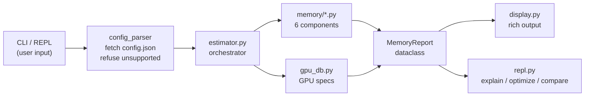

# `fitcheck` — Specification

> **PRD + Technical Design + Definition of Done — One Document**
>
> Version: 0.3.1 beta · Author: Anas · Date: September 2026

---

## Section 1: Problem & Users

### The Pain Point

Every ML practitioner who fine-tunes LLMs has hit the same wall:

1. Pick a model, set training config (batch size, LoRA rank, sequence length, precision).
2. Launch training. Wait 2–5 minutes for the model to load.
3. **`CUDA OutOfMemoryError`.**
4. Guess a smaller config. Relaunch. Wait again. Repeat.

This trial-and-error loop wastes 10–30 minutes per attempt and provides **zero insight** into *why* it doesn't fit or *how close* you are. The information needed to answer "will it fit?" exists — it's pure math from the model's `config.json` — but nobody has packaged it into a tool that gives a precise, component-level breakdown with actionable advice.

### Target Users

| Persona | What they need | How they use `fitcheck` |
|:---|:---|:---|
| **Solo GPU owner** (RTX 3090/4090) | Know if a QLoRA job fits before launching | `fitcheck <model> --gpu 4090 --lora-r 64 ...` |
| **Cloud ML engineer** (A100/H100) | Pick the cheapest instance that fits | `fitcheck <model> --gpu a100-40 ...` vs `--gpu a100-80` |
| **ML student / beginner** | Understand *where* GPU memory goes during training | Interactive REPL → `explain` command |
| **Framework developer** (Axolotl, Unsloth) | Pre-validate user configs before launching jobs | JSON output mode for CI/CD integration |
| **Inference deployer** (Ollama, vLLM) | Know if a model fits for serving | `fitcheck infer <model> --gpu 4090` — **v0.2**, see §2 |

### Why Existing Tools Don't Solve This

| Tool | Gap |
|:---|:---|
| `accelerate estimate-memory` | No LoRA/QLoRA. No activations, optimizer, gradients. Weights only. |
| HF Model Memory Calculator | Inference only. No training components. |
| LLM-Calc | Napkin math. No component breakdown. No LoRA. |
| vram.asmirnov.xyz | No GQA-aware formulas. No CLI. Limited architectures. |

**`fitcheck` fills every gap simultaneously:** component-level breakdown, LoRA/QLoRA-native, GQA-aware, architecture-specific (reads `config.json`), actionable advice, CLI-first, and two interaction modes (one-liner + interactive REPL).

---

## Section 2: Feature Scope

### MVP (v0.1 — Days 1–5)

| Feature | Priority | Notes |
|:---|:---:|:---|
| CLI with `click`: `fitcheck <model> [flags]` | P0 | Power-user one-liner mode |
| Interactive REPL: `fitcheck` (no args) | P0 | Commands: `model`, `gpu`, `memory`, `infer`, `explain`, `optimize`, `compare`, `help`, `exit` |
| Fetch HuggingFace `config.json` via `huggingface_hub` | P0 | No weight download — config only |
| Compute all 6 memory components | P0 | Weights, LoRA, optimizer, gradients, activations, overhead |
| GPU database (hard-coded) | P0 | 22 entries — consumer, older/cloud, workstation, datacenter. Roster in §3.4 |
| Rich terminal output | P0 | Colored table, pass/fail verdict, headroom %, max batch suggestion |
| Precision support: FP32, FP16, BF16, INT8, INT4 | P0 | |
| Optimizer support: AdamW, SGD, Adam8bit | P0 | |
| LoRA + QLoRA support | P0 | GQA-aware LoRA param counting |
| Read `intermediate_size` from config | P0 | Never assume `4h` |
| `--json` output for CI/CD | P0 | Machine-readable `MemoryReport` |
| `--explain` + savings hints | P0 | The "where did my VRAM go" teaching path |
| `pip install fitcheck-llm` | P0 | PyPI published on day 5 |
| Unit tests with `pytest` | P0 | ≥80% coverage on `memory/` modules |
| GitHub Actions CI | P0 | Three jobs: `lint` (`ruff check .` + `mypy --strict fitcheck/` — see §3.10), `test` (pytest on 3.10/3.11/3.12, coverage badge) and `floor` (lowest declared dependency versions on 3.10 — see §3.9) |

### Stretch — v0.2+ (Post-MVP)

| Feature | Phase | Notes |
|:---|:---:|:---|
| `fitcheck infer <model>` — inference mode | 1.5 | KV cache math, concurrent request estimation — **done, v0.2** (§3.1 Component 7, §3.5 Mode C) |
| `fitcheck advise` — config advisor | 2 | Sweep of (batch_size, lora_r, seq_len) → per-axis prices, per-axis ceilings, and the frontier at the edge of what fits — **done, v0.3** (§3.5 Mode D for the CLI, §3.5 Mode B for the session command, `docs/ADVISOR.md` for the derivation). Dominance is over **two** objectives (maximise tokens/step, maximise rank) with `total_mib ≤ usable` as the *constraint*, not a third objective: MiB is a monotone function of the other two, so minimising it filters nothing (measured 60 of 60 fitting points surviving on a 150-point Llama-3.1-8B grid) |
| Calibration mode | 3 | 1 real forward pass → correction factor |
| HuggingFace Gradio Space | 3 | Web UI for non-CLI users |
| Cost estimator (RunPod/Lambda pricing) | 3 | |
| ZeRO / FSDP sharding | 4 | Multi-GPU memory modeling |
| Axolotl/Unsloth YAML integration | 4 | Read their config, output estimate |

---

## Section 3: Technical Design

### 3.1 — The 6 Memory Components and Their Formulas

All training estimates use the master equation:

$$\boxed{\text{Peak VRAM} = W_{base} + W_{lora} + S_{optim} + G_{grad} + A_{act} + C_{overhead}}$$

Each component below uses the same order: what it counts, formula, why, and limits.
All results are converted to MiB at the boundary.

---

#### Component 1: Base Model Weights ($W_{base}$)

**What it counts.** The resident base-model weights and quantization scales.
A quantized base has a packed slice and an unquantized slice. The latter includes
`embed_tokens`, `lm_head`, and layernorms.

**Formula.**

Unquantized base:

$$W_{base} = P \times \text{bytes\_per\_param}$$

Quantized base:

$$W_{base} = P_q \times \left(\text{bytes\_per\_param} + \frac{4}{B_q}\right) + P_{skip} \times 4$$

Quantization-scale overhead:

$$Q_{overhead} = P_q \times \frac{4}{B_q}\text{ bytes}$$

Double quantization:

$$\text{Overhead}^{DQ} =
\frac{8\text{ bits}}{64} + \frac{32\text{ bits}}{64 \times 256}
= 0.125 + 0.00195
\approx \mathbf{0.127}\text{ bits/param}
\approx \mathbf{0.0159}\text{ bytes/param}$$

The factor relative to single quantization is $\mathbf{0.254}$.
Double quantization removes about three quarters of scale overhead.

Parameter count:

$$P = V h + L \left[P_{attn} + 3h \cdot d_{ff} + 2h\right] + h + V h \cdot \mathbb{1}[\text{untied}]$$

Attention parameter count:

$$P_{attn} =
2h \cdot n_h \cdot d_k + 2h \cdot n_{kv} \cdot d_k$$

| Attention type | Condition | $P_{attn}$ |
| :--- | :--- | ---: |
| MHA | $n_{kv}=n_h$ | $4h^2$ |
| GQA | $1<n_{kv}<n_h$ | $2h^2 + 2h \cdot n_{kv} \cdot d_k$ |
| MQA | $n_{kv}=1$ | $2h^2 + 2h \cdot d_k$ |

Here $P$ is the total parameter count, $P_q=P-P_{skip}$, and $B_q$ is the
quantization block size. The default $B_q$ is 64. `bytes_per_param` is 4 for
FP32, 2 for FP16/BF16, 1 for INT8, and 0.5 for INT4/NF4.

The skipped count is:

$$P_{skip}=2Vh\text{ (or }Vh\text{ when tied)} + 2Lh + h$$

The $2Lh$ term is the two per-layer RMSNorms. The final $+h$ is the final norm.
The unquantized slice is billed at 4 bytes per parameter during quantized training.

**Why.** A flat $P \times \text{bytes\_per\_param}$ is too low for quantized
training. For Llama-3.1-8B, $P_{skip}$ is 1.05B parameters. That slice costs
4,009 MiB at FP32, while a flat 0.5 bytes/param charges 501 MiB. A T4
Mistral-7B-v0.3 run measured 3,328 MiB of NF4 linears, 416 MiB of scales,
and 1,129 MiB of unquantized weights. The prediction was identical.

The QLoRA scale is one FP32 absmax per 64 weights. It is charged only on the
quantized slice. Two SmolLM2-1.7B NF4 T4 runs measured 96 MiB without double
quantization and 24 MiB with it. The quantized slice had 1,610,612,736
parameters. The derived double-quantization cost is 24.4 MiB. The old
0.5 factor was wrong by 2×. The shipped factor is 0.25390625. The golden
number set does not use double quantization. DQ stores first-level FP32 scales
as 8-bit integer codes and adds one FP32 second-level scale per 256 blocks.

The general attention formula uses $d_k$ from the model config. Do not replace
it with $h/n_h$. Gemma-2-9B has $n_h d_k=4096$ and $h=3584$.

**Limits.**

- `config_parser.py` gets the parameter count from Hub metadata and cross-checks
  the count derived from `config.json`. It never downloads weights.
- The flat formula is valid only for an unquantized base.
- The skipped slice is FP32 in the quantized training path because peft's
  `prepare_model_for_kbit_training` upcasts it.
- The implementation is `memory/weights.py`:
  `estimate_weight_memory(num_params, precision, quantization_config)`.

---

#### Component 2: LoRA Adapter Weights ($W_{lora}$)

**What it counts.** Trainable LoRA adapter weights.

**Formula.**

$$W_{lora} =
L \times r \times \gamma_{adapter}
\times \sum_{t \in \text{targets}}\left(d_{in}^{(t)} + d_{out}^{(t)}\right)$$

$$\gamma_{adapter}=4\text{ bytes (FP32) on every LoRA path}$$

For GQA, $d_{out}^{(k)}=d_{out}^{(v)}=n_{kv}d_k$, not $h$.

**Why.** peft keeps LoRA adapters in FP32 on every CLI path. On a quantized
base, `prepare_model_for_kbit_training` upcasts trainable parameters. On an
unquantized FP16 or BF16 base, `get_peft_model(autocast_adapter_dtype=True)`
does the same. An FP32 base is already FP32.

All 14 measured LoRA runs showed the same result. Adapter memory was exactly
twice the lower-precision prediction. A lower-precision calculation under-counted
gradient memory by exactly 50%. Nine runs used `--quant none`. The resident
weight breakdown places the upcast at load time, before the optimizer is built.

**Limits.**

- There is no CLI path that produces half-precision adapters.
- Adapter precision is separate from compute precision. Activations use the
  compute dtype, not $\gamma_{adapter}$.
- The implementation is `memory/lora.py`:
  `estimate_lora_memory(config, rank, targets, precision, adapter_precision=None)`.
  The orchestrator supplies `adapter_precision` from `estimator._adapter_precision`.

---

#### Component 3: Optimizer States ($S_{optim}$)

**What it counts.** Optimizer state for trainable parameters only.
Full fine-tuning may also need an FP32 master-weight copy.

**Formula.**

$$S_{optim}=P_{trainable}\times\beta_{optim}$$

| Optimizer | $\beta_{optim}$ (bytes/param) |
| :--- | ---: |
| AdamW with FP32 states | 8 |
| AdamW with BF16 states | 4 |
| AdamW 8-bit | 2 |
| SGD with momentum | 4 |
| SGD without momentum | 0 |

For full fine-tuning in mixed precision:

$$S_{optim}=P_{trainable}\times
\left(\beta_{optim}
+4\cdot\mathbb{1}[\text{not LoRA}]
\cdot\mathbb{1}[\text{precision}\ne\text{fp32}]\right)$$

**Why.** A lower-precision full-fine-tuning parameter needs an FP32 shadow.
An FP32 parameter does not. Its base-weight term already paid for the FP32
storage. With AdamW, both correct full-fine-tuning paths total 16 bytes per
parameter:

| Precision | $W_{base}$ | $G_{grad}$ | State | Master copy | Total |
| :--- | ---: | ---: | ---: | ---: | ---: |
| BF16/FP16 mixed | 2 | 2 | 8 | **+4** | **16** |
| FP32 | 4 | 4 | 8 | **+0** | **16** |

Billing the master copy unconditionally over-reports Llama-3.1-8B FP32
full fine-tuning by **30,633 MiB**. The condition depends on `precision`, not
the optimizer. Master weights also apply to mixed-precision SGD.

**Limits.**

- Optimizer states never apply to frozen base parameters in a LoRA run.
- Pure BF16 with BF16 states and no master copy is over-counted. Such
  stochastic-rounding setups are rare and are not modeled in v0.1.
- The implementation is `memory/optimizer.py`:
  `estimate_optimizer_memory(trainable_params, optimizer, is_lora, optimizer_dtype, precision)`.

---

#### Component 4: Gradients ($G_{grad}$)

**What it counts.** `.grad` tensors for trainable parameters.

**Formula.**

$$G_{grad}=P_{trainable}\times\gamma_{adapter}$$

The parameter dtype determines this factor:

| Trainable parameters | Bytes/param | Applies to |
| :--- | ---: | :--- |
| FP32 | 4 | Every LoRA run; full fine-tuning at FP32 |
| FP16/BF16 | 2 | Full fine-tuning at FP16/BF16 |

**Why.** A gradient matches its parameter in shape and dtype. LoRA parameters
are FP32, so LoRA gradients are FP32 too. The golden configuration uses
$54{,}525{,}952 \times 4=208$ MiB. Reading this term from `--precision`
alone under-counts every LoRA run by half. Fourteen measured LoRA rows showed
exactly this error. Nine used `--quant none`.

The measurement harness now keeps the compute weights at the requested
precision and stores the FP32 master copy in `measure.MasterWeightOptimizer`.
This keeps the weight, optimizer, and gradient terms separate. The optimizer
step can briefly hold a 4-byte-per-parameter gradient copy. FitCheck does not
model that transient.

**Limits.**

- Gradient accumulation reuses the same gradient tensor. It does not increase
  this term.
- `grad_accum_steps` must not appear in the formula.
- The harness uses no `autocast`. It measures the pure compute dtype.
- Rows are rejected when observed parameter, gradient, activation, or optimizer
  dtypes contradict their flags. Quantized rows are exempt from base-weight and
  activation dtype checks because peft intentionally upcasts the skipped slice.
- The implementation is `memory/gradients.py`:
  `estimate_gradient_memory(trainable_params, precision, param_precision=None)`.

---

#### Component 5: Activations ($A_{act}$)

**What it counts.** Saved tensors, attention score matrices, checkpoint storage,
and the LM-head logits hump during training.

Let $\gamma$ be the compute activation size: 2 bytes for FP16/BF16 and
4 bytes for FP32. Under `--quant int8`, $\gamma=4$ regardless of
`--precision`.

**Formula.**

The exact per-layer bracket is:

$$\text{bracket}=12h+3\,n_h d_k+1\,n_{kv}d_k+3\,d_{ff}$$

When $n_h d_k=h$, this becomes:

$$15h+1h\frac{n_{kv}}{n_h}+3d_{ff}$$

The per-layer transient peak is:

$$A_{layer}=
\gamma bs\left[15h+1h\frac{n_{kv}}{n_h}+3d_{ff}\right]
+c\gamma bn_hs^2\mathbb{1}[\text{no Flash Attn}]$$

The exact code form uses the bracket above with $n_h d_k$ and $n_{kv}d_k$.
The score-matrix copy count is $c=9$ with checkpointing for NF4 and INT8,
$c=7.4$ with checkpointing for `--quant none`, and $c=2.9$ without
checkpointing.

The LM-head hump is:

$$A_{logits}=\lambda\times4\text{ bytes}\times bsV$$

Here $\lambda=3.5$ for `--quant none` and $\lambda=4$ for `--quant nf4`
and `--quant int8`.
The logits tensor is always FP32. This term is independent of compute dtype,
gradient checkpointing, and Flash Attention.

With gradient checkpointing:

$$A_{act}=\kappa L\gamma_{ckpt}bsh+\max(A_{logits},A_{layer})$$

For `--quant none`, $\kappa=1$ and $\gamma_{ckpt}=\gamma$. For `--quant nf4`,
the checkpoint store is one FP32 tensor per layer. For `--quant int8`, the shipped
profile pins it to two FP32-equivalent tensors.

Without gradient checkpointing:

$$A_{act}=L\times A_{layer}^{retained}+A_{logits}$$

The retained eager score-matrix rate is $2.9\gamma$. The transient checkpointed
rate is $9\gamma$. Flash Attention removes the score-matrix term in both branches.

| Constant | `--quant none` | `--quant nf4` | `--quant int8` |
| :--- | ---: | ---: | ---: |
| Checkpoint tensors/layer ($\kappa$) | 1 | 1 | 2 (pinned) |
| Checkpoint dtype | $\gamma$ | FP32 | $\gamma$ (already FP32) |
| $A_{logits}$ FP32 copies | 3.5 | 4 | 4 |
| Score-matrix copies ($c$) | 7.4 | 9 | 9 |

The score-matrix profile therefore uses $c=7.4$ for checkpointed
`--quant none`, $c=9$ for checkpointed NF4/INT8, and $c=2.9$ in the
no-checkpointing branch.

**Why.** The saved-tensor derivation contains twelve named tensors:

| # | Saved tensor | Shape | Size | Reason |
| :--- | :--- | :--- | :--- | :--- |
| 1 | Layer input | $(b,s,h)$ | $\gamma bsh$ | RMSNorm backward |
| 2 | Attention-norm output | $(b,s,h)$ | $\gamma bsh$ | Input to q/k/v projections |
| 3 | Q after RoPE | $(b,n_h,s,d_k)$ | $\gamma bs\,n_h d_k$ | Attention backward |
| 4 | Attention output | $(b,s,n_h d_k)$ | $\gamma bs\,n_h d_k$ | Attention and o-projection input |
| 5 | Post-attention residual | $(b,s,h)$ | $\gamma bsh$ | MLP-norm backward |
| 6 | MLP-norm output | $(b,s,h)$ | $\gamma bsh$ | Input to gate and up projections |
| 7 | K after RoPE | $(b,n_{kv},s,d_k)$ | $\gamma bsh\,n_{kv}/n_h$ | GQA reduction |
| 8 | V after RoPE | $(b,n_{kv},s,d_k)$ | $\gamma bsh\,n_{kv}/n_h$ | GQA reduction |
| 9 | Attention score matrix | $(b,n_h,s,s)$ | $9\gamma bn_hs^2$ | Removed by Flash Attention |
| 10 | Gate output | $(b,s,d_{ff})$ | $\gamma bs\,d_{ff}$ | SiLU backward |
| 11 | Up output | $(b,s,d_{ff})$ | $\gamma bs\,d_{ff}$ | Element-wise product backward |
| 12 | Down-projection input | $(b,s,d_{ff})$ | $\gamma bs\,d_{ff}$ | Down projection backward |

The table derives six hidden-width tensors. Measurement of 11 no-checkpoint
rows across 9 models gives a total of 15 hidden-width tensors. Whole-number
candidates have a clean minimum there: 14 scores 7.8%, 15 scores 6.4%, and
16 scores 7.2%. The split between $h$ and $n_h d_k$ is not fully resolved:
only Gemma-2 has different values, and it also has four layer norms per layer.
The implementation uses $12h+3n_h d_k$ because it scores best. The $3d_{ff}$
term is exact. The $n_{kv}d_k$ term is one copy, not two.

In the golden QLoRA/FP16 profile, checkpoint storage is $2L\gamma bsh$.
It is 4,096 MiB here, or one FP32 $(b,s,h)$ tensor per layer in the quantized
profile. The checkpointed branch uses a max, not a sum: the logits hump and
one layer's recompute do not overlap. This is why the golden configuration
keeps $A_{act}=20{,}128$ MiB even after its layer term changes from 1,088 to
1,648 MiB.

Eager attention has two different measured rates. With checkpointing, nine
score-matrix copies are the transient peak of one live layer. Without it,
2.9 copies are what each layer retains. Charging nine copies in every layer
caused a **98.3%** worst error on SmolLM2-135M. Three equal-token SDPA runs
with a 4× sequence-length range had the same 3,001 MiB activation result,
which rules out another hidden $s^2$ term.

The 2026-09-15 T4 sweep had 32 distinct rows. Fitting the two checkpoint
profiles gave 0.90L / 3.56 copies / $c=7.30$ for `none` and
1.93L / 4.04 copies / $c=9.15$ for `nf4`; the shipped structure is the
rounded profile above. Against measured $A_{act}$, the `none` profile has
worst error **−3.3%** and mean **1.1%**. The unchanged `nf4` profile has
worst error **−4.8%** and mean **1.1%**. The old shared profile had
**+32.1%** worst and **23.3%** mean on `none`.

**Limits.**

- $b$ is micro-batch size, not effective batch size. Gradient accumulation does
  not increase activation memory.
- Read $d_{ff}$ from `intermediate_size`. Never assume $4h$.
- Read $d_k$ from `config.json`. Never assume $h/n_h$.
- Under checkpointing, the LM-head and layer humps use `max`, not sum.
- The three profile constants depend on base storage. They are not determined by
  $\gamma$ alone.
- The INT8 checkpoint pin is derived from an archived row because no INT8 sweep
  row exists. That row already under-predicts by 9.3% because LLM.int8() outlier
  buffers are not modeled.
- The FP32 NF4 checkpoint interpretation is derived, not measured. All 32 sweep
  rows used FP16.
- The no-checkpointing retained score constant has no unquantized measurement.
- The 15-tensor count is measured, not derived tensor by tensor. Nine tensors
  remain unnamed. Gemma-2 scored −5.9% on SDPA and −6.8% on eager because it
  has four layer norms and attention-logit softcapping, neither modeled here.
- All archived measurements are on a Tesla T4. There is no real FlashAttention-2
  measurement; the flash path uses SDPA's memory-efficient backend.
- The implementation is `memory/activations.py`:
  `estimate_activation_memory(config, batch_size, seq_len, grad_checkpoint,
  flash_attn, precision)`. It keeps transient and retained layer memory
  separate.

---

#### Component 6: CUDA Overhead ($C_{overhead}$)

**What it counts.** CUDA context, library workspace, and PyTorch caching
allocator over-reservation.

**Formula.**

$$\boxed{C_{overhead}=B+F\times\min(A_{logits},A_{layer})}$$

The profile key is `(GPU, attention kernel, quantization)`.
`B` is measured. $S$, the sequence slope, is zero.

**Why.** Under checkpointing, one of the two activation humps loses the
`max`. Its allocations remain in allocator segments that the winning hump
cannot reuse. The loser is therefore the right regressor.

`B` is `torch.cuda.mem_get_info()` minus
`torch.cuda.memory_reserved()`. It measured **140.875 MiB** on 69 archived rows.
The twelve final holdout rows report **141.0 MiB**. Fitting `B` caused
collinearity with the size column. Leave-one-out moved $F$ by up to **172%**
and produced 697 MiB intercepts for a 141 MiB context. The current model pins `B`.

Quantization belongs in the key. On the same card and kernel, `--quant none`
held 99–154 large-pool segments. NF4 held 15–25. The resulting $F$ values
differ by 2–3×.

Shipped T4 profiles:

| Kernel | Quant | Hump wins | $F$ | ± se | n | $R^2$ |
| :--- | :--- | :--- | ---: | ---: | ---: | ---: |
| Flash | None | Logits | **1.3181** | 0.106 | 10 | 0.75 |
| Flash | NF4 | Logits | **1.9683** | 0.112 | 15 | 0.88 |
| Eager | None | Logits | **0.5808** | 0.042 | 6 | 0.93 |
| Eager | None | Layer | **0.8468** | 0.109 | 4 | 0.78 |
| Eager | NF4 | Logits | **0.6442** | 0.043 | 6 | 0.93 |
| Eager | NF4 | Layer | **0.7518** | 0.060 | 8 | 0.88 |

The profiles are generated from `data/measurements/manifest.json` by:

```bash
python -m fitcheck.calibrate data/measurements/manifest.json --emit-python
```

`tests/test_manifest.py` checks the generated `OVERHEAD_DB` literal.
Forty-nine rows are fitted. Eight bit-identical repeats and ten pre-9.3 rows
are declared `repeat` or `excluded`.

Flash profiles have no measured layer-win coefficient. They fall back to
the logits-win value. No measured model has the required roughly $V<3.75h$
condition for a layer win under Flash Attention.

Current fitted accuracy over 57 scored rows is mean absolute process error
**2.4%**, worst over-prediction **+13.9%**, and worst under-prediction
**−6.4%**. Zero rows under-predict by more than 8%. The one row beyond ±8%
is an over-prediction.

The frozen final holdout has 12 rows. Tensor error is **±1.4%**, process MAE
is **5.4%**, and worst under-prediction is **−15.3%**. A separate boundary
file has **12/12** safe/unsafe verdicts matching the 14,000 MiB T4 safety
budget. The reserve can turn a point-safe case into `uncertain`; that is
intentional.

**Limits.**

- The hump formula is valid only with gradient checkpointing. Without it,
  activation memory is $L A_{layer}+A_{logits}$, so the two humps do not
  represent leftover allocations.
- The estimator falls back to the default **500 MiB + 5%** profile for other
  GPUs, INT8, checkpointing off, and inference.
- The default profile is deliberate. `usable_mib` already includes driver and
  display reserve. This component covers process runtime overhead. The overlap
  biases the estimate high to avoid unsafe fits.
- The fit is narrow: every measurement is a Tesla T4. The final holdout is
  NF4, FP16 compute, LoRA rank 16, sequence length 1024, and checkpointing on.
- The one INT8 measurement under-predicts because its FP16 outlier buffers are
  not modeled.
- The implementation is `memory/overhead.py`:
  `estimate_overhead(weight_memory, activation_memory, profile=None,
  seq_len=None, logits_mib=None, layer_mib=None)`. Passing both humps selects
  the measured form. Omitting them selects the default proportional form.

---

#### Component 7: Inference Serving ($M_{infer}$) — v0.2

**What it counts.** Resident model weights and KV-cache memory for serving.
It does not count backward-pass state.

**Formula.**

$$M_{infer}=W_{base}+\text{KV}+C_{overhead}$$

$$\text{KV}=2\times L\times n_{kv}\times d_k\times s\times
n_{concurrent}\times\gamma$$

The leading 2 is one K tensor plus one V tensor.

**Why.** The cache has one K/V pair for every layer and every concurrent
request. Four requests at 2,048 tokens cost the same cache bytes as one
request at 8,192 tokens. GQA uses $n_{kv}d_k$, not $h$.

`precision` is the compute dtype. It prices the KV cache and the float slice
of the weights. `quantization` is the base storage dtype. Keeping these axes
separate prevents a 4-bit deployment from incorrectly using 4-bit KV cache
bytes.

In serving, the unquantized weight slice is billed at the compute dtype.
Serving does not call `prepare_model_for_kbit_training`, so the slice is not
upcast to FP32. NF4 scales remain FP32 per 64 quantized weights. Double
quantization reduces them to about 25%, as measured.

The component function returns weights and KV cache separately. The serving
orchestrator adds `estimate_overhead(weights, kv)` before checking a GPU.
The model-side subtotal must not be rendered as the final verdict.

**Limits.**

- PagedAttention and block allocation are not modeled. The formula assumes
  every request holds all $s$ tokens.
- FP8 or INT8 KV cache is not modeled. It needs a third dtype axis.
- Decode-time transient memory is not modeled. It includes cache attention,
  logits, and runtime buffers.
- Four measured serving runs had exact cache error 0.0% and weight error
  within 0.1%. Total tensor error was −2.8% at concurrency 1, −3.4% at 4,
  −8.9% at 8, and **−23.2%** at 16. At 16, the peak was 3,650 MiB versus
  2,812 MiB resident, leaving 838 MiB of transient work.
- No transient coefficient is shipped. Its mechanism is not identified.
  The warning threshold is `_SERVING_CONCURRENCY_WARN_AT` = 4. A proper fix
  needs a 1/4/8/16/32 concurrency sweep with prefill and decode peaks.
- Reference: Llama-3.1-8B, FP16, $s=2048$, one request, unquantized, RTX 4090:
  weights 15,316.51 MiB, KV 256.00 MiB, overhead 1,278.63 MiB, total
  **16,851.13 MiB**, and 6,648.87 MiB headroom. The model-side subtotal is
  15,572.51 MiB. The maximum is 25 concurrent requests. The cache is 0.125
  MiB/token. NF4 changes weights to 5,748.51 MiB and leaves the cache at
  256.00 MiB.
- The implementation is `memory/inference.py`:
  `estimate_inference_memory(config, precision, seq_len, num_concurrent,
  quantization, double_quant)`. It returns
  `InferenceMemory(weight_mib, kv_cache_mib)`. Serving has its own
  `InferenceReport`; it is not part of the training master equation.

---

### 3.2 — Module / File Structure and Data Flow

```
fitcheck/
├── __init__.py              # version, public API
├── __main__.py              # python -m fitcheck entry point
├── cli.py                   # click commands & option groups
├── repl.py                  # Interactive REPL (Mode B)
├── config_parser.py         # HuggingFace config.json → ModelConfig; refuses MoE / nested multimodal
├── estimator.py             # Orchestrators: estimate() -> MemoryReport (the 6 training
│                            #   components) and estimate_inference() -> InferenceReport (7 + 6)
├── memory/
│   ├── __init__.py          # re-exports all estimate_* functions
│   ├── weights.py           # Component 1
│   ├── lora.py              # Component 2
│   ├── optimizer.py         # Component 3
│   ├── gradients.py         # Component 4
│   ├── activations.py       # Component 5
│   ├── overhead.py          # Component 6
│   └── inference.py         # Component 7 — serving (v0.2), not in the training equation
├── gpu_db.py                # GPU name → GpuSpec(name, vram_mib, usable_mib)
├── overhead_db.py           # (GPU, kernel, quant) → OverheadProfile — fitted C_overhead constants
├── safety.py                # final-holdout reserve envelope for safe/uncertain verdicts
├── display.py               # rich tables, panels, verdicts, explain text
├── advisor.py               # Config advisor (v0.3): sweep, frontier, per-axis ceilings
├── calibrate.py             # fits overhead_db.py from measure.py --json
├── validation.py            # the shared input contract: which compute dtypes, storage
│                            #   formats and combinations of the two are accepted at all
└── utils.py                 # bytes↔MiB, precision→bytes lookup
tests/
├── conftest.py              # shared fixtures (Llama, Mistral, Qwen configs)
├── test_config_parser.py
├── test_gpu_db.py
├── test_weights.py
├── test_lora.py
├── test_optimizer.py
├── test_gradients.py
├── test_activations.py
├── test_overhead.py
├── test_overhead_db.py
├── test_calibrate.py
├── test_inference.py
├── test_advisor.py
├── test_validation.py       # the shared contract, and interface parity against it
└── test_end_to_end.py       # full pipeline: config → report → verdict
scripts/                     # NOT part of the installed package
├── measure.py               # ground-truth harness (§3.8) — imports torch/peft/bitsandbytes
├── measure_infer.py         # the serving-side equivalent (Component 7)
├── calibration_sweep.py     # drives measure.py over the 9.3 grid, one process per row
└── requirements-measure.txt # its deps, deliberately separate from pyproject.toml
data/measurements/           # NOT packaged — archived measure.py --json rows, the only
                             # evidence behind overhead_db.py
```

> **The dependency runs one way.** `scripts/measure.py` imports `fitcheck`; `fitcheck` never imports
> `torch`, `peft` or `bitsandbytes` — not lazily, not inside a `try`. An estimate must cost a few KB
> of `config.json` and no GPU, and that is the constraint the whole product rests on.

**Data flow:**



**Key dataclasses:**

```python
@dataclass
class ModelConfig:
    name: str
    num_params: int
    hidden_size: int
    num_layers: int
    num_attention_heads: int
    num_kv_heads: int
    intermediate_size: int
    vocab_size: int
    head_dim: int
    tie_word_embeddings: bool

@dataclass
class TrainingConfig:
    precision: str          # COMPUTE dtype: "fp32" | "fp16" | "bf16"
                            #   drives LoRA weights, gradients, and activations (γ)
    quantization: str       # BASE MODEL storage: "none" | "nf4" | "int8"
    double_quant: bool      # NF4 double quantization
    optimizer: str          # "adamw" | "adam8bit" | "sgd" | "sgd-momentum"
    optimizer_dtype: str    # AdamW state dtype: "fp32" | "bf16"
    batch_size: int         # MICRO-batch
    seq_len: int
    lora_rank: int | None   # None => full fine-tuning
    lora_targets: list[str]
    grad_checkpoint: bool
    flash_attn: bool
    grad_accum_steps: int

@dataclass
class MemoryReport:
    weight_mib: float
    lora_mib: float
    optimizer_mib: float
    gradient_mib: float
    activation_mib: float
    overhead_mib: float
    total_mib: float
    gpu_capacity_mib: float
    headroom_mib: float
    fits: bool
    max_batch_size: int
    effective_batch_size: int    # batch_size × grad_accum_steps — DISPLAY ONLY, costs no memory
    savings_hints: list[str]     # see §3.5 --explain
    warnings: tuple[str, ...] = ()   # caveats that apply to this config — see §3.7
```

> **`warnings` carries the caveats, it does not change the number.** Empty means every formula the
> estimate used has a measured row behind it. Since measurement closed the no-checkpointing branch, the
> only training-side entry comes from `--quant int8` (§3.7); `estimate_warnings(training)` computes
> it and is public, so the REPL and the advisor can ask the same question without building a full
> report. `InferenceReport` carries the same field, filled by `inference_warnings(serving)`, which
> fires above four concurrent requests.

> **`precision` is the compute dtype only.** Base-model storage precision is a separate axis
> (`quantization`), because they genuinely vary independently: QLoRA is a 4-bit base with BF16 compute.
> Collapsing them into one flag leaves the activation and gradient dtype undefined whenever the base is
> quantized, and silently under-counts activations by 2× under FP32.

> **One input contract, `fitcheck/validation.py`.** The two axes are only two axes if something
> enforces it, so every surface — `estimate()`, `estimate_inference()`, the advisor, the CLI, the
> REPL — validates through the same three functions instead of its own copy:
>
> - `validate_precision` takes the **compute** dtypes only: `fp32`, `fp16`, `bf16`. A storage format
>   (`nf4`, `int8`, `int4`, `fp8`) as `precision` is refused, not silently priced — it would rescale
>   $W_{lora}$, $G_{grad}$ and $A_{act}$ by 4×.
> - `validate_quantization` takes the **storage** formats only: `none`, `nf4`, `int8`.
> - `validate_double_quant` allows `double_quant` **only under `nf4`**. It is bitsandbytes'
>   `bnb_4bit_use_double_quant`, a second level of quantization for the NF4 absmax scales: `none` has
>   no scales to shrink, and `int8` has none either, so charging the ~75% saving (Component 1) on
>   either would report a saving the run never gets. `scripts/measure.py` has always refused this
>   pair; before the shared validation layer, the library and `fitcheck infer` did not, which is the drift the shared
>   layer removes.
>
> The message is one string, returned by `double_quant_conflict` so the CLI and REPL can raise it as
> a `click.UsageError` while the library raises the same sentence as a `ValueError`.

> **The shape axes have ceilings too.** `MAX_SEQ_LEN` (2^24 = 16,777,216 tokens, past every
> published context window) and `MAX_SEQUENCES` (2^20 = 1,048,576, the estimator's own
> `_MAX_SEARCH_CEILING`, so the max-batch bisection can still probe its whole range) live beside the
> dtype axes in `validation.py`. `estimate_activation_memory` bounds `batch_size` and `seq_len`
> against them; `estimate_inference_memory` bounds `seq_len` and `num_concurrent`. They are not a
> claim about what a GPU can run. They are the point past which a number is a typo: the eager score
> matrix is $O(s^2)$ and the KV cache is $O(s \cdot n)$, so a large enough value leaves the byte count
> outside the float range and the user gets an `OverflowError` traceback instead of a sentence.
> For the same reason `estimate_overhead` refuses NaN and infinity — `value < 0` is false for both,
> so the non-negative check alone let them through and every downstream verdict came back `nan`.

---

### 3.3 — How Config Fetching Works (No Weight Download)

```python
from huggingface_hub import HfApi, hf_hub_download
import json

def fetch_model_config(model_id: str) -> ModelConfig:
    path = hf_hub_download(repo_id=model_id, filename="config.json")
    with open(path) as f:
        raw = json.load(f)

    _reject_unsupported(raw, model_id)   # architectures the formulas cannot estimate
    fields = _parse_fields(raw)

    return ModelConfig(
        name=model_id.split("/")[-1],
        # the Hub's own count, with _count_params(fields) as cross-check and fallback
        num_params=_reconcile_param_count(
            model_id, _reported_param_count(model_id, token), _count_params(fields)
        ),
        hidden_size=raw["hidden_size"],
        num_layers=raw["num_hidden_layers"],
        num_attention_heads=raw["num_attention_heads"],
        num_kv_heads=raw.get("num_key_value_heads", raw["num_attention_heads"]),
        intermediate_size=raw["intermediate_size"],
        vocab_size=raw["vocab_size"],
        # explicit field wins; h // n_h is only the fallback
        head_dim=raw.get("head_dim") or raw["hidden_size"] // raw["num_attention_heads"],
        # absent ≠ untied — see below
        tie_word_embeddings=_tie_word_embeddings(raw),   # model_type lookup, False if unknown
    )
```

This downloads only `config.json` (~2KB), never the model weights (~4–140GB).

**The refusal gate runs before any field is parsed.** `_reject_unsupported(raw, model_id)` raises
`UnsupportedModelError` — a `ValueError` subclass, so every existing caller still catches it, and a
distinct type so `cli.py` and `repl.py` print the message without the "could not read config.json"
prefix. The file read fine; it is the architecture that is refused. Both refusals exit **2**.

| Trigger | Keys | Why refusing beats estimating |
|:---|:---|:---|
| Mixture-of-Experts | any of `num_experts_per_tok`, `num_local_experts`, `num_experts`, `n_routed_experts` — the expert-count key varies by family (Mixtral and gpt-oss use `num_local_experts`, Qwen3-MoE `num_experts`, DeepSeek-V2 `n_routed_experts`), while `num_experts_per_tok` is common to all four | The dense-FFN count sees one expert out of 8–128: Mixtral-8x7B reads as 7.24B against a true 46.70B (−84.5%), Qwen3-30B-A3B −89.1%, gpt-oss-20b −88.6%, DeepSeek-V2-Lite −82.9%. Every one of those is in the direction that says "fits" for a run that OOMs |
| Nested multimodal | `text_config` present **and** `hidden_size` absent | Previously raised `config.json field 'hidden_size' must be a positive integer`, which is true of the top level and misleading about the file. The dimensions are nested, and the vision tower is not modelled |

**Error text must name the direction of the error,** not just the fact of it. "Would under-count by
80-90%, in the direction that reports a fit where the run would OOM" is the sentence that stops
someone trusting a number the tool printed before this gate existed. A refusal a user reads as a
mere inconvenience gets worked around; a refusal that explains the failure mode does not.

**Three ways the Hub can fail, and they are not one failure.** `fetch_model_config` sorts them at the
point of the call, because that is the last place the difference is visible:

| What happened | Raised | What the user is told |
|:---|:---|:---|
| The repo is gated | `RuntimeError` | Accept the licence, then `hf auth login` or `HF_TOKEN` — a different sentence depending on whether a token was found at all |
| The Hub answered and said no (404, 401, 5xx) | `HfHubHTTPError`, re-raised untouched | The Hub's own message, under "Could not read config.json for 'X'" |
| No answer came back (timeout, dropped connection, proxy) | `HubUnavailableError` | "Could not reach the Hugging Face Hub for 'X' (ReadTimeout). Check the connection and try again, or set `HF_HUB_OFFLINE=1` to estimate from a config.json already in the local cache" |

`HubUnavailableError` is a `RuntimeError` subclass, and a distinct type for the same reason
`UnsupportedModelError` is one: `cli.py` and `repl.py` print its message as it stands, with no
"could not read config.json" prefix. Nothing was wrong with `config.json`; it was never fetched.
Both exit **2**, and the REPL keeps the session.

The transport failure is caught as `huggingface_hub.errors.HTTPError` — the Hub's re-export of
whichever HTTP library it ships with (`httpx` from 1.0, `requests` below it). Taking it from there
instead of importing `httpx` keeps the runtime dependencies at three (§3.9), and it is the only
spelling that covers both. Under `httpx` this is not cosmetic: `httpx.ReadTimeout` is **not** an
`OSError`, so nothing downstream was catching it and a timed-out estimate printed a traceback and no
message at all. Under `requests` the same failure was already an `OSError` and always reported
cleanly. **Order matters:** `HfHubHTTPError` derives from both, so it is re-raised first — otherwise
a plain 404 would come back dressed as a network problem. Nothing here catches `Exception`, so a
programmer error still surfaces as itself.

**A model that parses is not thereby endorsed.** The gate catches shapes that are *detectable* from
`config.json` keys, and that is not the same as the shapes the formulas cover. Qwen2.5-VL keeps its
text dimensions at the top level beside `vision_config`, so nothing in the file marks it as
multimodal. What catches it is the parameter cross-check below, not this gate.

#### The parameter count comes from the Hub, and the formula grades it

`_count_params` is a Llama-shaped formula: a 3-matrix SwiGLU MLP (`gate`/`up`/`down`) and no biases
anywhere. It is exact for the family it was derived on and drifts silently for everything else —
`microsoft/phi-2` has a 2-matrix `fc1`/`fc2` MLP plus biases and comes out **+30.1%**, and any model
with a component `config.json` does not describe (a vision tower) comes out low. Deriving a number
the Hub already knows is the wrong trade.

```python
def _reported_param_count(model_id: str, token: str | None) -> int | None:
    """Exact parameter count from the Hub's safetensors metadata, or None."""
    try:
        info = HfApi(token=token).model_info(model_id, expand=["safetensors"])
    except Exception:            # any Hub failure means "fall back", never "crash"
        return None
    total = getattr(getattr(info, "safetensors", None), "total", None)
    return total if isinstance(total, int) and not isinstance(total, bool) and total > 0 else None
```

One metadata call, no weight bytes, so §3.8's "an estimate costs a few KB and no GPU" still
holds. `expand=` and
`ModelInfo.safetensors.total` both exist at the declared floor of `huggingface-hub==0.25.0`
(§3.9), so this needs no dependency change.

**Precedence and tolerance.** The Hub count wins whenever it is available — including inside the
tolerance band, where it is the truth and the formula is the approximation. `_PARAM_COUNT_TOLERANCE`
is **2%**, relative and not absolute, because exact equality is the wrong test:

| Model | Derived | Hub | Relative gap | Cause | Outcome |
|:---|---:|---:|---:|:---|:---|
| `meta-llama/Llama-3.1-8B` | 8,030,261,248 | 8,030,261,248 | 0% | — | ✅ Hub count used |
| `HuggingFaceTB/SmolLM2-1.7B` | 1,711,376,384 | 1,711,376,384 | 0% | — | ✅ |
| `TinyLlama/TinyLlama-1.1B` | 1,100,048,384 | 1,100,048,384 | 0% | — | ✅ |
| `Qwen/Qwen2.5-1.5B` | 1,543,656,960 | 1,543,714,304 | −0.004% | q/k/v biases the formula ignores | ✅ |
| `microsoft/phi-2` | 3,617,753,600 | 2,779,683,840 | **+30.1%** | 2-matrix MLP charged as 3-matrix | ❌ refused, exit 2 |
| `Qwen/Qwen2.5-VL-7B-Instruct` | 7,615,487,488 | 8,292,166,656 | **−8.2%** | vision tower not modelled | ❌ refused, exit 2 |

A relative tolerance is what makes the harmless rows harmless. Absolute equality would reject
Qwen2.5-1.5B over 57,344 bias parameters, and gpt-oss-20b differs from its own safetensors count by
704 params (0.000003%) purely on tied-tensor accounting. Neither says anything about the memory
model; +30.1% does.

**A disagreement past the tolerance is refused, not averaged, and not silently corrected.** This is
the point of the whole check. The parameter count is not an isolated number: $A_{act}$ charges
$3 d_{ff}$ for a 3-matrix MLP (Component 5) and the LoRA target dimensions assume the same shape
(Component 2). If $P$ is 30% out, those are out too — so taking the Hub's $P$ and keeping the rest
would buy a correct $W_{base}$ sitting next to a wrong $A_{act}$, which is the "silently wrong"
failure this document refuses everywhere else. The error text names both numbers, the signed gap,
and the direction: an over-count over-states the memory needed, an under-count is the direction
that reports a fit where the run would OOM.

**The formula stays as the offline fallback.** When the Hub cannot answer — no network, a repo with
no safetensors weights, a cached `config.json` in an air-gapped run — `_reconcile_param_count`
returns the derived count and prints a warning to **stderr** naming it as derived and naming the
assumption behind it. That keeps §3.8's offline promise without pretending the fallback is exact.
Note what the fallback costs: with no Hub count there is nothing to grade against, so phi-2 and
Qwen2.5-VL are estimated rather than refused when offline.

**The refusal gate runs first**, so a MoE or nested-multimodal model costs no metadata call.

**Two fields that are not what they look like.** Both are silent, both are wrong on the same model
family, and Gemma-2-9B is a row in the validation matrix:

| Field | Naïve rule | Why it breaks | Correct rule |
|:---|:---|:---|:---|
| `head_dim` | $h / n_h$ | Gemma-2-9B declares `head_dim: 256` against $3584/16 = 224$; Gemma-2-27B declares `128` against $4608/32 = 144$ | Use the field when present; fall back to $h/n_h$ |
| `tie_word_embeddings` | absent → `False` | Gemma-2 omits the key **and** ties. Defaulting to untied counts a $256000 \times 3584$ embedding twice | Per-architecture default table, `False` for unknown `model_type` |

Getting both wrong compounds: Gemma-2-9B comes out at **9.93B** parameters against a true **9.24B** —
a 7.5% over-count, ≈1.3 GiB of phantom BF16 weights, on a model the README promises to validate.

Two consequences worth stating outright:

- **Divisibility is a rule about the fallback, not about the model.** Rejecting a config because
  $h \bmod n_h \ne 0$ is only valid when $d_k$ is being derived. A config that declares `head_dim`
  is free to violate it, and must be accepted.
- **`False` for an unknown `model_type` is a deliberate divergence from `transformers`,** whose own
  `PretrainedConfig` default is `True`. Assuming untied over-counts the embedding, and for a tool
  whose job is avoiding OOM, over-counting is the direction that costs the user nothing. Known
  tying families are listed explicitly so the conservative default only ever applies to
  architectures fitcheck has not seen.
- **A declared `tie_word_embeddings` must be a real JSON boolean, not anything truthy.** `bool(...)`
  reads the string `"false"` as `True`, which ties the embeddings and drops a whole $V 	imes h$ LM
  head from the count — an under-count, the direction that reports a fit where the run would OOM.
  A non-boolean is refused rather than coerced. The same rule applies one level up: `config.json`
  must have a JSON **object** at its root, or there are no fields to read and `raw.get` would fail
  with an `AttributeError` instead of a message.

---

### 3.4 — GPU Database Design

Hard-coded in v0.1. User-extensible in v0.3+.

The database ships 22 entries. `gpu_db.py` is the authority; this is the current roster:

| Class | Keys |
|:---|:---|
| Consumer | `3060-12`, `4070ti`, `5070`, `5070ti`, `5080`, `3090`, `4090`, `5090` |
| Older / cloud | `t4`, `v100-16`, `l4`, `a10` |
| Workstation | `a6000`, `rtx6000-ada`, `l40`, `l40s` |
| Datacenter | `a100-40`, `a100-80`, `h100`, `h100-80`, `h200`, `b200` |

`h100` and `h100-80` are intentional aliases for the same card — users reach for both spellings.
`--list-gpus` prints this table at runtime, and `--vram-mib N` synthesizes a `GpuSpec` for anything unlisted
(usable defaults to 95% of the value given).

> [!WARNING]
> **The T4 entry was wrong in the dangerous direction, and is now fixed.** `gpu_db.py` used to list the
> Tesla T4 as `vram_mib=16_384, usable_mib=15_360`, but the card in every measurement reports
> **14,912 MiB total** to `torch.cuda.get_device_properties()` — so the *usable* figure exceeded the
> card's entire capacity by 448 MiB and could produce a false “fits”. The cause was treating a vendor
> “16 GB” as 16 GiB; a T4 is 16 GB = 15,258 MiB, and less again with ECC on. It now reads
> `vram_mib=14_912, usable_mib=14_000`, the measured total with a normal driver allowance.
>
> The same audit was applied to the two entries where the vendor unit is ambiguous: `h200`
> (“141 GB”) and `b200` (“192 GB”) now take the `usable_mib` that is safe under the **pessimistic**
> reading — 134,000 and 176,000 — because under-stating capacity costs a conservative estimate while
> over-stating it costs an OOM. Neither is measured. `t4` is the only row in the table with a
> measured total; every other value is an estimate, and a measured row for any of them is a useful
> contribution (see `.github/ISSUE_TEMPLATE/measurement.yml`).

**Usable vs. advertised:** Usable ≈ advertised × 0.91–0.97 (CUDA context, driver overhead, display if desktop
GPU). This is a rough per-card allowance, not a fixed formula — older/consumer cards (T4, V100, L4, RTX
30/40/50-series) sit lower in the range (as low as ~0.91–0.94), while newer datacenter cards without a display
attached sit at the top (~0.96–0.97, e.g. A100, H100, H200, B200). `GPU_DB` values are current estimates, not
measured constants — treat any entry as approximate until benchmarked.

---

### 3.5 — CLI Interface Design

#### Mode A: One-Liner (Power User)

```
fitcheck <model_id> [OPTIONS]

Arguments:
  MODEL_ID               HuggingFace model ID (e.g., meta-llama/Llama-3.1-8B)

Model / quantization:
  --quant TEXT           none|nf4|int8 — BASE MODEL storage (default: none)
  --double-quant         NF4 double quantization (cuts scale overhead ~75%)
  --qlora                Shorthand: --quant nf4 --precision bf16 --grad-checkpoint

Training Options:
  --precision TEXT       fp32|fp16|bf16 — COMPUTE dtype: LoRA weights,
                         gradients, activations (default: bf16)
  --lora-r INT           LoRA rank (default: 16)
  --no-lora              Full fine-tuning (all params trainable)
  --lora-targets TEXT    Comma-separated modules, or a preset:
                         minimal (q,v) | standard (q,k,v,o) | full (+gate,up,down)
                         (default: standard)
  --batch-size INT       MICRO-batch size (default: 1)
  --grad-accum INT       Accumulation steps — display only, costs no memory (default: 1)
  --seq-len INT          Sequence length (default: 2048)
  --optimizer TEXT       adamw|adam8bit|sgd|sgd-momentum (default: adamw)
  --optimizer-dtype TEXT fp32|bf16 — AdamW state dtype (default: fp32)
  --grad-checkpoint      Enable gradient checkpointing
  --flash-attn           Enable Flash Attention

GPU Options:
  --gpu TEXT             GPU name from database (default: 4090)
  --vram-mib INT         VRAM override for a GPU not in the database
  --list-gpus            Print the GPU database and exit

Output Options:
  --json                 Output as JSON (for CI/CD) — schema below
  --no-color             Disable colored output
  --verbose              Show per-layer breakdown
  --explain              Plain-English breakdown + savings hints
  -V, --version          Print the installed fitcheck version and exit
```

#### `--json` output contract

The machine-readable surface is a **published contract**, not a dump of whatever `MemoryReport`
happens to hold — the framework-developer persona in §1 gates CI on it. Top-level keys:

| Key | Type | Contents |
|:---|:---|:---|
| `fitcheck_version` | `str` | Installed package version — pin CI assertions against it |
| `model` | `object` | `ModelConfig` fields verbatim (incl. `num_params`, from the Hub when reachable — §3.3) |
| `gpu` | `object` | `GpuSpec`: `name`, `vram_mib`, `usable_mib` |
| `training` | `object` | `TrainingConfig` as resolved — after `--qlora` expansion and preset lookup |
| `trainable_params` | `int` | LoRA param count, or `num_params` under `--no-lora` |
| `memory_mib` | `object` | `weights`, `lora`, `optimizer`, `gradients`, `activations`, `overhead`, `total` |
| `activations_per_layer_mib` | `float` | $A_{layer}$ — the per-layer figure `--verbose` renders |
| `verdict` | `object` | `fits`, `safe_fits`, `status`, `gpu_capacity_mib`, `headroom_mib`, `safe_total_mib`, `safe_headroom_mib`, `headroom_pct`, `max_batch_size`, `estimated_max_batch_size`, `recommended_batch_size`, `recommendation_basis`, `effective_batch_size` |
| `savings_hints` | `list[str]` | The §3.5 hint lines, unformatted |
| `warnings` | `list[str]` | Caveats that apply to this configuration — empty when every formula used is measured. A CI job can branch on it being non-empty to refuse an estimate that rests on a derived branch |

Every `*_mib` value is a float rounded to 2 dp. `max_batch_size` (also exposed as
`estimated_max_batch_size`) is the point-estimate ceiling; `recommended_batch_size` is the
conservative power-of-two batch after the validated reserve; `recommendation_basis` says whether
that reserve was available or the recommendation is only a point-estimate margin. `safe_fits` and
`status` are the fields a CI job should branch on. Keys may be **added** in a minor version, never renamed or
removed.

**Exit codes (Mode A):** `0` the config passes the safety policy (validated reserve where the exact
holdout scope applies, generous point-estimate headroom otherwise) · `1` it does not fit or is
`uncertain` · `2` the estimate could not be run (bad flags, unknown GPU, unreachable config,
**or a model the memory model refuses** — §3.3).
A CI job can therefore gate on the exit status alone and never parse the JSON. The REPL is the exception and **always exits 0** — inside a session a
doesn't-fit is a verdict on screen, not the status of the shell you came from.

**Validation:** reject `--quant nf4 --no-lora` — **a `fitcheck` scope limitation, not a universal claim.**
Quantized models *can* be trained (QAT, and quantized-training methods that keep master weights or
straight-through estimators); `fitcheck` simply does not model those memory profiles. Its quantized path
assumes the base stays frozen while only adapters train, which is what the $W_{base}$ and $S_{optim}$
formulas are derived for. Error messages must say "not modelled", never "not possible". Reject
`--optimizer-dtype` with a non-AdamW optimizer. `--qlora` sets defaults, so an explicit later flag wins.

#### `--explain` output contract

`--explain` must name the largest component and say *why*, then price each toggle by re-running the estimator
with that one flag flipped — no new math, just a second call:

```
Largest component: activations (20,128 MiB, 66%) — 16,032 MiB of that is four FP32
copies of the (b, s, V) logits tensor, which a 128k vocabulary makes enormous.

  adamw -> adam8bit ......... saves    312 MiB
  --flash-attn OFF .......... costs      0 MiB   (currently ON)
  --grad-checkpoint OFF ..... costs +32,256 MiB  (currently ON)
  --grad-accum 8 ............ costs      0 MiB   (accumulation is free)
```

Each figure is a **total-memory delta**, not a single-component delta — flipping gradient checkpointing off
adds the layer activations *plus* the 5% of that which $C_{overhead}$ picks up. Compute every hint as the
difference of two full `estimate()` calls; never by summing component deltas by hand.

Two lines here are load-bearing. "Gradient accumulation costs memory" is the single most common
misconception this tool can correct, and a hard `0 MiB` corrects it faster than a paragraph. The
Flash Attention line is the second: at this shape it really does save **nothing**, because the LM-head
hump wins the $\max$ in $A_{act}$ either way. A hint that promised a saving here would be wrong.

> [!NOTE]
> **The largest component is computed, never assumed.** This has now been wrong in both directions.
> Earlier drafts named activations as the leader; the v0.1.1 numbers made it the NF4 base (4,068 MiB
> against 3,136 of activations); and with the corrected $A_{act}$ it is activations again, by a wide
> margin. Rank the components from the report and never hard-code the answer.

#### Mode B: Interactive REPL

```
fitcheck                    # no MODEL_ID → enters REPL
fitcheck --qlora --gpu 4090 # flags without a MODEL_ID seed the session

Commands:
  model <model_id>          Load a model config from HuggingFace
  gpu <name> [--vram-mib N] Set target GPU
  memory [OPTIONS]          Compute training memory breakdown (same flags as CLI)
  infer [OPTIONS]           Serving breakdown: weights + KV cache (Mode C's flags)
  advise [OPTIONS]          Sweep batch/seq/rank: axis prices and the wall (Mode D)
  explain                   Explain the last memory result in plain English
  optimize                  Suggest best config for current model + GPU
  compare <gpu> [...] [--infer]
                            Compare the current config across other GPUs;
                            --infer compares the serving config instead
  show                      Current model, GPU, both flag sets, swept axes, last estimates
  reset                     Training, serving and sweep flags back to defaults
  gpus                      Print the GPU database
  help                      Show available commands
  exit / quit               Exit the REPL

Aliases: mem, serve/inference/kv, sweep, q, ?, h, config/state, list-gpus.
```

**Mode selection is the presence of `MODEL_ID`, not the absence of flags.** `cli.estimate_command` takes
`MODEL_ID` as an optional argument; when it is missing, it builds the `TrainingConfig` exactly as it would for a
one-liner and hands it to `run_repl(console, training=..., gpu=...)`. Three consequences:

- **Estimate flags seed the session.** `fitcheck --qlora --lora-r 64` then `model <id>` reaches the same
  state as entering the bare REPL and typing those flags at the `memory` prompt — the flags are sticky
  either way, so honoring them at entry is the only reading that is not silent data loss.
- **Only an explicit `--gpu` / `--vram-mib` presets the session GPU.** Mode A defaults to the 4090 when
  `--gpu` is absent; carrying that default in would set a session GPU the user never named, so the seeded
  session leaves it unset and `gpu <name>` is still required.
- **The output-only flags are a usage error without a `MODEL_ID`.** `--json`, `--verbose`, and `--explain`
  format one estimate; with no model there is nothing to format, and the error names `memory --json` etc.
  as the in-session equivalent. Validation (`--no-lora --quant nf4`, bad `--lora-targets`) runs before
  entry, so a contradictory line fails at the shell rather than three commands later.

The banner echoes any seeded GPU and flags. Seeded state that nothing shows is state the user has forgotten
by the third command. The REPL always exits 0 — a config that does not fit is a verdict inside the session,
not the session's exit status.

**REPL state:** The REPL maintains a session object holding the current `ModelConfig`, `GpuSpec`, the
training flags in force, and the last `MemoryReport`. Commands like `explain`, `optimize`, and `compare` read
from the last computed report — and compute one from the session's state if none exists yet, rather than
refusing. Only a missing model or GPU is a hard error ("Run `model <id>` and `gpu <name>` first").

**"Same flags as CLI mode" is enforced structurally, not by hand.** `repl.py` builds its `memory` command
from `cli.estimate_command.params` — the *same* `click.Option` objects — minus the four that make no sense in a session
(`MODEL_ID`, `--list-gpus`, `--no-color`, `--version`). A flag added to Mode A appears in Mode B for free, and
the two surfaces cannot drift.

**Flags are sticky.** `memory --qlora --lora-r 64 --batch-size 4 --seq-len 2048 --flash-attn` followed by
`memory --batch-size 8` re-uses everything else; retyping a fifteen-flag line to move one dial is what makes
people abandon a REPL. Only options the user actually typed are folded in (`ParameterSource.COMMANDLINE`),
and the report header echoes the config in force, so the state is never invisible. Consequences:

- Sticky booleans need an undo, so the REPL adds `--no-flash-attn`, `--no-grad-checkpoint`, and
  `--no-double-quant`; `reset` restores every default at once. An on/off pair on one line is an error.
- `--lora-r` or `--lora-targets` re-enables LoRA after `--no-lora` (naming a rank means you want adapters).
- A `--quant` that cannot use `--double-quant` (`none`, `int8`) silently clears a sticky one,
  instead of failing on a flag set three lines ago. Typing both on **one** line is still an error.
- `--gpu` / `--vram-mib` override **one** estimate; only `gpu <name>` moves the session GPU.

**`infer` is Mode C inside the session**, built from `cli.infer_command.params` exactly as `memory` is
built from `cli.estimate_command.params` — minus `MODEL_ID` and `--no-color`, plus a `--no-double-quant`
undo. It renders the same `render_inference_report` panel, honours `--json`, and takes `--gpu` /
`--vram-mib` as a one-shot override. Two things are deliberate:

- **The serving flags are their own sticky set**, held as a `ServingConfig` beside the `TrainingConfig`.
  They share four names (`--quant`, `--precision`, `--seq-len`, `--double-quant`) but not their values:
  serving compute defaults to fp16 and training to bf16 (§3.1 Component 7, note 4), so folding one
  line's `--seq-len` into both would silently move a number the user was not editing. `reset` clears
  both, `show` prints both, and `model` / `gpu` invalidate both cached reports.
- **A non-NF4 `--quant` clears a sticky `--double-quant`**, and typing the pair on one line is the
  same usage error as Mode A — literally the same function, `cli._validate_serving_combination`,
  over the same rule in `fitcheck.validation`.

**`advise` is Mode D inside the session**, built from `cli.advise_command.params` the same way, minus
`MODEL_ID` and `--no-color`, and it renders the same `render_advisor_report` panel. It differs from
`infer` in one deliberate way:

- **It does not get a third sticky flag set.** The fixed axes of the sweep *are* the session's
  `TrainingConfig` — the very flags `memory` holds — so `advise --qlora --flash-attn` sets them for
  `memory` too, and there is no pair of values to keep in sync. `infer` needed its own `ServingConfig`
  because serving defaults differ (fp16 vs bf16); `advise` has no such conflict. Only the **sweep
  bounds** are its own state: `batch_sizes`, `seq_lens`, `lora_ranks` and `--max-seq-len`.
- **The bounds stick too, and `--seq-lens` stops being required.** Mode A demands it on every line
  because there is nothing to remember it with; a session remembers, so the copied option drops
  `required` (`repl._optional`, a shallow copy — the Mode A option is untouched and still required
  there). Give `--seq-lens` once and every later line can be a bare `advise`. Until it is given once,
  `advise` says so rather than inventing a range.
- **`show` prints the axes being swept**, or `not set` with the line to type; **`reset` clears the
  bounds** along with the training and serving flags.
- A session whose `TrainingConfig` is a full fine-tune (`--no-lora`) has no rank axis to sweep, so
  `advise` says that and names the fix, rather than passing an impossible config to the advisor.

**`compare` takes several GPUs** and prices each one separately: columns are usable VRAM, **peak**,
headroom, % used, max micro-batch, and the verdict. The peak is *usually* the same everywhere — the
model does not know what card it is on — but `C_overhead` is keyed by GPU (Component 6), so a
calibrated card and an uncalibrated one do not agree. The footer says "peak is identical on every
card, only the ceiling moves" only when the rendered peaks really are identical, and otherwise gives
the range. With `--infer` it is the one table again with the serving config in the header and max
concurrent requests in place of max micro-batch.

**`optimize` recommends, it does not just report the ceiling.** It suggests the largest power-of-two
micro-batch within ~75% of `max_batch_size`, plus the `--grad-accum` steps that restore an effective batch of
at least 16 (free, per Component 4) — and says why the ceiling itself is the wrong thing to run. When even
`batch_size=1` does not fit, it applies levers in ascending order of what they cost the user
(`--flash-attn` → `--grad-checkpoint` → `--quant nf4 --double-quant` → halve `--seq-len` →
`--optimizer adam8bit`), stopping at the first configuration that fits and printing the command to run. If
the ladder is exhausted it names the smallest card in the database that would hold the result.

#### Mode C: Inference Serving (`fitcheck infer`)

```
fitcheck infer <model_id> [OPTIONS]

Arguments:
  MODEL_ID               HuggingFace model ID (e.g., meta-llama/Llama-3.1-8B)

Serving Options:
  --quant TEXT           none|nf4|int8 — BASE MODEL storage (default: none).
                         Embeddings, LM head and norms are never quantized.
  --double-quant         NF4 double quantization (cuts scale overhead ~75%)
  --precision TEXT       fp32|fp16|bf16 — COMPUTE dtype: the KV cache and the
                         unquantized weight slice (default: fp16)
  --seq-len INT          Context length one request holds (default: 2048)
  --concurrent INT       Requests in flight (default: 1). Alias --num-concurrent.

GPU Options:
  --gpu TEXT             GPU name from database (default: 4090)
  --vram-mib INT         VRAM override for a GPU not in the database

Output Options:
  --json                 Output as JSON (for CI/CD) — schema below
  --no-color             Disable colored output
```

**`fitcheck <model>` still means training.** `infer` is a subcommand; anything whose first token is
not a registered subcommand name — a model id, a flag, nothing at all — is routed to the training
command unchanged, so the v0.1 command line and the bare-`fitcheck` REPL are untouched and no usage
line ever names the internal `estimate` command. A model literally named `infer` is reachable as
`fitcheck estimate infer`.

**The two axes are not interchangeable, and the flags say so.** `--precision` is the compute dtype and
`--quant` is base-model storage, exactly as in training (§3.1 Component 7, notes 4–5). `--quant nf4
--precision fp16` is the real 4-bit deployment: packed linears, fp16 embeddings, fp16 cache. There is
no way to spell "4-bit cache", because that is not modelled.

**`--double-quant` outside `--quant nf4` is a usage error**, same wording and same reason as Mode A.

#### `fitcheck infer --json` output contract

| Key | Type | Contents |
|:---|:---|:---|
| `fitcheck_version` | `str` | Installed package version |
| `model` | `object` | `ModelConfig` fields verbatim |
| `gpu` | `object` | `GpuSpec`: `name`, `vram_mib`, `usable_mib` |
| `serving` | `object` | `ServingConfig` as resolved |
| `memory_mib` | `object` | `weights`, `kv_cache`, `overhead`, `total` |
| `kv_cache_mib_per_request` | `float` | Cache one request holds at this `seq_len` |
| `kv_cache_mib_per_token` | `float` | Cache per token, 6 dp — the number to plan capacity with |
| `verdict` | `object` | `fits`, `gpu_capacity_mib`, `headroom_mib`, `headroom_pct`, `max_concurrent` |
| `warnings` | `list[str]` | Caveats that apply to this serving config — empty at low concurrency, non-empty above four concurrent requests, where the unmodelled decode transient starts to matter (§3.7). Same contract as Mode A's `warnings` |

`memory_mib.total` **includes `overhead`**. It is the only figure a verdict may be drawn from; the
Component 7 model-side subtotal (`weights + kv_cache`) is ~500 MiB optimistic and is deliberately not
a key here. Exit codes and the add-only key policy match Mode A.

**Inside the REPL this is the `infer` command** (§3.5 Mode B), with the same flags, its own sticky
`ServingConfig`, and `compare <gpu> ... --infer` for the max concurrent requests per card.

**`max_concurrent` is found by bisection over the full estimate and floored**, for the same reason
`max_batch_size` is: $C_{overhead}$ is 5% of a total that itself grows with the cache, so
`headroom / kv_per_request` over-counts. Both use the one `_largest_fitting` helper in `estimator.py`.


#### Mode D: Config Advisor (`fitcheck advise`)

```
fitcheck advise <model_id> [OPTIONS]

Arguments:
  MODEL_ID               HuggingFace model ID (e.g., meta-llama/Llama-3.1-8B)

Sweep Axes (ranges, not one config):
  --seq-lens TEXT        REQUIRED. Comma-separated lengths, e.g. '1024,2048,4096'
  --max-seq-len INT      The model's real context length. Any --seq-lens value
                         above it is rejected instead of priced.
  --batch-sizes TEXT     Comma-separated micro-batch sizes (default: 1,2,4,8,16)
  --lora-ranks TEXT      Comma-separated LoRA ranks (default: 8,16,32,64,128,256)

Held Fixed Across the Sweep:
  --quant TEXT           none|nf4|int8 — BASE MODEL storage (default: none)
  --double-quant         NF4 double quantization (cuts scale overhead ~75%)
  --qlora                Shorthand: --quant nf4 --precision bf16 --grad-checkpoint
  --precision TEXT       fp32|fp16|bf16 — COMPUTE dtype (default: bf16)
  --lora-targets TEXT    Preset (minimal | standard | full) or modules (default: standard)
  --optimizer TEXT       adamw|adam8bit|sgd|sgd-momentum (default: adamw)
  --optimizer-dtype TEXT fp32|bf16 — AdamW state dtype (default: fp32)
  --grad-checkpoint      Enable gradient checkpointing
  --flash-attn           Enable Flash Attention

GPU Options:
  --gpu TEXT             GPU name from database (default: 4090)
  --vram-mib INT         VRAM override for a GPU not in the database

Output Options:
  --json                 Output as JSON (for CI/CD) — schema below
  --no-color             Disable colored output
```

**`advise` says what each axis costs and where the wall is; the REPL's `optimize` says what to
run.** They are deliberately different questions — see `docs/ADVISOR.md` §1. `advise` ignores
whatever single batch size and rank you are holding, sweeps the grid, and reports three things:
the **frontier** (the edge of what fits), the **ceilings** (bisected with the same
`_largest_fitting` that `max_batch_size` uses), and the **price** of each axis around the
recommended point.

**There is no `--no-lora`.** `advise` sweeps the LoRA rank, so a full fine-tune has no axis to
sweep; use Mode A for that. There is no `--grad-accum` either, because accumulation costs no
memory and so cannot move a frontier.

**`--seq-lens` is required, and that is the rule enforced by the type.** `ModelConfig` does not
carry `max_position_embeddings` (`config_parser.py` does not parse it), so **no default sequence
range can be honest** — it would sweep past a model's real context length in silence. `advise`
therefore has `DEFAULT_BATCH_SIZES` and `DEFAULT_LORA_RANKS` but deliberately no
`DEFAULT_SEQ_LENS`. `--max-seq-len` is the optional guard rail: pass the model's real context
length and any longer swept value is a usage error, not a priced recommendation.

**Ties are grouped, never hidden.** Under grad checkpointing with `--flash-attn`, `A_act` depends
only on `b x s`, so `8 x 512`, `4 x 1024`, `2 x 2048` and `1 x 4096` cost exactly the same. One
frontier row lists every tied split, because `seq_len` is usually fixed by the user's data and is
not the tool's to trade away.

**`fitcheck <model>` still means training.** `advise` is a subcommand registered on the same
group as `infer`, so routing is unchanged and no usage line names the internal `estimate`
command. A model literally named `advise` is reachable as `fitcheck estimate advise`.

#### `fitcheck advise --json` output contract

| Key | Type | Contents |
|:---|:---|:---|
| `fitcheck_version` | `str` | Installed package version |
| `model` | `object` | `ModelConfig` fields verbatim |
| `gpu` | `object` | `GpuSpec`: `name`, `vram_mib`, `usable_mib` |
| `sweep` | `object` | `batch_sizes`, `seq_lens`, `lora_ranks` — sorted, deduplicated |
| `anchor` | `object` | The full `TrainingConfig` the prices and ceilings were measured at: the recommended point, or the smallest grid point when nothing fits. Everything in it that is not a `sweep` key is a held-fixed axis |
| `grid_size` | `int` | Points evaluated = `len(batch_sizes) x len(seq_lens) x len(lora_ranks)` |
| `fitting_count` | `int` | How many of them fit |
| `frontier` | `list[object]` | The edge of what fits, best first — see the row schema below |
| `recommended` | `object \| null` | The head of the frontier, or `null` when nothing fits |
| `ceilings` | `list[object]` | `axis` (`batch_size` \| `tokens_per_step` \| `lora_rank`), `max_value` (bisected and floored; `0` when not even 1 fits), `total_mib_at_max` |
| `prices` | `list[object]` | `axis`, `from_value`, `to_value`, `delta_mib` (positive costs, negative saves) |
| `verdict` | `object` | `fits` (i.e. `fitting_count > 0`), `gpu_capacity_mib` |

Each `frontier` row, and `recommended`:

| Key | Type | Contents |
|:---|:---|:---|
| `batch_size`, `seq_len`, `lora_rank` | `int` | The canonical split — the largest batch among the tied ones |
| `tokens_per_step` | `int` | `batch_size x seq_len` — **work per optimizer step, not a speed** |
| `total_mib` | `float` | Predicted peak, 2 dp |
| `fits` | `bool` | Always `true`: only fitting points reach the frontier |
| `command` | `str` | A runnable `fitcheck ...` line, written with the MODEL_ID as typed |
| `equivalent_splits` | `list[[int, int]]` | Every `[batch_size, seq_len]` at the same cost |

**There is no throughput or speed key, and there never will be.** `fitcheck` has no FLOPs count
and no timing data, so `tokens_per_step` is the honest second axis: the work done before one
optimizer update. See `docs/ADVISOR.md` §2.

**Exit codes (Mode D):** `0` at least one swept config fits · `1` none of them fits · `2` the
sweep could not be run. Same contract as Modes A and C, and the same add-only key policy.

---

### 3.6 — Key Architecture Decisions

| Decision | Rationale |
|:---|:---|
| **Static estimation (no GPU required)** | The whole point — predict before you spend money/time. Pure math from `config.json`. |
| **One formula per file** | Each `memory/*.py` module has one formula. Testable, debuggable, swappable independently. |
| **Read `config.json` not weights** | Downloads ~2KB vs. ~4–140GB. Works offline after first fetch. No GPU needed. |
| **Practical grad checkpointing** (every layer) | This is what HuggingFace `transformers` actually does, and it stores $2L\gamma bsh$ = 4,096 MiB for the golden config. The academic $\sqrt{L}$ formula models a *different* algorithm, so it does not describe the memory profile this tool predicts. See Component 5 above. |
| **GQA-aware by default** | Most modern models use GQA. Ignoring it gives 20–25% error on LoRA and activation estimates. |
| **`click` not `argparse`** | Better UX: auto-generated help, option groups, composable commands. Standard for Python CLIs. |
| **`rich` for display** | Screenshot-worthy terminal output drives organic sharing. Tables, colors, panels, emojis. |
| **Separate REPL module** | Mode B has its own state machine. Cleaner than cramming it into `cli.py`. |

---

### 3.7 — Edge Cases and Known Limitations

| Edge Case | How `fitcheck` Handles It | Status |
|:---|:---|:---:|
| **MoE models** (Mixtral, Qwen3-MoE, gpt-oss, DeepSeek) | **Refused at parse time, exit 2.** Active experts × per-expert FFN changes both the parameter count and the activation formula; estimating anyway under-counts by 80–90% and reports a fit for a run that OOMs. `_reject_unsupported` fires on `num_experts_per_tok` / `num_local_experts` / `num_experts` / `n_routed_experts` — see §3.3. | ❌ refused |
| **Nested multimodal configs** (SmolVLM / Idefics3, Llama-4) | **Refused at parse time, exit 2.** `text_config` present and `hidden_size` absent means the decoder dimensions are *nested*, not missing, and the vision tower is unmodelled either way. The message says nested, so the user is not sent looking for a broken file. | ❌ refused |
| **Flat multimodal configs** (Qwen2.5-VL) | **Refused, exit 2 — by the parameter cross-check, not the key gate.** Text dimensions sit at the top level next to `vision_config`, so `_reject_unsupported` sees nothing wrong. The Hub reports 8,292,166,656 params against the formula's 7,615,487,488, a −8.2% gap past the 2% tolerance, and the omitted vision tower is refused there — see §3.3. Offline, with no Hub count to grade against, it is estimated 8% low instead. | ❌ refused (online) |
| **Non-SwiGLU MLPs** (phi-2 `fc1`/`fc2`, models with biases) | **Refused, exit 2.** `_count_params` assumes a 3-matrix gated MLP and no biases; phi-2 comes out +30.1%. The Hub cross-check (§3.3) catches the gap, and refuses rather than adopting the Hub count, because $A_{act}$'s $3d_{ff}$ and the LoRA target dimensions assume that same shape. Bias-only gaps (Qwen2.5's q/k/v biases, −0.004%) sit far inside the tolerance and are unaffected. | ❌ refused (online) |
| **Models with tied embeddings** | Detected via `tie_word_embeddings` in config. Count embedding params once. | ✅ MVP |
| **Gated vs. non-gated FFN** | Detect `mlp_type` or presence of `gate_proj` in config. If `intermediate_size` is missing, fall back to `4h` and print a warning to the user that this is an approximation (can be 10–30% off — see Component 5 above). | ✅ MVP |
| **Non-standard `head_dim`** (Gemma-2/3) | `head_dim` read from config when present, $h/n_h$ only as fallback; the divisibility rule applies only when the value is derived. $P$, LoRA dims **and** the activation bracket all use the exact $n_hd_k$ / $n_{kv}d_k$ form. Sliding-window attention is still not modelled — see the row below. | ✅ MVP |
| **`tie_word_embeddings` absent from config** | Architecture default table (Gemma family ties), `False` for unknown `model_type`. | ✅ MVP |
| **Custom attention patterns** (sliding window, local) | Not modeled. Treated as standard attention. Note Gemma-2 alternates sliding/full layers, so its non-Flash path is approximate even once the two rows above are fixed. | ❌ v0.3 |
| **FSDP / DeepSpeed ZeRO** | Not supported. Memory is split across GPUs — requires sharding-aware formulas. | ❌ v0.4 |
| **`torch.compile`** | Changes which tensors are saved (kernel fusion). Not modeled. | ❌ v0.4 |
| **Multi-GPU (tensor parallel)** | Not supported. Single-GPU estimation only. | ❌ v0.4 |
| **Very long sequences** ($s > 8192$) | The $9\gamma$ eager coefficient is measured at $s \le 4096$ only. It is the term that grows as $s^2$, so extrapolation error grows with it. | ⚠️ Known |
| **Gated linear units** (GLU variants: SiLU, GELU) | Treated uniformly — all save same intermediate shapes. | ✅ MVP |
| **Private / gated HF models** | `huggingface_hub` handles auth via `HF_TOKEN` env var. | ✅ MVP |
| **Hub unreachable** (timeout, DNS failure, proxy refusal) | `HubUnavailableError`, exit 2: one line naming the failure and pointing at a retry or `HF_HUB_OFFLINE=1`. Under `huggingface_hub` 1.x the transport error is an `httpx` exception, which is not an `OSError`, so it used to escape every handler and reach the terminal as a traceback with no message — §3.3. | ✅ handled |
| **Offline mode** | If `config.json` is cached locally, works without internet. The Hub parameter count is unavailable, so `num_params` falls back to the `config.json` formula with a warning on stderr — and the architectures that only the cross-check catches (phi-2, Qwen2.5-VL) are estimated rather than refused. | ✅ MVP |
| **`C_overhead` fragmentation model** | Rebuilt and **shipped** on 2026-09-16: `C_overhead = B + F x min(A_logits, A_layer)`, keyed per **(GPU, kernel, quantization)**. `B` is the CUDA context, now **measured** (140.875 MiB on 69 archived T4 rows; 141.0 MiB on the twelve final holdout rows) rather than fitted -- fitting it was the main defect, because the constant column is collinear with the size column and leave-one-out moved `F` by up to 172%. The sequence slope `S` is **measured to be zero** (t = +0.4, -0.1, +0.5, -0.2). Over-reservation tracks the hump that *loses* the checkpointed `max()`, because segments cached for one allocation pattern cannot serve the other; `R^2` on `none/eager` went **-0.04 -> 0.80**. Four T4 profiles ship; everything else (other cards, int8, checkpointing off, inference) keeps the 500 MiB + 5% default. Re-fitted from `data/measurements/manifest.json` on 2026-09-21, which declares the role of every archived row so repeats, holdout, and earlier rows cannot enter the fit: 49 rows fitted, scored over 57 calibration/repeat rows, plus 12 final holdout rows kept separate; the holdout reports tensor ±1.4%, process MAE 5.4%, and worst under-prediction -15.3%. (SS3.8, Component 6). | [x] Shipped |
| **T4 / ECC entries in `gpu_db`** | Fixed: T4 is now `14_912 / 14_000`, the measured total. `h200` and `b200` take the `usable_mib` that is safe under the pessimistic reading of their vendor GB. Only the T4 is measured; the rest of the table is estimates. | ✅ fixed, rest unmeasured |
| **No-checkpointing branch** | **Measured 2026-09-12** over 11 rows and 9 models: worst-case error 98.3% → 5.9%. The bracket is now $12h + 3n_hd_k + 1n_{kv}d_k + 3d_{ff}$ and the score matrix is charged at the retained rate ($2.9\gamma$), not the transient one ($9\gamma$) — see Component 5. The 8.3 warning is **removed**: keeping a caveat that says the branch is unmeasured would now be false. | ✅ measured |
| **`--quant int8` activations** | Billed at **$\gamma = 4$** whatever `--precision` says: `prepare_model_for_kbit_training` upcasts the layer norms to FP32 and LLM.int8() takes that FP32 input at every linear — the run prints `MatMul8bitLt: inputs will be cast from torch.float32` hundreds of times. On the one measured int8 row (TinyLlama, bs=2, seq=1024) that takes $A_{act}$ from **1,620 predicted against 3,729 measured ($-56.6\%$)** to **3,382 ($-9.3\%$)**, and the tensors tier from $-38.9\%$ to $-5.7\%$. The residual is LLM.int8()'s own FP16 outlier buffers, which are not modelled, so `estimate_warnings` attaches a caveat calling the figure a lower bound. **One model, one run** — a second int8 row on a different model is owed before the mechanism can be called general. | ⚠️ Partly measured, warned |
| **Serving activations (`fitcheck infer`)** | Not modelled at all: $M_{infer}$ is resident memory only. Measured $-2.8\%$ at 1 concurrent request and $-23.2\%$ at 16, the unsafe direction, growing with concurrency. `inference_warnings` attaches a caveat above 4 concurrent naming both numbers. No coefficient is fitted, because 838 MiB of transient at 16 concurrent is far larger than any identified mechanism and one data point cannot settle it — see Component 7. | ⚠️ Unmeasured, warned |
| **Full fine-tuning term split** | fitcheck keeps the FP32 master copy in $S_{optim}$ (12 B/param). `measure.py` used to upcast in place so it landed in *weights* — +50% / −50% / −50% across three terms with a **sum exact to the MiB** (2,479 vs 2,479) — and that cast also made an `fp16` row measure FP32 activations. Harness fixed 2026-09-20 (Component 4); the fitcheck terms are unchanged. | ⚠️ harness fixed, full-FT row not re-measured |
| **Non-T4 hardware, BF16, real Flash Attention** | All 79 archived measurement rows are from one Tesla T4 (sm_75) in FP16. BF16 and FA2 need sm_80+; the flash-like path is validated only via SDPA's memory-efficient backend as a stand-in. | ⚠️ Unmeasured |
| **Unknown GPU** | Error message listing available GPUs. Flag to pass custom VRAM: `--vram-mib 24000`. | ✅ MVP |

---

### 3.8 — Ground Truth: how the numbers are checked (`scripts/measure.py`)

Everything above is arithmetic. This section is how we find out whether the arithmetic is *true*.
It is the part of the project that turned a plausible formula into a measured one, so it belongs in
the spec even though it ships no user-facing feature.

#### Why the harness lives outside the package

`scripts/measure.py` imports `torch`, `peft`, `transformers` and `bitsandbytes`. The `fitcheck`
package must never import any of them — that is the hard constraint the whole product rests on (an
estimate costs a few KB of `config.json`, one Hub metadata call for the parameter count, and no
GPU). So the dependency runs **one way only**:

```
scripts/measure.py  ──imports──>  fitcheck        ✅
fitcheck            ──imports──>  torch           ❌ never
```

The harness is not a runtime dependency and is not installed by `pip install fitcheck-llm`. It runs
on a machine that *has* a GPU, and it prints a markdown row you paste into the README matrix.

#### What one run does

```bash
python scripts/measure.py <model_id> --qlora --precision fp16 --lora-r 32 \
       --batch-size 2 --seq-len 1024 --gpu t4
```

1. Ask `fitcheck` for a prediction (pure arithmetic, no GPU).
2. Load the real model with the real quantization config, apply real LoRA adapters.
3. Run `--warmup-steps` full training steps. **Warmup must be ≥ 1**: AdamW allocates its
   `exp_avg` / `exp_avg_sq` buffers lazily on the first `.step()`, so a zero-warmup peak would miss
   $S_{optim}$ entirely.
4. Reset the peak counters, run `--measure-steps` more steps, read the peaks.
5. Run one extra *instrumented* step that resets the counter between phases, with forward hooks
   on the decoder layers reading back the dtype of the hidden states.
6. **Refuse the row if the observed dtypes contradict the flags.** Parameters, gradients,
   activations and optimizer states are all read off a real step and checked against what the run
   claims to be; a row measured at one dtype and filed under another corrupts every per-param term
   downstream of it. Component 4 has the checks and the quantized-base exemptions.
7. Print prediction vs measurement at three tiers, plus per-component spot-checks.

Step 5 happens **after** the headline peaks are read, so adding the instrumentation did not change
any number the harness had already reported. The dtype hooks keep nothing but a set of strings and
are installed for that step only, for the same reason.

#### The three tiers — and why comparing the wrong one is meaningless

PyTorch exposes two memory counters, and neither of them is "how much VRAM the process uses". Getting
this wrong makes a correct formula look broken and a broken one look correct.

| counter | what it counts | what it misses |
|:---|:---|:---|
| `max_memory_allocated()` | bytes in live tensors | the allocator's spare pool, the CUDA context |
| `max_memory_reserved()` | bytes the caching allocator holds from the driver | the CUDA context |
| `nvidia-smi` | everything the process holds | — |

So the harness compares like with like, three times:

| tier | predicted side | measured side | what it tests |
|:---|:---|:---|:---|
| **tensors** | six-component total **minus** $C_{overhead}$ | `max_memory_allocated()` | the five *physical* formulas |
| **allocator** | total minus the 500 MiB context constant | `max_memory_reserved()` | the formulas + the fragmentation model |
| **process** | the full `fitcheck` total | `max_memory_reserved()` + CUDA context | what a user actually sees |

The **tensors** tier is the one that grades the physics: it is deterministic, and it excludes
$C_{overhead}$, which is a heuristic rather than a derivation. The **process** tier is the one that
grades the *product*, because the fits / doesn't-fit verdict is computed from the full total. A
validation table that shows only the tensors tier is technically true and quietly flattering; publish
both.

#### Peak by phase — peak memory is a **max over time**, not a sum

This is the single most important idea in the whole project, and getting it wrong is what produced a
36% error in v0.1.1.

`max_memory_allocated()` is the highest the water level ever reached. A training step is not one
moment — memory rises and falls:

```
memory
  │              ╱╲      ← hump B: backward, one layer recomputed
  │      ╱╲     ╱  ╲        (holds the s² score matrix under eager attention)
  │     ╱  ╲   ╱    ╲
  │    ╱    ╲ ╱      ╲
  │   ╱ hump A        ╲
  │  ╱  logits + loss  ╲
  └────────────────────────► time
     forward        backward      optimizer step
```

Hump A and hump B never exist at the same time: the FP32 logits are freed as the backward pass moves
down from the LM head, long before it reaches a decoder layer's recompute. **Adding them over-counts a
peak that never happened.** Think of a room where ten people arrive in the morning and ten different
people arrive in the evening — you need ten chairs, not twenty.

That is why $A_{act}$ under checkpointing is `resident + max(A_logits, A_layer)` and not a sum
(Component 5). The harness proves it by resetting the peak counter between forward, backward and
optimizer step, and printing all three:

```
  PEAK BY PHASE  (which part of the step actually is the peak)
    forward   (logits + loss)               4,081 MiB
    backward  (recompute + attn)            6,655 MiB
    optimizer step                          1,793 MiB
```

Across every measured run the peak is in the **backward** phase — never the forward, never the
optimizer step. But *which hump dominates inside the backward* changes with shape, and that is
exactly the behaviour a `max()` reproduces and a sum cannot.

#### Component spot-checks — measuring $A_{act}$ instead of inferring it

Four of the six components can be observed directly, so the harness does not have to guess which one
is wrong:

| component | measured as |
|:---|:---|
| $W_{base} + W_{lora}$ | `memory_allocated()` right after the model is built |
| $S_{optim}$ | sum over `optimizer.state` tensors (also reports their dtype) |
| $G_{grad}$ | sum over `p.grad` after backward, before `zero_grad` |
| $A_{act}$ | `peak allocated − after load − S_optim − G_grad` |

The last line is the important one. Activations cannot be read from a counter, but everything *else*
in the peak can, so whatever is left over is the activation memory. This turns "the total is 12% off"
into "the activation term is 16% off and the other four are exact", which is the difference between
guessing and debugging.

The harness also prints a resident-weight breakdown (NF4-packed bytes, quantization scales,
unquantized FP32 bytes). That is what confirmed the $P_{skip}$ rule in Component 1: embeddings and the
LM head really are held in FP32, and the number matches $2Vh \times 4$ to the MiB.

#### Attention kernels — and how to measure the $s^2$ term

"Attention" is the math; a **kernel** is the code that runs it. Same result, very different memory.

| kernel | how it works | builds the $(b, n_h, s, s)$ matrix? |
|:---|:---|:---|
| `eager` | plain PyTorch ops, one at a time | **yes** — about nine times over (Component 5) |
| `sdpa` → `MATH` | SDPA's fallback backend | **yes** |
| `sdpa` → `EFFICIENT_ATTENTION` | tiled, running softmax | no |
| `sdpa` → `FLASH_ATTENTION` | Flash Attention 2, tiled | no |
| `flash_attention_2` | the standalone library | no |

`fitcheck` does not really have a "Flash Attention" flag; it has an **"is the $s^2$ matrix resident or
not"** flag. Flash is simply the best-known way of answering no. Any tiled kernel — including SDPA's
memory-efficient backend — has the same memory profile, because all of them recompute tiles in the
backward pass instead of storing the matrix.

That equivalence is what makes the $s^2$ term measurable **by difference**:

```
eager peak  −  tiled-kernel peak  =  the true cost of the score matrix
```

Run the same config twice, change only the kernel, and everything else — weights, optimizer states,
gradients, logits, checkpoints — cancels. It is a controlled A/B test, and it is how the $9\gamma$
coefficient stopped being a guess. Measured on TinyLlama at $b{=}2$:

| seq | eager $A_{act}$ | tiled $A_{act}$ | difference = real matrix cost | $\gamma bn_hs^2$ predicts |
|---:|---:|---:|---:|---:|
| 512 | 672 | 670 | **2 MiB** | 32 |
| 1024 | 1,699 | 1,351 | **348 MiB** | 128 |
| 2048 | 5,478 | 2,720 | **2,758 MiB** | 512 |

At 512 the matrix is effectively free — hump A wins the `max` and the matrix is invisible. At 2048 it
costs 5.4× what a single copy would. One coefficient cannot fit both, which is what proved the
*structure* was wrong and not just the number.

**Why SDPA and not Flash Attention 2.** Flash Attention 2 requires **sm_80** (Ampere: RTX 30-series,
A100 and newer). The Tesla T4 every measurement was taken on is **sm_75** (Turing). SDPA's
memory-efficient backend runs on Turing and has the same memory behaviour, so it stands in for flash
on hardware that cannot run flash. `--flash-attn --attn-impl sdpa` therefore means *predict as though
Flash Attention were on, and measure with a kernel that genuinely has no score matrix*.

The backend is **pinned**, not requested. Plain `sdpa` is free to fall back to `MATH`, which does build
the matrix, and that would silently void the comparison — so the harness forces
`EFFICIENT_ATTENTION` and fails loudly if it is unavailable. It prints which backend was used; a run
that does not say `EFFICIENT_ATTENTION` is not a valid control.

#### The GQA shim — why grouped-query models needed extra work

Under **MHA**, every query head owns a K and a V head ($n_{kv} = n_h$). Under **GQA**, several query
heads share one K/V head ($n_{kv} < n_h$) — that is what shrinks rows 7 and 8 of the saved-tensor
table. But the attention math still needs K and V at *every* query position, so someone must widen
them. There are two ways:

- **copy** — `repeat_kv` duplicates 4 heads into 32. Costs memory; works everywhere.
- **broadcast** — PyTorch 2.5+ accepts `enable_gqa=True` and re-reads the narrow tensor. Cheaper.

When no attention mask is passed, `transformers` chooses broadcast. The memory-efficient backend does
not support it — it requires Q, K and V to have matching head counts — so every GQA model died with
`RuntimeError: No available kernel`. Only SmolLM2 survived, because it is MHA.

The harness therefore installs a small shim that widens K/V with `repeat_interleave` before calling
SDPA, and drops `enable_gqa`. This is exactly what the eager path does anyway, so the eager-vs-tiled
comparison stays fair — the only remaining difference between the two runs is the score matrix, which
is the whole point.

#### Measuring the CUDA context at the right moment

`_cuda_context_mib()` computes `total − free − reserved`: device memory the process holds that the
caching allocator does not account for. **When** you read it matters. Straight after
`torch.cuda.init()` it reports ~105 MiB, but cuBLAS/cuDNN workspaces and lazily-loaded kernel images
land during the first real matmul, and by peak it is ~141 MiB on this T4. Reading it early
under-states the process total and makes `fitcheck` look better than it is, so the harness reads it
**after** the measured steps and prints the init-time value only for reference.

#### Measured status

**79 rows are archived, all on one Tesla T4 (sm_75), FP16 compute.** `data/measurements/manifest.json`
declares the role of each: **49 fitted, 57 calibration/repeat rows scored, 12 final holdout rows,
10 legacy rows excluded.** The current accuracy
figures come from one command and are not maintained by hand:

```bash
python -m fitcheck.calibrate data/measurements/manifest.json --check --role calibration --role repeat
```

worst process-tier error **13.9%**, mean **2.4%**; re-scored with the current code the tensors tier
is worst **4.6%**, mean **0.7%**. `tests/test_docs_claims.py` fails if any document drifts from that.

**Two stacks, four sessions.** `t4-2026-09-01` (10 rows) and `t4-2026-09-16` (17 rows) ran torch
2.10.0+cu128 / transformers 5.0.0 / peft 0.19.1; `t4-2026-09-15` (40 rows) ran torch 2.14.0+cu130 /
transformers 5.17.0 / peft 0.20.0; the final `t4-2026-09-21` session adds the twelve holdout rows
on the first stack. Python 3.12 throughout. The measured CUDA context is close across sessions,
but the holdout remains out of fit by design.

**Everything below in this subsection is historical**, recording the 33-run population that v0.1.1
through v0.2 were validated on (2026-09-01 to 2026-09-12). Only its first ten rows are in the
committed archive, and they are the ten marked `excluded` — they carry no embedded `model_config`,
so they cannot be re-predicted offline. The other twenty-three were never committed at all.

The original ten — QLoRA r=32 [q,k,v,o], AdamW FP32 states, gradient checkpointing on, three models,
three sequence lengths, both attention kernels:

| tier | max abs error | mean abs error | worst run |
|:---|---:|---:|:---|
| **tensors** | **2.8%** | 0.7% | TinyLlama bs2 seq2048 eager |
| **process** | **14.7%** | 5.5% | SmolLM2 bs4 seq1024 eager |
| allocator | 20.2% | 9.5% | SmolLM2 bs4 seq1024 eager |

Two of those ten moved under the wider bracket, both for the better (TinyLlama seq-1024 eager
$-3.4\% \to -1.0\%$, seq-2048 eager $+0.7\% \to +2.8\%$); the other eight are unchanged, because
$A_{logits}$ wins the $\max()$ and absorbs the change.

The thirteen new rows, which are where the formula was actually wrong:

| branch | before correction | after correction |
|:---|---:|---:|
| tensors tier, checkpointing **off** (11 rows) | **33.7%** worst | **4.4%** worst |
| $A_{act}$ alone, checkpointing **off** | 98.3% worst | 6.8% worst |
| $G_{grad}$, every LoRA row | **−50.0%**, all 14 | +3.1% worst |
| tensors tier, checkpointing **on** (2 rows) | 15.6% worst | 17.4% worst |

Read that as: **the five physical formulas are right to a few percent on every branch that ships,
and $C_{overhead}$ is not.** The allocator and process tiers differ from the tensors tier only by the
overhead model. The one row still above 10% on the tensors tier — SmolLM2-360M at seq 4096, +17.4% —
is also an overhead row: its allocator reserved 7,304 MiB against 4,909 allocated, the worst
fragmentation this project has measured. See Component 6.

**What has still never been measured**, stated as plainly as the results: any GPU other than this T4,
therefore no BF16 and no real FlashAttention-2 (sm_75 supports neither — the flash path is validated
only through SDPA's memory-efficient backend); `--quant int8` on more than one model; and any serving
run above 16 concurrent requests.

---

### 3.9 — The dependency contract

Runtime dependencies stay at three. A fourth is a decision, not a detail.

| Dependency | Floor | Why this floor and not a lower one |
|:---|:---|:---|
| `click` | `>=8.1` | Option groups and the command style `cli.py` is written in |
| `rich` | `>=13.0` | Tables, panels and the verdict styling in `display.py` |
| `huggingface-hub` | `>=0.25` | `config_parser.py` does `from huggingface_hub.errors import GatedRepoError`. That module does not exist before 0.22, and it does not export `GatedRepoError` until 0.25. The same import also takes `HfHubHTTPError` and `HTTPError` (§3.3); both are in 0.25's `errors.py`, so neither raises the floor — `HTTPError` is the re-export of the HTTP library the hub ships with, `requests` at this floor and `httpx` from 1.0. The Hub parameter count (§3.3) needs `HfApi.model_info(..., expand=[...])` and `ModelInfo.safetensors.total`; both are present in 0.25.0, so it does not raise the floor |

The `dev` extra is `pytest>=7.4`, `pytest-cov>=4.1`, `httpx>=0.27`, `ruff>=0.16` and `mypy>=2.3`.
`httpx` is there because `tests/test_config_parser.py` builds a fake 403 response with it. It used
to work undeclared, purely because `huggingface-hub` 1.x happens to pull it in; at the declared
floor the hub still uses `requests`, so without the explicit entry the suite would not even collect.
The two tool floors are the versions the configuration in §3.10 was verified against: a linter that
drifts below them reports a different set of findings, which makes "clean" mean something else.

**A declared floor is a promise, so CI tests it.** Each floor above was found by installing that
exact version in a clean environment and importing, not by guessing:

| `huggingface-hub` | Result of `from huggingface_hub.errors import GatedRepoError` |
|:---|:---|
| `0.20.0` | `ModuleNotFoundError: No module named 'huggingface_hub.errors'` |
| `0.23.0` | `ImportError: cannot import name 'GatedRepoError'` |
| `0.24.0` | `ImportError: cannot import name 'GatedRepoError'` |
| `0.25.0` | works — this is the true floor |

The `test` matrix job cannot catch a wrong floor, because a resolver always picks the newest release
that satisfies the pin. So a second CI job, `floor`, installs the **lowest** version of every direct
dependency on Python 3.10 and runs `pytest -m "not network"` against it:

```yaml
- run: uv pip install --system -e ".[dev]" --resolution lowest-direct
- run: pytest -m "not network"
```

`--resolution lowest-direct` is a `uv` flag; `pip` has no equivalent, which is why the job installs
`uv` first. "Direct" and not "lowest" on purpose: this project's floors are the contract, and
pinning the floor of every transitive package as well would fail on other people's metadata rather
than on ours.

---

### 3.10 — Lint and type checking

`ruff check .` and `mypy --strict fitcheck/` are both clean, and the `lint` CI job runs them on every
push and PR. The annotations were always there — `from __future__ import annotations` at the top of
every module, frozen dataclasses for all three configs, `_validate_*` helpers on every public
estimator. This is what makes them binding.

**Configuration lives in `pyproject.toml`**, not in separate dotfiles:

| Block | Setting | Why |
|:---|:---|:---|
| `[tool.ruff]` | `line-length = 100`, `target-version = "py310"` | The width the source was already written to, and the declared floor |
| `[tool.ruff]` | `extend-exclude = ["*.ipynb"]` | The notebooks are dated measurement artifacts — they record what one GPU did on one day, and their saved outputs are the evidence. Linting invites edits that invalidate them |
| `[tool.ruff.lint]` | `select = ["E", "W", "F", "I", "UP", "B", "C4", "SIM", "RUF"]` | Errors, imports, modern syntax, bugbear, comprehensions, simplifications, and ruff's own checks |
| `[tool.ruff.lint]` | `ignore = ["RUF001", "RUF002", "RUF003"]` | The formulas are written with the same symbols this document uses (γ, ×). Renaming them to ASCII lookalikes would make the code and the spec disagree |
| `[tool.ruff.lint.isort]` | `combine-as-imports = true` | `estimator.py` imports one private helper under a readable alias; it should not be torn into a second statement from the same module |
| `[tool.mypy]` | `python_version = "3.10"`, `strict = true`, `files = ["fitcheck"]` | Check against the declared floor, not the CI runner's interpreter |

**`--strict` covers `fitcheck/` only.** `scripts/measure.py` imports `torch`, `peft` and
`bitsandbytes`, which are not installed in CI and must never become dependencies of the package
(§3.9). Type-checking the harness would require them in the lint environment, which is exactly the
coupling the project forbids.

**What the first pass actually found.** No bug, which is the honest result to report — the
annotations were accurate. What `--strict` did surface was three places where a type was wider than
the invariant it stood for:

- `advisor.py` reads `anchor.lora_rank`, declared `int | None`, as an `int` throughout `_ceilings`
  and `_prices`. `advise()` refuses a full-fine-tuning config at the door and `_anchor_config` always
  fills the rank from the validated sweep, so the value is never `None` there. A private
  `_anchor_rank()` now states that invariant instead of leaving it implicit.
- `estimator.py`'s `_validate_positive_int` and `_validate_flag` were annotated as taking `int` and
  `bool`. They exist to *check* values that may be anything — their bodies test `isinstance` — so
  `object` is the honest parameter type, and the narrowing is the return.
- `repl.py`'s `_cli_module()` had no return annotation (the lazy import that breaks the
  `cli` ↔ `repl` cycle) and its `sticky()` helpers returned `object`, which cannot be passed to
  `int()`. The values come from `click`'s `ctx.params`, so they are `Any`.

Everything else was mechanical: import order, `typing.Iterable` → `collections.abc`, trailing
whitespace, and `zip(..., strict=True)` on two pairings in `calibrate.py` that are length-equal by
construction.

---

## Section 4: Definition of Done

### v0.1 (MVP) — done when all 6 bullets are true

1. **`pip install fitcheck-llm` works** — published to PyPI, installs cleanly on Python 3.10+, `fitcheck --help` runs.

2. **Both interaction modes functional** — Mode A (CLI one-liner) and Mode B (interactive REPL with `model`, `gpu`, `memory`, `explain`, `optimize`, `compare`, `exit`) produce correct output. v0.2 adds `infer` and `compare --infer` to Mode B.

3. **Estimates are analytical and labelled as such** — every component reproduces its row in the
   Appendix, and the README states exactly what is and is not measured. This was written when nothing
   had been measured; as of v0.1.2 the physical formulas are validated to 3.4% and $C_{overhead}$ is
   not, so the honesty requirement now means *publishing both tiers*, not disclaiming everything.

4. **`pytest` passes with ≥80% line coverage** on all `memory/` modules, including at least one end-to-end test (known config → expected MiB ± tolerance).

5. **CI is green** — GitHub Actions runs `pytest --cov` on 3.10 / 3.11 / 3.12 for every push and PR, badge in the README. §2 marks this P0; a red badge on day one costs more trust than a missing feature. A second job, `floor`, resolves every direct dependency to its lowest declared version and runs the offline suite there (§3.9) — the matrix job always resolves to the newest release, so only `floor` can catch a wrong pin. A third job, `lint`, runs `ruff check .` and `mypy --strict fitcheck/` (§3.10); all three gate a PR.

6. **README is complete** — includes: what it does (with screenshot of terminal output), comparison table vs. existing tools, installation instructions, usage examples (both modes), the validation matrix *with its columns still TBD*, and "how it works" linking to this spec.

### v0.2 — the accuracy gate

7. **Estimates within ±10% of measured ground truth** for ≥3 configurations, measured with
   `scripts/measure.py` and filled into the README matrix.

   **Status (2026-09-02): met on the tensors tier, not yet on the process tier.** Ten runs across
   three models, three sequence lengths and both attention kernels land within **3.4%** on the
   tensors tier (mean 0.8%). The process tier — the full total, which is what the fits/doesn't-fit
   verdict uses — reaches **14.7%**, and every bit of that gap is $C_{overhead}$. Treat the gate as
   half-passed: the physics is validated, the overhead heuristic is not. The remaining hardware gap
   is a second GPU — all twenty measurements to date are one Tesla T4.

> **Why the split.** Requiring measured rows before the first publish would block PyPI on owning a
> 4090. Shipping unvalidated with a loud banner is the honest trade; shipping unvalidated *quietly*,
> or launching to an audience that checks numbers before the matrix has rows, is not.

### v0.3 — the advisor gate

8. **`fitcheck advise` answers the two questions a breakdown cannot** — what each axis costs, and
   where the wall on each axis is. Done when all four are true:

   a. **Both modes carry it.** Mode D (`fitcheck advise <model> --seq-lens ...`, §3.5) and the
      session command `advise` / `sweep` (§3.5 Mode B) are built from the same
      `cli.advise_command.params`, so a flag added to one appears in the other for free. The
      session drops only the `--seq-lens` requirement, because a session remembers it.

   b. **The wall is bisected, never read off the grid.** The grid gives the shape; each per-axis
      ceiling comes from re-running the whole estimator (`_largest_fitting`), for the same reason
      `max_batch_size` does — see the Appendix. A grid that stops at rank 256 hides a real
      ceiling of 330.

   c. **Every frontier row prints a command you can paste.** It carries the model id the user
      typed, not `ModelConfig.name` (which is only the last path segment and does not resolve on
      the Hub).

   d. **The golden sweep reproduces to the digit.** Llama-3.1-8B, QLoRA r=64 [q,k,v,o], 4090,
      ckpt + flash, seq lens 512–8192: grid 150, fitting 60, frontier `4,096 tok/step r=256 @
      22,535.87 MiB`, rank ceiling **330** @ 23,497.87 MiB, axis prices −416 / +832 / −5,283.60 /
      +10,567.20 MiB. The grid size, the bisected rank ceiling and the axis prices are asserted in
      `tests/test_advisor.py` (`advisor.py` at 100% coverage); the rendered screen is verified by
      hand in both modes, the way 4.5/4.6 verify `cli.py` and `display.py`.

> **Historical v0.3 accuracy note.** When the advisor gate shipped, `advise` re-ran the same
> estimator on a grid and inherited the v0.2 evidence — 3.4% on the tensors tier, 14.7% on the
> full total, and twenty measurements from one Tesla T4. A sweep of an unvalidated heuristic did
> not add accuracy evidence. The current beta evidence is reported in §3.8.

---

## Appendix: Worked Example (Reference Implementation Check)

**Config:** Llama-3.1-8B, QLoRA r=64, targets=[q,k,v,o], bs=4, seq=2048, BF16 compute, NF4 base (no double
quant), AdamW FP32 states, grad ckpt ON, Flash Attn ON, RTX 4090.

**This is the single golden number set for the whole project.** Every doc, and every test, cites these values
and no others.

Derived inputs: $P = 8{,}030{,}261{,}248$, $h=4096$, $L=32$, $n_h=32$, $n_{kv}=8$, $d_{ff}=14336$, $\gamma=2$.

```
bracket = 15h + 1h·(n_kv/n_h) + 3·d_ff
        = 61,440 + 1,024 + 43,008          = 105,472
A_layer = γ·b·s·bracket = 2·4·2048·105,472 = 1,727,983,616 B = 1,648 MiB
2L·γbsh = 2 · 32 · 2·4·2048·4096           = 4,294,967,296 B = 4,096 MiB
```

Let $P_{skip}$ be the parameters bitsandbytes does not quantize -- embeddings, LM head,
layernorms -- which peft then upcasts to FP32:
$P_{skip} = 2Vh + (2Lh + h) = 1{,}050{,}673{,}152 + 266{,}240 = 1{,}050{,}939{,}392$ for the
untied Llama-3.1-8B ($V = 128{,}256$). The quantized slice is $P_q = P - P_{skip} = 6{,}979{,}321{,}856$.

| Component      | Formula                                                  | Bytes            | Result (MiB) |
| :------------- | :------------------------------------------------------- | ---------------: | -----------: |
| $W_{base}$     | $P_q(0.5 + \frac{4}{64}) + P_{skip} \times 4$            |    8,129,626,112 |     7,753.02 |
| $W_{lora}$     | $32 \times 1{,}703{,}936 \times 4$ bytes                 |      218,103,808 |       208.00 |
| $S_{optim}$    | $54{,}525{,}952 \times 8$ bytes                          |      436,207,616 |       416.00 |
| $G_{grad}$     | $54{,}525{,}952 \times 4$ bytes                          |      218,103,808 |       208.00 |
| $A_{act}$      | $2L\gamma bsh + \max(A_{logits},\ A_{layer})$            |   21,105,344,512 |    20,128.00 |
| $C_{overhead}$ | $500 + 0.05 \times (7{,}753.02 + 20{,}128)$              |                — |     1,894.05 |
| **Total**      |                                                          |                  | **30,607.07** |

$A_{act} = 4{,}096 + \max(16{,}032,\ 1{,}648) = 4{,}096 + 16{,}032$, where
$A_{logits} = 4 \times 4 \times bsV = 4 \times 4 \times 8{,}192 \times 128{,}256 = 16{,}810{,}573{,}824$ B
$= 16{,}032$ MiB — four FP32 copies of the logits tensor, reduced by neither gradient
checkpointing nor Flash Attention.

Note that $A_{logits}$ wins the $\max$ by a wide margin here, so at this shape **Flash Attention
saves 0 MiB**: with it off, $A_{layer}$ rises from 1,648 to 10,864 MiB and is still the smaller
of the two. That is a property of the 128k vocabulary, not a bug.

RTX 4090 usable: 23,500 MiB → **❌ DOES NOT FIT** — headroom −7,107 MiB (−30%) — max micro-batch **2**.
The same configuration at $b = 1$ costs 14,756 MiB and fits comfortably.

Displayed rounded as **30,607 MiB**. Tests assert the unrounded total within a tolerance, never the display
string.

> **Unchanged by the 2026-09-12 correction, and that is the point.** The bracket widened from 69,632 to
> 105,472, so $A_{layer}$ went 1,088 → 1,648 MiB — and every number in the table above stayed exactly
> where it was, because 1,648 still loses the $\max()$ to $A_{logits}$. A correction that moves an
> intermediate by 51% and the headline total by zero is the clearest possible demonstration of why
> this config's peak is an LM-head problem, not an attention problem. The adapter-precision widening
> in Components 2 and 4 also leaves it alone: this config is QLoRA, so the adapters were already
> being billed at FP32.

> **Revised 2026-09-01 (v0.1.2).** The previous set — $A_{act}$ 19,168 and total 29,599.07, headroom
> −6,099 (−26%), $b{=}1$ at 14,504 — came from summing the LM-head and layer humps and from storing one
> $(b,s,h)$ tensor per checkpoint. Twenty measured T4 runs showed both were wrong; see Component 5. Every
> verdict is unchanged (still does not fit, max micro-batch still 2, $b{=}1$ still fits) — only the MiB
> figures moved, by +3.4%. Worst-case prediction error across those 20 runs fell from 36.1% to 4.8%.

> [!IMPORTANT]
> **This appendix changed on 2026-08-31.** v0.1 published 8,688.67 MiB here and claimed the
> config fits a 4090 with 63% headroom. The first real measurement — Mistral-7B-v0.3, QLoRA
> r=32 bs=2 seq=1024 fp16 no-FA on a Kaggle T4 — came back 35.6% above the v0.1 prediction. It had four
> causes. Three of them ($P_{skip}$, FP32 absmax, FP32 adapters) were confirmed to the MiB
> against the measured storage breakdown. The fourth,
> $A_{logits}$, is now confirmed out-of-sample: Qwen2.5-7B and Qwen2.5-1.5B (152k vocabulary,
> where logits are 85-93% of $A_{act}$) predict to +0.5% and +0.0%. The open item that replaced
> it is a second GPU -- every measurement so far is one Tesla T4, in FP16, without Flash Attention.

**Units discipline:** all values are MiB ($1024^2$), never MB ($10^6$). $W_{base}$ is 8,130 **MB** but 7,753
**MiB**; quoting the former as the latter is a 4.9% error, which is enough on its own to flip a fits/doesn't-fit
verdict near the boundary. GPU vendors advertise in GB, PyTorch reports in MiB — convert once, at the edge.

**`max_batch_size` is defined by search, not extrapolation:** the largest integer $b$ with
$\text{total\_mib}(b) \le \text{usable\_mib}$, found by re-running the whole estimator (bisection).
Every activation term is linear in $b$, so *within one branch of the `max`* the total is linear too:

$$A_{act}(b) = \underbrace{1{,}024b}_{2L\gamma sh} + \underbrace{4{,}008b}_{A_{logits}} = 5{,}032\,b$$

$$\text{total}(b) = \underbrace{8{,}585.02}_{W+W_{lora}+S+G} + 5{,}032b + \underbrace{500 + 0.05(7{,}753.02 + 5{,}032b)}_{C_{overhead}(b)} = 9{,}472.67 + 5{,}283.60\,b$$

$$9{,}472.67 + 5{,}283.60\,b \le 23{,}500 \;\Rightarrow\; b \le 2.655 \;\Rightarrow\; b_{max} = \mathbf{2}$$

Note the two slopes: activations grow at 5,032 MiB per batch unit but the **total** grows at 5,283.60,
the extra 251.60 being $C_{overhead}$ following $A_{act}$ upward. Dividing headroom by the activation
slope over-estimates how many batches fit — in the optimistic direction.

And note $2.655$: **always floor, never round.** Rounding hands the user a config that OOMs on the
first step, and an optimistic error is the only kind this tool actually costs anyone.

> **Why bisection rather than this algebra.** Inside one branch the extrapolation above is exact.
> But $\text{total}(b)$ is *piecewise* linear — it has a kink wherever the `max` flips from the
> LM-head hump to the layer hump, which happens as $b$ and $s$ grow (the eager $s^2$ term flips it
> sooner). Extrapolating across that kink gives the wrong answer; re-running the estimator is correct
> regardless of the curve's shape, and stays correct as components are added.

**Cross-check (Flash Attention OFF):** the eager score matrix adds
$9\gamma bn_hs^2 = 9 \cdot 2 \cdot 4 \cdot 32 \cdot 2048^2 = 9{,}216$ MiB per layer, taking $A_{layer}$
from 1,648 to $\mathbf{10{,}864}$ MiB. That is still below $A_{logits} = 16{,}032$, so the `max` picks
the same branch and $A_{act}$ stays at $\mathbf{20{,}128}$ MiB. **Flash Attention saves 0 MiB at this
shape** — a property of the 128k vocabulary, not a bug, and the kind of result only a `max` reveals.

Every `memory/*.py` module must reproduce its row in this table for the corresponding inputs, and
`test_end_to_end.py` must assert the **Total**.
