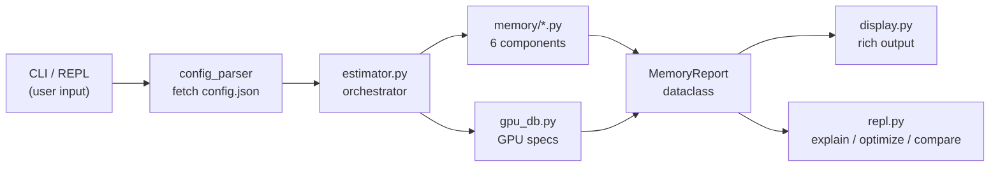

# `fitcheck` — Specification

> **PRD + Technical Design + Definition of Done — One Document**
>
> Version: 0.1.0 (MVP) · Author: Anas · Date: August 2026

---

## Section 1: Problem & Users

### The Pain Point

Every ML practitioner who fine-tunes LLMs has hit the same wall:

1. Pick a model, set training config (batch size, LoRA rank, sequence length, precision).
2. Launch training. Wait 2–5 minutes for the model to load.
3. **`CUDA OutOfMemoryError`.**
4. Guess a smaller config. Relaunch. Wait again. Repeat.

This trial-and-error loop wastes 10–30 minutes per attempt and provides **zero insight** into *why* it doesn't fit or *how close* you are. The information needed to answer "will it fit?" exists — it's pure math from the model's `config.json` — but nobody has packaged it into a tool that gives a precise, component-level breakdown with actionable advice.

### Target Users

| Persona | What they need | How they use `fitcheck` |
|:---|:---|:---|
| **Solo GPU owner** (RTX 3090/4090) | Know if a QLoRA job fits before launching | `fitcheck <model> --gpu 4090 --lora-r 64 ...` |
| **Cloud ML engineer** (A100/H100) | Pick the cheapest instance that fits | `fitcheck <model> --gpu a100-40 ...` vs `--gpu a100-80` |
| **ML student / beginner** | Understand *where* GPU memory goes during training | Interactive REPL → `explain` command |
| **Framework developer** (Axolotl, Unsloth) | Pre-validate user configs before launching jobs | JSON output mode for CI/CD integration |
| **Inference deployer** (Ollama, vLLM) | Know if a model fits for serving | `fitcheck infer <model> --gpu 4090` — **v0.2**, see §2 |

### Why Existing Tools Don't Solve This

| Tool | Gap |
|:---|:---|
| `accelerate estimate-memory` | No LoRA/QLoRA. No activations, optimizer, gradients. Weights only. |
| HF Model Memory Calculator | Inference only. No training components. |
| LLM-Calc | Napkin math. No component breakdown. No LoRA. |
| vram.asmirnov.xyz | No GQA-aware formulas. No CLI. Limited architectures. |

**`fitcheck` fills every gap simultaneously:** component-level breakdown, LoRA/QLoRA-native, GQA-aware, architecture-specific (reads `config.json`), actionable advice, CLI-first, and two interaction modes (one-liner + interactive REPL).

---

## Section 2: Feature Scope

### MVP (v0.1 — Days 1–5)

| Feature | Priority | Notes |
|:---|:---:|:---|
| CLI with `click`: `fitcheck <model> [flags]` | P0 | Power-user one-liner mode |
| Interactive REPL: `fitcheck` (no args) | P0 | Commands: `model`, `gpu`, `memory`, `explain`, `optimize`, `compare`, `help`, `exit` |
| Fetch HuggingFace `config.json` via `huggingface_hub` | P0 | No weight download — config only |
| Compute all 6 memory components | P0 | Weights, LoRA, optimizer, gradients, activations, overhead |
| GPU database (hard-coded) | P0 | 22 entries — consumer, older/cloud, workstation, datacenter. Roster in §3.4 |
| Rich terminal output | P0 | Colored table, pass/fail verdict, headroom %, max batch suggestion |
| Precision support: FP32, FP16, BF16, INT8, INT4 | P0 | |
| Optimizer support: AdamW, SGD, Adam8bit | P0 | |
| LoRA + QLoRA support | P0 | GQA-aware LoRA param counting |
| Read `intermediate_size` from config | P0 | Never assume `4h` |
| `--json` output for CI/CD | P0 | Machine-readable `MemoryReport` |
| `--explain` + savings hints | P0 | The "where did my VRAM go" teaching path |
| `pip install fitcheck-llm` | P0 | PyPI published on day 5 |
| Unit tests with `pytest` | P0 | ≥80% coverage on `memory/` modules |
| GitHub Actions CI | P0 | pytest on 3.10/3.11/3.12, coverage badge |

### Stretch — v0.2+ (Post-MVP)

| Feature | Phase | Notes |
|:---|:---:|:---|
| `fitcheck infer <model>` — inference mode | 1.5 | KV cache math, concurrent request estimation |
| `fitcheck advise` — config advisor | 2 | Pareto sweep of (batch_size, lora_r, seq_len) |
| Calibration mode | 3 | 1 real forward pass → correction factor |
| HuggingFace Gradio Space | 3 | Web UI for non-CLI users |
| Cost estimator (RunPod/Lambda pricing) | 3 | |
| ZeRO / FSDP sharding | 4 | Multi-GPU memory modeling |
| Axolotl/Unsloth YAML integration | 4 | Read their config, output estimate |

---

## Section 3: Technical Design

### 3.1 — The 6 Memory Components and Their Formulas

All formulas are derived from first principles. The master equation:

$$\boxed{\text{Peak VRAM} = W_{base} + W_{lora} + S_{optim} + G_{grad} + A_{act} + C_{overhead}}$$

---

#### Component 1: Base Model Weights ($W_{base}$)

$$W_{base} = P \times \text{bytes\_per\_param} + Q_{overhead}$$

Where:
- $P$ = total parameter count (computed from `config.json`, not loaded)
- `bytes_per_param`: FP32→4, FP16/BF16→2, INT8→1, INT4→0.5
- For QLoRA (NF4 4-bit): bytes_per_param=0.5 bytes (4 bits = 0.5 bytes).
- $Q_{overhead}$ = quantization scale overhead (QLoRA only)

**QLoRA quantization overhead:**

$$Q_{overhead} = P \times \frac{2}{B_q} \text{ bytes}$$

Where $B_q$ = quantization block size (default 64). One FP16 scale per block → 2 bytes per 64 weights = 0.03125 bytes/param.

Double Quantization **quantizes the quantization constants themselves**:

1. The first-level scales $c_1$ (one per block of 64 weights) are quantized from **FP16 (16 bits)** down to
   **8-bit integers**. Note: 8-bit *quantized ints*, not FP8 — the format is an int8 codebook, not a float type.
2. A second-level scale $c_2$ in **FP32 (32 bits)** is added once every **256 blocks**.

$$ \text{Overhead}^{DQ} = \frac{8\text{ bits}}{64} + \frac{32\text{ bits}}{64 \times 256} = 0.125 + 0.00195 \approx \mathbf{0.127}\text{ bits/param} \approx \mathbf{0.0158}\text{ bytes/param} $$

Against the single-quantization $0.03125$ bytes/param that is a factor of $0.5078$, so the implementation
applies the simpler **$Q_{overhead} \times 0.5$**. That shortcut understates the double-quant overhead by
1.5% *of that term* — **1.9 MiB** on an 8B model, or 0.05% of $W_{base}$. Far inside the ±10% target.

> **Known simplification — scale dtype.** fitcheck models the first-level NF4 scales as **FP16**
> (2 bytes per block of 64). `bitsandbytes` keeps `absmax` in **FP32** when double quantization is off —
> which is where the QLoRA paper's 0.5 bits/param figure comes from — costing $P \times \frac{4}{64}$ =
> 0.0625 bytes/param, or **479 MiB** instead of 239 MiB on an 8B base. The DQ arithmetic above is
> internally consistent against its own FP16 baseline, so v0.1 keeps FP16 and the golden number set
> unchanged. This is the **first formula to revisit** if the Llama-3.1-8B row of the validation matrix
> measures high (TASKS 6.3) — and it errs low, which is the unsafe direction for an OOM tool.

**Parameter counting from config** (no weight download):

$$P = V h + L \left[P_{attn} + 3h \cdot d_{ff} + 2h\right] + h + V h \cdot \mathbb{1}[\text{untied}]$$

Where $V$ = vocab size, $h$ = hidden size, $L$ = layers, and $d_k$ = head dimension — **read from
config, never assumed to be $h/n_h$** (§3.3). The $2h$ is the two per-layer RMSNorms; the lone $+h$ is
the single final norm. Both are rounding error in MiB and neither is optional: they are the difference
between reproducing $P = 8{,}030{,}261{,}248$ and missing it, and `test_end_to_end.py` asserts that
integer exactly.

#### **Attention parameters ($P_{attn}$) depend on the attention type:**

| Attention Type                    | When               | $P_{attn}$                         |
| :-------------------------------- | :----------------- | :--------------------------------- |
| **MHA** (Multi-Head Attention)    | $n_{kv} = n_h$     | $4h^2$                             |
| **GQA** (Grouped Query Attention) | $1 < n_{kv} < n_h$ | $2h^2 + 2h \cdot n_{kv} \cdot d_k$ |
| **MQA** (Multi-Query Attention)   | $n_{kv} = 1$       | $2h^2 + 2h \cdot d_k$              |

General formula (works for all 3): $P_{attn} = 2h \cdot n_h \cdot d_k + 2h \cdot n_{kv} \cdot d_k$

> For MHA: $n_{kv} = n_h$ → $n_{kv} \cdot d_k = h$ → $2h^2 + 2h^2 = 4h^2$ ✓
>
> The `q`/`o` term is written $2h \cdot n_h \cdot d_k$ rather than $2h^2$ because $n_h \cdot d_k = h$ is an
> *observed regularity of Llama-shaped models*, not an invariant. Gemma-2-9B breaks it:
> $16 \times 256 = 4096$ against $h = 3584$. The two forms are identical for Llama, Mistral and Qwen;
> only the general one is also right for Gemma.

**Implementation:** `memory/weights.py` — single function `estimate_weight_memory(num_params, precision, quantization_config)`. It takes the scalar param count, not the whole `ModelConfig`: counting parameters is `config_parser`'s job, and keeping the boundary there makes the function trivially testable with a bare integer.

---

#### Component 2: LoRA Adapter Weights ($W_{lora}$)
$$W_{lora} = L \times r \times \gamma \times \sum_{t \in \text{targets}} \left(d_{in}^{(t)} + d_{out}^{(t)}\right)$$

$\gamma = \texttt{precision\_to\_bytes(precision)}$ — adapters are trainable, so they follow the **compute**
dtype, never the base model's `quantization`. QLoRA's adapters are BF16 on top of an NF4 base.
For GQA targets, $d_{out}^{(k)} = d_{out}^{(v)} = n_{kv} \cdot d_k$, not $h$.

**Implementation:** `memory/lora.py` — function `estimate_lora_memory(config, rank, targets, precision)`.

---

#### Component 3: Optimizer States ($S_{optim}$)

$$S_{optim} = P_{trainable} \times \beta_{optim}$$

| Optimizer           | $\beta_{optim}$ (bytes/param) |
| :------------------ | :---------------------------: |
| AdamW (FP32 states) |               8               |
| AdamW (BF16 states) |               4               |
| AdamW 8-bit         |               2               |
| SGD + momentum      |               4               |
| SGD (no momentum)   |               0               |

**Subtlety — full fine-tuning master copy:** Add $P_{trainable} \times 4$ bytes for the FP32 master weight
copy **only when full fine-tuning in mixed precision** — that is, when `is_lora` is false *and*
`precision != "fp32"`:

$$S_{optim} = P_{trainable} \times \left(\beta_{optim} + 4 \cdot \mathbb{1}[\text{not LoRA}] \cdot \mathbb{1}[\text{precision} \ne \text{fp32}]\right)$$

A master weight is the FP32 shadow of a parameter stored in lower precision. Under `--precision fp32` the
parameters *are* FP32, there is nothing to shadow, and $W_{base}$ has already paid those 4 bytes/param —
adding the copy there double-counts. The two correct paths must agree at **16 bytes/param** for full FT with
AdamW, which is the invariant to test:

| precision | $W_{base}$ | $G_{grad}$ | $\beta_{optim}$ | master copy | total |
|:---|--:|--:|--:|--:|--:|
| bf16 / fp16 (mixed) | 2 | 2 | 8 | **+4** | **16** |
| fp32 | 4 | 4 | 8 | **+0** | **16** |

On Llama-3.1-8B, billing the copy unconditionally over-reports `--no-lora --precision fp32` by
$8{,}030{,}261{,}248 \times 4$ B = **30,633 MiB**, which is enough to flip a fits/doesn't-fit verdict on any card.

The condition is keyed on **precision, not optimizer** — master weights predate Adam and apply to
mixed-precision SGD too. Do not overload `optimizer_dtype`, which is the state dtype and an independent axis.

> **Known simplification:** pure-BF16 training with BF16 states and no master copy (stochastic-rounding
> setups) is over-counted by this rule. Rare, and the error is conservative. Not modeled in v0.1.

**Implementation:** `memory/optimizer.py` — function
`estimate_optimizer_memory(trainable_params, optimizer, is_lora, optimizer_dtype, precision)`.

---

#### Component 4: Gradients ($G_{grad}$)

$$G_{grad} = P_{trainable} \times \gamma \qquad \gamma = \texttt{precision\_to\_bytes(precision)}$$

| Precision   | Bytes per param |
| :---------- | :-------------: |
| FP32        |        4        |
| FP16 / BF16 |        2        |

A `.grad` tensor matches its parameter in shape and dtype, so gradients scale with the **compute**
precision — 2 bytes is the BF16 case, not a constant. Under `--precision fp32` this term doubles.

Gradient accumulation does **not** increase this — gradients are accumulated in-place into the same
tensor. `grad_accum_steps` must not appear in this formula.

**Implementation:** `memory/gradients.py` — function `estimate_gradient_memory(trainable_params, precision)`.

---

#### Component 5: Activations ($A_{act}$) — The Hard One

**The saved-tensor table is the derivation.** Every term in the formula below traces to exactly one row here.
Let $\gamma$ = `bytes_per_activation` (2 for BF16/FP16, 4 for FP32).

| # | Saved tensor | Shape | Size | Why autograd keeps it |
|:--|:---|:---|:---|:---|
| 1 | Layer input (pre-attn-norm input) | $(b,s,h)$ | $\gamma bsh$ | RMSNorm backward needs its input |
| 2 | Attn-norm output | $(b,s,h)$ | $\gamma bsh$ | Input to `q/k/v_proj` — one tensor, three Linears |
| 3 | Q (post-RoPE) | $(b,n_h,s,d_k)$ | $\gamma bs \cdot n_h d_k$ | Saved by attention backward |
| 4 | Attention output | $(b,s,n_h d_k)$ | $\gamma bs \cdot n_h d_k$ | Attention's `out` **and** `o_proj`'s input (same storage) |
| 5 | Post-attn residual sum | $(b,s,h)$ | $\gamma bsh$ | MLP-norm backward needs its input |
| 6 | MLP-norm output | $(b,s,h)$ | $\gamma bsh$ | Input to `gate_proj` and `up_proj` |
| | **subtotal** | | $\mathbf{\gamma bs(4h + 2n_h d_k)}$ | $= \gamma bs \cdot 6h$ when $n_h d_k = h$ |
| 7 | K (post-RoPE) | $(b,n_{kv},s,d_k)$ | $\gamma bsh \cdot \frac{n_{kv}}{n_h}$ | **Reduced by GQA** |
| 8 | V | $(b,n_{kv},s,d_k)$ | $\gamma bsh \cdot \frac{n_{kv}}{n_h}$ | **Reduced by GQA** |
| 9 | Attention score matrix | $(b,n_h,s,s)$ | $9\gamma bn_hs^2$ | **Removed by Flash Attention.** Nine copies, not one — see below |
| 10 | Gate proj output | $(b,s,d_{ff})$ | $\gamma bs \cdot d_{ff}$ | SiLU backward |
| 11 | Up proj output | $(b,s,d_{ff})$ | $\gamma bs \cdot d_{ff}$ | Element-wise multiply backward |
| 12 | Down proj input | $(b,s,d_{ff})$ | $\gamma bs \cdot d_{ff}$ | `down_proj` backward |

**Not saved** — and this is the instructive part: pre-RoPE Q/K (RoPE backward needs only `cos`/`sin`, so the
pre-rotation tensors are freed), `o_proj`'s *output* (a Linear's backward needs its input, not its output),
and the residual additions themselves (addition's backward is the identity — it stores nothing). Flash
Attention's `logsumexp` is $(b,n_h,s)$ in FP32 — real, but negligible next to the rest.

**Per-layer activation memory:**

$$A_{layer} = \gamma bs\left[6h + 2h \cdot \frac{n_{kv}}{n_h} + 3 \cdot d_{ff}\right] + 9\gamma bn_hs^2 \cdot \mathbb{1}[\text{no Flash Attn}]$$

**The $9\gamma$ on the score matrix.** Eager attention materializes the $(b,n_h,s,s)$ tensor about nine
times at the compute dtype across forward and backward, not once. Forward: the raw scores, the masked
copy, the FP32 softmax (which costs $2\gamma$), and the cast back — five. Backward: grad w.r.t. the
softmax output, the FP32 softmax backward ($2\gamma$), and grad w.r.t. the scores — four. Measured by
differencing eager against SDPA's memory-efficient kernel, which never builds the tensor: at
$b{=}2,\ s{=}2048$ TinyLlama's score matrix cost **2,758 MiB** where $\gamma bn_hs^2$ predicts 512.

**Exact bracket (implement this one).** Rows 1, 2, 5, 6 are $(b,s,h)$; rows 3 and 4 are $(b,s,n_hd_k)$;
rows 7 and 8 are $(b,s,n_{kv}d_k)$. Written without the Llama-shaped assumption:

$$\text{bracket} = 4h + 2\,n_h d_k + 2\,n_{kv} d_k + 3\,d_{ff}$$

Substituting $n_h d_k = h$ gives $4h + 2h + 2h\frac{n_{kv}}{n_h} + 3d_{ff}$ — the headline form, exactly.
The two are the same number for every model where $n_h d_k = h$ (Llama, Mistral, Qwen), so **the Appendix
is unaffected**; only the exact form is also right for Gemma-2. Keep the $6h$ form in prose — it is the
memorable one, and the $6$ is the fact people get wrong — and ship the exact one in code.

**Total activation memory.** Under checkpointing the peak is **not** a sum. Only the checkpoints stay
resident for the whole backward; the LM-head hump $A_{logits}$ and one layer's recompute $A_{layer}$ are
both transient and never overlap, so the peak takes whichever is larger:

$$A_{act} = \begin{cases} L \times A_{layer} + A_{logits} & \text{no gradient checkpointing} \\ 2L\gamma bsh + \max(A_{logits},\ A_{layer}) & \text{gradient checkpointing (every layer)} \end{cases}$$

| Flash Attn | Grad Checkpoint | $A_{act}$                                                |
| ---------- | --------------- | -------------------------------------------------------- |
| off        | off             | `L × A_layer + A_logits` (with the s² term active)       |
| off        | on              | `2Lγbsh + max(A_logits, A_layer)` (s² term active)       |
| on         | off             | `L × A_layer + A_logits` (s² term zeroed)                |
| on         | on              | `2Lγbsh + max(A_logits, A_layer)` (s² term zeroed)       |

**Why $2L\gamma bsh$ and not $L\gamma bsh$.** Non-reentrant checkpointing (`use_reentrant=False`, which is
what `transformers` uses) retains two $(b,s,h)$ tensors per boundary: the layer input it saved, and the
recomputed output the autograd graph holds. Measured across 20 T4 runs — a multiplier of **1** gives 10.4%
worst-case error and **3** gives 9.8%, against **4.8%** for **2**.

> **Consequence worth knowing.** For a large-vocabulary model under checkpointing the LM-head hump usually
> wins the $\max$, and then **Flash Attention does not reduce peak memory at all** — for the golden
> Llama-3.1-8B config it saves exactly 0 MiB. Measured: SmolLM2 eager vs SDPA differed by 16 MiB out of
> 5,297. Flash only starts paying once the sequence is long enough for $A_{layer}$ to overtake $A_{logits}$.

**Critical implementation details:**

1. **Flash Attention** removes the $O(s^2)$ -> $\gamma bn_hs²$ attention matrix term — two code paths required.
2. **$d_{ff}$** must be read from `intermediate_size` in `config.json`. Never assume `4h`. Error range: 10–30%.
3. **$b$** is the micro-batch size, not effective batch. Gradient accumulation doesn't increase memory.
4. **Gradient checkpointing** uses the practical default (checkpoint every layer), storing $2L$ hidden-state tensors, plus whichever of $A_{logits}$ and one layer's full activations is larger — a max, not a sum.
5. **$\gamma$ is derived from the compute precision**, never hardcoded to 2. Under `--precision fp32` every row in the table doubles.
6. **$d_k$ comes from `config.json`**, not from $h/n_h$ (§3.3). Rows 3–4 scale with $n_h d_k$ and rows 7–8 with $n_{kv} d_k$; these equal $h$ and $h\frac{n_{kv}}{n_h}$ only when $n_h d_k = h$.

**Implementation:** `memory/activations.py` — function `estimate_activation_memory(config, batch_size, seq_len, grad_checkpoint, flash_attn, precision)`.

---

#### Component 6: CUDA Overhead ($C_{overhead}$)

$$C_{overhead} \approx 500\text{ MiB} + 0.05 \times (W_{base} + A_{act})$$

Covers: CUDA context (~300-800 MiB), cuDNN/cuBLAS workspace, PyTorch caching allocator fragmentation.

> **On the deliberate overlap with `usable_mib`.** `GpuSpec.usable_mib` already discounts what the driver and
> display reserve before your process starts (4090: 24,576 → 23,500), while $C_{overhead}$ covers what
> PyTorch's own runtime adds on top — CUDA context, allocator fragmentation, cuBLAS workspace. The two
> allowances overlap by a few hundred MiB, so `fitcheck` biases its estimate high **on purpose**: for a tool
> whose entire job is avoiding OOM, a false "fits" is far more costly to the user than a false "doesn't fit".
> Do not "fix" this by removing one of them.

> **Measured status: this is the least accurate component, by a wide margin.** Across the ten runs in
> §3.8 the tensors tier (which excludes $C_{overhead}$) lands within 3.4%, while the allocator and
> process tiers — identical except that they include it — reach 20.2% and 14.7%. All of the remaining
> error is here. The specific failure is the 5% fragmentation fraction: measured
> `reserved - allocated` ran from 6% to 32% of the total, and it is consistently larger under eager
> attention, because the transient score matrices churn the allocator pool. The 500 MiB context
> constant is also generous — the T4 measured 141 MiB at peak. The two errors partly cancel, which is
> why the process tier scores better than the allocator tier. A fragmentation model that keys off the
> attention kernel is the obvious next improvement; it is not in the code yet.

**Implementation:** `memory/overhead.py` — function `estimate_overhead(weight_memory, activation_memory)`.

---

#### Component 7: Inference Serving ($M_{infer}$) — v0.2, not part of the training equation

Serving keeps nothing for a backward pass: no optimizer states, no gradients, no saved
activations. What is left is the resident weights plus one KV cache entry per layer, per
concurrent request:

$$M_{infer} = W_{base} + \text{KV}, \qquad \text{KV} = 2 \times L \times n_{kv} \times d_k \times s \times n_{concurrent} \times \gamma$$

**Critical implementation details:**

1. **The leading 2 is K and V — once each, not twice.** It counts the pair, not a per-tensor factor.
2. **$n_{concurrent}$ is the batch dimension of the cache** and belongs in the formula, not just in the
   signature. $s$ is the context one request holds; $n_{concurrent}$ is how many are in flight. The two
   are interchangeable multipliers: 4 requests × 2048 tokens costs exactly what 1 × 8192 costs.
3. **$n_{kv} d_k$, never $h$.** Under GQA the cache is $n_{kv}/n_h$ of the MHA size — a quarter for
   Llama-3.1-8B. Reading $h$ here over-counts by 4×, and $d_k$ comes from `config.json` (§3.3).
4. **`precision` is the serving dtype, applied to the weights and the cache alike.** A
   quantized-weights / fp16-cache deployment (bitsandbytes, AWQ, GPTQ) is **not modelled** — it needs
   a separate compute-dtype axis, the same split the training path draws between `precision` and
   `quantization`. Likewise absent: the NF4 scale overhead and the unquantized embedding/LM-head slice.
5. **$C_{overhead}$ is not included.** This is the model-side number; the caller adds Component 6
   before rendering a fits/doesn't-fit verdict, exactly as `estimator.py` does for training.
6. **PagedAttention / vLLM block allocation is not modelled.** The formula assumes every request holds
   its full $s$ tokens of cache. A real vLLM deployment allocates in blocks as generation proceeds, so
   this is a worst-case ceiling for a serving engine that pre-reserves, and an over-estimate otherwise.

Reference (Llama-3.1-8B, fp16, $s$ = 2048, 1 request): $W_{base}$ = 15,316.51 MiB, KV = 256.00 MiB,
$M_{infer}$ = **15,572.51 MiB**. The cache is 0.125 MiB per token.

**Implementation:** `memory/inference.py` — function
`estimate_inference_memory(config, precision, seq_len, num_concurrent)`.

> **Not derived from Components 1–6 and not folded into them.** The master equation is the training
> equation. Inference is a separate entry point (`fitcheck infer`, task 6.5); `estimator.py` does not
> call this, and `MemoryReport` does not carry it.

---

### 3.2 — Module / File Structure and Data Flow

```
fitcheck/
├── __init__.py              # version, public API
├── __main__.py              # python -m fitcheck entry point
├── cli.py                   # click commands & option groups
├── repl.py                  # Interactive REPL (Mode B)
├── config_parser.py         # HuggingFace config.json → ModelConfig dataclass
├── estimator.py             # Orchestrator: calls all 6 components, returns MemoryReport
├── memory/
│   ├── __init__.py          # re-exports all estimate_* functions
│   ├── weights.py           # Component 1
│   ├── lora.py              # Component 2
│   ├── optimizer.py         # Component 3
│   ├── gradients.py         # Component 4
│   ├── activations.py       # Component 5
│   ├── overhead.py          # Component 6
│   └── inference.py         # Component 7 — serving (v0.2), not in the training equation
├── gpu_db.py                # GPU name → GpuSpec(name, vram_mib, usable_mib)
├── display.py               # rich tables, panels, verdicts, explain text
├── advisor.py               # Phase 2: parameter sweep (stub in MVP)
├── calibrate.py             # Phase 3: real measurement (stub in MVP)
└── utils.py                 # bytes↔MiB, precision→bytes lookup
tests/
├── conftest.py              # shared fixtures (Llama, Mistral, Qwen configs)
├── test_config_parser.py
├── test_gpu_db.py
├── test_weights.py
├── test_lora.py
├── test_optimizer.py
├── test_gradients.py
├── test_activations.py
├── test_overhead.py
├── test_inference.py
└── test_end_to_end.py       # full pipeline: config → report → verdict
scripts/                     # NOT part of the installed package
├── measure.py               # ground-truth harness (§3.8) — imports torch/peft/bitsandbytes
└── requirements-measure.txt # its deps, deliberately separate from pyproject.toml
```

> **The dependency runs one way.** `scripts/measure.py` imports `fitcheck`; `fitcheck` never imports
> `torch`, `peft` or `bitsandbytes` — not lazily, not inside a `try`. An estimate must cost a few KB
> of `config.json` and no GPU, and that is the constraint the whole product rests on.

**Data flow:**



**Key dataclasses:**

```python
@dataclass
class ModelConfig:
    name: str
    num_params: int
    hidden_size: int
    num_layers: int
    num_attention_heads: int
    num_kv_heads: int
    intermediate_size: int
    vocab_size: int
    head_dim: int
    tie_word_embeddings: bool

@dataclass
class TrainingConfig:
    precision: str          # COMPUTE dtype: "fp32" | "fp16" | "bf16"
                            #   drives LoRA weights, gradients, and activations (γ)
    quantization: str       # BASE MODEL storage: "none" | "nf4" | "int8"
    double_quant: bool      # NF4 double quantization
    optimizer: str          # "adamw" | "adam8bit" | "sgd" | "sgd-momentum"
    optimizer_dtype: str    # AdamW state dtype: "fp32" | "bf16"
    batch_size: int         # MICRO-batch
    seq_len: int
    lora_rank: int | None   # None => full fine-tuning
    lora_targets: list[str]
    grad_checkpoint: bool
    flash_attn: bool
    grad_accum_steps: int

@dataclass
class MemoryReport:
    weight_mib: float
    lora_mib: float
    optimizer_mib: float
    gradient_mib: float
    activation_mib: float
    overhead_mib: float
    total_mib: float
    gpu_capacity_mib: float
    headroom_mib: float
    fits: bool
    max_batch_size: int
    effective_batch_size: int    # batch_size × grad_accum_steps — DISPLAY ONLY, costs no memory
    savings_hints: list[str]     # see §3.5 --explain
```

> **`precision` is the compute dtype only.** Base-model storage precision is a separate axis
> (`quantization`), because they genuinely vary independently: QLoRA is a 4-bit base with BF16 compute.
> Collapsing them into one flag leaves the activation and gradient dtype undefined whenever the base is
> quantized, and silently under-counts activations by 2× under FP32.

---

### 3.3 — How Config Fetching Works (No Weight Download)

```python
from huggingface_hub import hf_hub_download
import json

def fetch_model_config(model_id: str) -> ModelConfig:
    path = hf_hub_download(repo_id=model_id, filename="config.json")
    with open(path) as f:
        raw = json.load(f)

    return ModelConfig(
        name=model_id.split("/")[-1],
        num_params=_count_params(raw),   # computed, not from a field
        hidden_size=raw["hidden_size"],
        num_layers=raw["num_hidden_layers"],
        num_attention_heads=raw["num_attention_heads"],
        num_kv_heads=raw.get("num_key_value_heads", raw["num_attention_heads"]),
        intermediate_size=raw["intermediate_size"],
        vocab_size=raw["vocab_size"],
        # explicit field wins; h // n_h is only the fallback
        head_dim=raw.get("head_dim") or raw["hidden_size"] // raw["num_attention_heads"],
        # absent ≠ untied — see below
        tie_word_embeddings=_tie_word_embeddings(raw),   # model_type lookup, False if unknown
    )
```

This downloads only `config.json` (~2KB), never the model weights (~4–140GB).

**Two fields that are not what they look like.** Both are silent, both are wrong on the same model
family, and Gemma-2-9B is a row in the validation matrix:

| Field | Naïve rule | Why it breaks | Correct rule |
|:---|:---|:---|:---|
| `head_dim` | $h / n_h$ | Gemma-2-9B declares `head_dim: 256` against $3584/16 = 224$; Gemma-2-27B declares `128` against $4608/32 = 144$ | Use the field when present; fall back to $h/n_h$ |
| `tie_word_embeddings` | absent → `False` | Gemma-2 omits the key **and** ties. Defaulting to untied counts a $256000 \times 3584$ embedding twice | Per-architecture default table, `False` for unknown `model_type` |

Getting both wrong compounds: Gemma-2-9B comes out at **9.93B** parameters against a true **9.24B** —
a 7.5% over-count, ≈1.3 GiB of phantom BF16 weights, on a model the README promises to validate.

Two consequences worth stating outright:

- **Divisibility is a rule about the fallback, not about the model.** Rejecting a config because
  $h \bmod n_h \ne 0$ is only valid when $d_k$ is being derived. A config that declares `head_dim`
  is free to violate it, and must be accepted.
- **`False` for an unknown `model_type` is a deliberate divergence from `transformers`,** whose own
  `PretrainedConfig` default is `True`. Assuming untied over-counts the embedding, and for a tool
  whose job is avoiding OOM, over-counting is the direction that costs the user nothing. Known
  tying families are listed explicitly so the conservative default only ever applies to
  architectures fitcheck has not seen.

---

### 3.4 — GPU Database Design

Hard-coded in v0.1. User-extensible in v0.3+.

The database ships 22 entries. `gpu_db.py` is the authority; this is the current roster:

| Class | Keys |
|:---|:---|
| Consumer | `3060-12`, `4070ti`, `5070`, `5070ti`, `5080`, `3090`, `4090`, `5090` |
| Older / cloud | `t4`, `v100-16`, `l4`, `a10` |
| Workstation | `a6000`, `rtx6000-ada`, `l40`, `l40s` |
| Datacenter | `a100-40`, `a100-80`, `h100`, `h100-80`, `h200`, `b200` |

`h100` and `h100-80` are intentional aliases for the same card — users reach for both spellings.
`--list-gpus` prints this table at runtime, and `--vram-mib N` synthesizes a `GpuSpec` for anything unlisted
(usable defaults to 95% of the value given).

> [!WARNING]
> **The T4 entry is known to be wrong, and wrong in the dangerous direction.** `gpu_db.py` lists the
> Tesla T4 as `vram_mib=16_384, usable_mib=15_360`, but the card in every measurement reports
> **14,912 MiB total** to `torch.cuda.get_device_properties()` — so the *usable* figure exceeds the
> card's entire capacity by 448 MiB. The cause is treating a vendor “16 GB” as 16 GiB; a T4 is 16 GB
> = 15,258 MiB, and less again with ECC on. This is exactly the MiB/MB confusion the units rule at the
> end of this document warns about, and it can produce a false “fits”. Every ECC datacenter entry
> (T4, V100, A100, H100, H200, B200) needs the same audit before it is trusted.

**Usable vs. advertised:** Usable ≈ advertised × 0.91–0.97 (CUDA context, driver overhead, display if desktop
GPU). This is a rough per-card allowance, not a fixed formula — older/consumer cards (T4, V100, L4, RTX
30/40/50-series) sit lower in the range (as low as ~0.91–0.94), while newer datacenter cards without a display
attached sit at the top (~0.96–0.97, e.g. A100, H100, H200, B200). `GPU_DB` values are current estimates, not
measured constants — treat any entry as approximate until benchmarked.

---

### 3.5 — CLI Interface Design

#### Mode A: One-Liner (Power User)

```
fitcheck <model_id> [OPTIONS]

Arguments:
  MODEL_ID               HuggingFace model ID (e.g., meta-llama/Llama-3.1-8B)

Model / quantization:
  --quant TEXT           none|nf4|int8 — BASE MODEL storage (default: none)
  --double-quant         NF4 double quantization (halves scale overhead)
  --qlora                Shorthand: --quant nf4 --precision bf16 --grad-checkpoint

Training Options:
  --precision TEXT       fp32|fp16|bf16 — COMPUTE dtype: LoRA weights,
                         gradients, activations (default: bf16)
  --lora-r INT           LoRA rank (default: 16)
  --no-lora              Full fine-tuning (all params trainable)
  --lora-targets TEXT    Comma-separated modules, or a preset:
                         minimal (q,v) | standard (q,k,v,o) | full (+gate,up,down)
                         (default: standard)
  --batch-size INT       MICRO-batch size (default: 1)
  --grad-accum INT       Accumulation steps — display only, costs no memory (default: 1)
  --seq-len INT          Sequence length (default: 2048)
  --optimizer TEXT       adamw|adam8bit|sgd|sgd-momentum (default: adamw)
  --optimizer-dtype TEXT fp32|bf16 — AdamW state dtype (default: fp32)
  --grad-checkpoint      Enable gradient checkpointing
  --flash-attn           Enable Flash Attention

GPU Options:
  --gpu TEXT             GPU name from database (default: 4090)
  --vram-mib INT         VRAM override for a GPU not in the database
  --list-gpus            Print the GPU database and exit

Output Options:
  --json                 Output as JSON (for CI/CD) — schema below
  --no-color             Disable colored output
  --verbose              Show per-layer breakdown
  --explain              Plain-English breakdown + savings hints
  -V, --version          Print the installed fitcheck version and exit
```

#### `--json` output contract

The machine-readable surface is a **published contract**, not a dump of whatever `MemoryReport`
happens to hold — the framework-developer persona in §1 gates CI on it. Top-level keys:

| Key | Type | Contents |
|:---|:---|:---|
| `fitcheck_version` | `str` | Installed package version — pin CI assertions against it |
| `model` | `object` | `ModelConfig` fields verbatim (incl. the derived `num_params`) |
| `gpu` | `object` | `GpuSpec`: `name`, `vram_mib`, `usable_mib` |
| `training` | `object` | `TrainingConfig` as resolved — after `--qlora` expansion and preset lookup |
| `trainable_params` | `int` | LoRA param count, or `num_params` under `--no-lora` |
| `memory_mib` | `object` | `weights`, `lora`, `optimizer`, `gradients`, `activations`, `overhead`, `total` |
| `activations_per_layer_mib` | `float` | $A_{layer}$ — the per-layer figure `--verbose` renders |
| `verdict` | `object` | `fits`, `gpu_capacity_mib`, `headroom_mib`, `headroom_pct`, `max_batch_size`, `effective_batch_size` |
| `savings_hints` | `list[str]` | The §3.5 hint lines, unformatted |

Every `*_mib` value is a float rounded to 2 dp; `fits` and `max_batch_size` are the two fields a CI
job should actually branch on. Keys may be **added** in a minor version, never renamed or removed.

**Exit codes (Mode A):** `0` the config fits · `1` it does not fit · `2` the estimate could not be run
(bad flags, unknown GPU, unreachable config). A CI job can therefore gate on the exit status alone and
never parse the JSON. The REPL is the exception and **always exits 0** — inside a session a
doesn't-fit is a verdict on screen, not the status of the shell you came from.

**Validation:** reject `--quant nf4 --no-lora` — **a `fitcheck` scope limitation, not a universal claim.**
Quantized models *can* be trained (QAT, and quantized-training methods that keep master weights or
straight-through estimators); `fitcheck` simply does not model those memory profiles. Its quantized path
assumes the base stays frozen while only adapters train, which is what the $W_{base}$ and $S_{optim}$
formulas are derived for. Error messages must say "not modelled", never "not possible". Reject
`--optimizer-dtype` with a non-AdamW optimizer. `--qlora` sets defaults, so an explicit later flag wins.

#### `--explain` output contract

`--explain` must name the largest component and say *why*, then price each toggle by re-running the estimator
with that one flag flipped — no new math, just a second call:

```
Largest component: activations (20,128 MiB, 66%) — 16,032 MiB of that is four FP32
copies of the (b, s, V) logits tensor, which a 128k vocabulary makes enormous.

  adamw -> adam8bit ......... saves    312 MiB
  --flash-attn OFF .......... costs      0 MiB   (currently ON)
  --grad-checkpoint OFF ..... costs +32,256 MiB  (currently ON)
  --grad-accum 8 ............ costs      0 MiB   (accumulation is free)
```

Each figure is a **total-memory delta**, not a single-component delta — flipping gradient checkpointing off
adds the layer activations *plus* the 5% of that which $C_{overhead}$ picks up. Compute every hint as the
difference of two full `estimate()` calls; never by summing component deltas by hand.

Two lines here are load-bearing. "Gradient accumulation costs memory" is the single most common
misconception this tool can correct, and a hard `0 MiB` corrects it faster than a paragraph. The
Flash Attention line is the second: at this shape it really does save **nothing**, because the LM-head
hump wins the $\max$ in $A_{act}$ either way. A hint that promised a saving here would be wrong.

> [!NOTE]
> **The largest component is computed, never assumed.** This has now been wrong in both directions.
> Earlier drafts named activations as the leader; the v0.1.1 numbers made it the NF4 base (4,068 MiB
> against 3,136 of activations); and with the corrected $A_{act}$ it is activations again, by a wide
> margin. Rank the components from the report and never hard-code the answer.

#### Mode B: Interactive REPL

```
fitcheck                    # no MODEL_ID → enters REPL
fitcheck --qlora --gpu 4090 # flags without a MODEL_ID seed the session

Commands:
  model <model_id>          Load a model config from HuggingFace
  gpu <name> [--vram-mib N] Set target GPU
  memory [OPTIONS]          Compute memory breakdown (same flags as CLI mode)
  explain                   Explain the last memory result in plain English
  optimize                  Suggest best config for current model + GPU
  compare <gpu> [<gpu> ...] Compare the current config across other GPUs
  show                      Current model, GPU, flags, and last estimate
  reset                     Training flags back to defaults
  gpus                      Print the GPU database
  help                      Show available commands
  exit / quit               Exit the REPL

Aliases: mem, q, ?, h, config/state, list-gpus.
```

**Mode selection is the presence of `MODEL_ID`, not the absence of flags.** `cli.main` takes `MODEL_ID` as
an optional argument; when it is missing, `main` builds the `TrainingConfig` exactly as it would for a
one-liner and hands it to `run_repl(console, training=..., gpu=...)`. Three consequences:

- **Estimate flags seed the session.** `fitcheck --qlora --lora-r 64` then `model <id>` reaches the same
  state as entering the bare REPL and typing those flags at the `memory` prompt — the flags are sticky
  either way, so honoring them at entry is the only reading that is not silent data loss.
- **Only an explicit `--gpu` / `--vram-mib` presets the session GPU.** Mode A defaults to the 4090 when
  `--gpu` is absent; carrying that default in would set a session GPU the user never named, so the seeded
  session leaves it unset and `gpu <name>` is still required.
- **The output-only flags are a usage error without a `MODEL_ID`.** `--json`, `--verbose`, and `--explain`
  format one estimate; with no model there is nothing to format, and the error names `memory --json` etc.
  as the in-session equivalent. Validation (`--no-lora --quant nf4`, bad `--lora-targets`) runs before
  entry, so a contradictory line fails at the shell rather than three commands later.

The banner echoes any seeded GPU and flags. Seeded state that nothing shows is state the user has forgotten
by the third command. The REPL always exits 0 — a config that does not fit is a verdict inside the session,
not the session's exit status.

**REPL state:** The REPL maintains a session object holding the current `ModelConfig`, `GpuSpec`, the
training flags in force, and the last `MemoryReport`. Commands like `explain`, `optimize`, and `compare` read
from the last computed report — and compute one from the session's state if none exists yet, rather than
refusing. Only a missing model or GPU is a hard error ("Run `model <id>` and `gpu <name>` first").

**"Same flags as CLI mode" is enforced structurally, not by hand.** `repl.py` builds its `memory` command
from `cli.main.params` — the *same* `click.Option` objects — minus the four that make no sense in a session
(`MODEL_ID`, `--list-gpus`, `--no-color`, `--version`). A flag added to Mode A appears in Mode B for free, and
the two surfaces cannot drift.

**Flags are sticky.** `memory --qlora --lora-r 64 --batch-size 4 --seq-len 2048 --flash-attn` followed by
`memory --batch-size 8` re-uses everything else; retyping a fifteen-flag line to move one dial is what makes
people abandon a REPL. Only options the user actually typed are folded in (`ParameterSource.COMMANDLINE`),
and the report header echoes the config in force, so the state is never invisible. Consequences:

- Sticky booleans need an undo, so the REPL adds `--no-flash-attn`, `--no-grad-checkpoint`, and
  `--no-double-quant`; `reset` restores every default at once. An on/off pair on one line is an error.
- `--lora-r` or `--lora-targets` re-enables LoRA after `--no-lora` (naming a rank means you want adapters).
- `--quant none` silently clears a sticky `--double-quant` instead of failing on a flag set three lines ago.
- `--gpu` / `--vram-mib` override **one** estimate; only `gpu <name>` moves the session GPU.

**`compare` takes several GPUs** and leads with the insight: the peak is identical on every card, only the
ceiling moves. Columns are usable VRAM, headroom, % used, max micro-batch, and the verdict.

**`optimize` recommends, it does not just report the ceiling.** It suggests the largest power-of-two
micro-batch within ~75% of `max_batch_size`, plus the `--grad-accum` steps that restore an effective batch of
at least 16 (free, per Component 4) — and says why the ceiling itself is the wrong thing to run. When even
`batch_size=1` does not fit, it applies levers in ascending order of what they cost the user
(`--flash-attn` → `--grad-checkpoint` → `--quant nf4 --double-quant` → halve `--seq-len` →
`--optimizer adam8bit`), stopping at the first configuration that fits and printing the command to run. If
the ladder is exhausted it names the smallest card in the database that would hold the result.

---

### 3.6 — Key Architecture Decisions

| Decision | Rationale |
|:---|:---|
| **Static estimation (no GPU required)** | The whole point — predict before you spend money/time. Pure math from `config.json`. |
| **One formula per file** | Each `memory/*.py` module has one formula. Testable, debuggable, swappable independently. |
| **Read `config.json` not weights** | Downloads ~2KB vs. ~4–140GB. Works offline after first fetch. No GPU needed. |
| **Practical grad checkpointing** (every layer) | This is what HuggingFace `transformers` actually does, and it stores $2L\gamma bsh$ = 4,096 MiB for the golden config. The academic $\sqrt{L}$ formula models a *different* algorithm, so it does not describe the memory profile this tool predicts. Derivation: Blueprint Component 5. |
| **GQA-aware by default** | Most modern models use GQA. Ignoring it gives 20–25% error on LoRA and activation estimates. |
| **`click` not `argparse`** | Better UX: auto-generated help, option groups, composable commands. Standard for Python CLIs. |
| **`rich` for display** | Screenshot-worthy terminal output drives organic sharing. Tables, colors, panels, emojis. |
| **Separate REPL module** | Mode B has its own state machine. Cleaner than cramming it into `cli.py`. |

---

### 3.7 — Edge Cases and Known Limitations

| Edge Case | How `fitcheck` Handles It | Status |
|:---|:---|:---:|
| **MoE models** (Mixtral, DeepSeek) | Not supported in MVP. Active experts × per-expert FFN changes the activation formula. | ❌ v0.3 |
| **Models with tied embeddings** | Detected via `tie_word_embeddings` in config. Count embedding params once. | ✅ MVP |
| **Gated vs. non-gated FFN** | Detect `mlp_type` or presence of `gate_proj` in config. If `intermediate_size` is missing, fall back to `4h` and print a warning to the user that this is an approximation (can be 10–30% off — see Blueprint.md's note on `intermediate_size`). | ✅ MVP |
| **Non-standard `head_dim`** (Gemma-2/3) | `head_dim` read from config when present, $h/n_h$ only as fallback; the divisibility rule applies only when the value is derived. $P$ and LoRA dims are correct; activation rows 3–4 still assume $n_hd_k = h$ (TASKS 3.10). | ⚠️ partial |
| **`tie_word_embeddings` absent from config** | Architecture default table (Gemma family ties), `False` for unknown `model_type`. | ✅ MVP |
| **Custom attention patterns** (sliding window, local) | Not modeled. Treated as standard attention. Note Gemma-2 alternates sliding/full layers, so its non-Flash path is approximate even once the two rows above are fixed. | ❌ v0.3 |
| **FSDP / DeepSpeed ZeRO** | Not supported. Memory is split across GPUs — requires sharding-aware formulas. | ❌ v0.4 |
| **`torch.compile`** | Changes which tensors are saved (kernel fusion). Not modeled. | ❌ v0.4 |
| **Multi-GPU (tensor parallel)** | Not supported. Single-GPU estimation only. | ❌ v0.4 |
| **Very long sequences** ($s > 8192$) | The $9\gamma$ eager coefficient is measured at $s \le 2048$ only. It is the term that grows as $s^2$, so extrapolation error grows with it. | ⚠️ Known |
| **Gated linear units** (GLU variants: SiLU, GELU) | Treated uniformly — all save same intermediate shapes. | ✅ MVP |
| **Private / gated HF models** | `huggingface_hub` handles auth via `HF_TOKEN` env var. | ✅ MVP |
| **Offline mode** | If `config.json` is cached locally, works without internet. | ✅ MVP |
| **`C_overhead` fragmentation model** | Fixed 5% of $(W_{base}+A_{act})$. Measured fragmentation ranged 6%–32% and is larger under eager attention. This is where all the residual error sits (§3.8, Component 6). | ⚠️ Known |
| **T4 / ECC entries in `gpu_db`** | `usable_mib` for the T4 exceeds the card's real capacity (15,360 vs a measured 14,912). Vendor GB treated as GiB. Can cause a false “fits”. | ❌ Bug |
| **No-checkpointing branch** | `L × A_layer + A_logits` is derived, never measured — every ground-truth run so far has checkpointing on. | ⚠️ Unmeasured |
| **Non-T4 hardware, BF16, real Flash Attention** | All twenty measurements are one Tesla T4 (sm_75) in FP16. BF16 and FA2 need sm_80+; the flash path is validated only via SDPA's memory-efficient backend as a stand-in. | ⚠️ Unmeasured |
| **Unknown GPU** | Error message listing available GPUs. Flag to pass custom VRAM: `--vram-mib 24000`. | ✅ MVP |

---

### 3.8 — Ground Truth: how the numbers are checked (`scripts/measure.py`)

Everything above is arithmetic. This section is how we find out whether the arithmetic is *true*.
It is the part of the project that turned a plausible formula into a measured one, so it belongs in
the spec even though it ships no user-facing feature.

#### Why the harness lives outside the package

`scripts/measure.py` imports `torch`, `peft`, `transformers` and `bitsandbytes`. The `fitcheck`
package must never import any of them — that is the hard constraint the whole product rests on (an
estimate costs a few KB of `config.json` and no GPU). So the dependency runs **one way only**:

```
scripts/measure.py  ──imports──>  fitcheck        ✅
fitcheck            ──imports──>  torch           ❌ never
```

The harness is not a runtime dependency and is not installed by `pip install fitcheck-llm`. It runs
on a machine that *has* a GPU, and it prints a markdown row you paste into the README matrix.

#### What one run does

```bash
python scripts/measure.py <model_id> --qlora --precision fp16 --lora-r 32 \
       --batch-size 2 --seq-len 1024 --gpu t4
```

1. Ask `fitcheck` for a prediction (pure arithmetic, no GPU).
2. Load the real model with the real quantization config, apply real LoRA adapters.
3. Run `--warmup-steps` full training steps. **Warmup must be ≥ 1**: AdamW allocates its
   `exp_avg` / `exp_avg_sq` buffers lazily on the first `.step()`, so a zero-warmup peak would miss
   $S_{optim}$ entirely.
4. Reset the peak counters, run `--measure-steps` more steps, read the peaks.
5. Run one extra *instrumented* step that resets the counter between phases.
6. Print prediction vs measurement at three tiers, plus per-component spot-checks.

Step 5 happens **after** the headline peaks are read, so adding the instrumentation did not change
any number the harness had already reported.

#### The three tiers — and why comparing the wrong one is meaningless

PyTorch exposes two memory counters, and neither of them is "how much VRAM the process uses". Getting
this wrong makes a correct formula look broken and a broken one look correct.

| counter | what it counts | what it misses |
|:---|:---|:---|
| `max_memory_allocated()` | bytes in live tensors | the allocator's spare pool, the CUDA context |
| `max_memory_reserved()` | bytes the caching allocator holds from the driver | the CUDA context |
| `nvidia-smi` | everything the process holds | — |

So the harness compares like with like, three times:

| tier | predicted side | measured side | what it tests |
|:---|:---|:---|:---|
| **tensors** | six-component total **minus** $C_{overhead}$ | `max_memory_allocated()` | the five *physical* formulas |
| **allocator** | total minus the 500 MiB context constant | `max_memory_reserved()` | the formulas + the fragmentation model |
| **process** | the full `fitcheck` total | `max_memory_reserved()` + CUDA context | what a user actually sees |

The **tensors** tier is the one that grades the physics: it is deterministic, and it excludes
$C_{overhead}$, which is a heuristic rather than a derivation. The **process** tier is the one that
grades the *product*, because the fits / doesn't-fit verdict is computed from the full total. A
validation table that shows only the tensors tier is technically true and quietly flattering; publish
both.

#### Peak by phase — peak memory is a **max over time**, not a sum

This is the single most important idea in the whole project, and getting it wrong is what produced a
36% error in v0.1.1.

`max_memory_allocated()` is the highest the water level ever reached. A training step is not one
moment — memory rises and falls:

```
memory
  │              ╱╲      ← hump B: backward, one layer recomputed
  │      ╱╲     ╱  ╲        (holds the s² score matrix under eager attention)
  │     ╱  ╲   ╱    ╲
  │    ╱    ╲ ╱      ╲
  │   ╱ hump A        ╲
  │  ╱  logits + loss  ╲
  └────────────────────────► time
     forward        backward      optimizer step
```

Hump A and hump B never exist at the same time: the FP32 logits are freed as the backward pass moves
down from the LM head, long before it reaches a decoder layer's recompute. **Adding them over-counts a
peak that never happened.** Think of a room where ten people arrive in the morning and ten different
people arrive in the evening — you need ten chairs, not twenty.

That is why $A_{act}$ under checkpointing is `resident + max(A_logits, A_layer)` and not a sum
(Component 5). The harness proves it by resetting the peak counter between forward, backward and
optimizer step, and printing all three:

```
  PEAK BY PHASE  (which part of the step actually is the peak)
    forward   (logits + loss)               4,081 MiB
    backward  (recompute + attn)            6,655 MiB
    optimizer step                          1,793 MiB
```

Across every measured run the peak is in the **backward** phase — never the forward, never the
optimizer step. But *which hump dominates inside the backward* changes with shape, and that is
exactly the behaviour a `max()` reproduces and a sum cannot.

#### Component spot-checks — measuring $A_{act}$ instead of inferring it

Four of the six components can be observed directly, so the harness does not have to guess which one
is wrong:

| component | measured as |
|:---|:---|
| $W_{base} + W_{lora}$ | `memory_allocated()` right after the model is built |
| $S_{optim}$ | sum over `optimizer.state` tensors (also reports their dtype) |
| $G_{grad}$ | sum over `p.grad` after backward, before `zero_grad` |
| $A_{act}$ | `peak allocated − after load − S_optim − G_grad` |

The last line is the important one. Activations cannot be read from a counter, but everything *else*
in the peak can, so whatever is left over is the activation memory. This turns "the total is 12% off"
into "the activation term is 16% off and the other four are exact", which is the difference between
guessing and debugging.

The harness also prints a resident-weight breakdown (NF4-packed bytes, quantization scales,
unquantized FP32 bytes). That is what confirmed the $P_{skip}$ rule in Component 1: embeddings and the
LM head really are held in FP32, and the number matches $2Vh \times 4$ to the MiB.

#### Attention kernels — and how to measure the $s^2$ term

"Attention" is the math; a **kernel** is the code that runs it. Same result, very different memory.

| kernel | how it works | builds the $(b, n_h, s, s)$ matrix? |
|:---|:---|:---|
| `eager` | plain PyTorch ops, one at a time | **yes** — about nine times over (Component 5) |
| `sdpa` → `MATH` | SDPA's fallback backend | **yes** |
| `sdpa` → `EFFICIENT_ATTENTION` | tiled, running softmax | no |
| `sdpa` → `FLASH_ATTENTION` | Flash Attention 2, tiled | no |
| `flash_attention_2` | the standalone library | no |

`fitcheck` does not really have a "Flash Attention" flag; it has an **"is the $s^2$ matrix resident or
not"** flag. Flash is simply the best-known way of answering no. Any tiled kernel — including SDPA's
memory-efficient backend — has the same memory profile, because all of them recompute tiles in the
backward pass instead of storing the matrix.

That equivalence is what makes the $s^2$ term measurable **by difference**:

```
eager peak  −  tiled-kernel peak  =  the true cost of the score matrix
```

Run the same config twice, change only the kernel, and everything else — weights, optimizer states,
gradients, logits, checkpoints — cancels. It is a controlled A/B test, and it is how the $9\gamma$
coefficient stopped being a guess. Measured on TinyLlama at $b{=}2$:

| seq | eager $A_{act}$ | tiled $A_{act}$ | difference = real matrix cost | $\gamma bn_hs^2$ predicts |
|---:|---:|---:|---:|---:|
| 512 | 672 | 670 | **2 MiB** | 32 |
| 1024 | 1,699 | 1,351 | **348 MiB** | 128 |
| 2048 | 5,478 | 2,720 | **2,758 MiB** | 512 |

At 512 the matrix is effectively free — hump A wins the `max` and the matrix is invisible. At 2048 it
costs 5.4× what a single copy would. One coefficient cannot fit both, which is what proved the
*structure* was wrong and not just the number.

**Why SDPA and not Flash Attention 2.** Flash Attention 2 requires **sm_80** (Ampere: RTX 30-series,
A100 and newer). The Tesla T4 every measurement was taken on is **sm_75** (Turing). SDPA's
memory-efficient backend runs on Turing and has the same memory behaviour, so it stands in for flash
on hardware that cannot run flash. `--flash-attn --attn-impl sdpa` therefore means *predict as though
Flash Attention were on, and measure with a kernel that genuinely has no score matrix*.

The backend is **pinned**, not requested. Plain `sdpa` is free to fall back to `MATH`, which does build
the matrix, and that would silently void the comparison — so the harness forces
`EFFICIENT_ATTENTION` and fails loudly if it is unavailable. It prints which backend was used; a run
that does not say `EFFICIENT_ATTENTION` is not a valid control.

#### The GQA shim — why grouped-query models needed extra work

Under **MHA**, every query head owns a K and a V head ($n_{kv} = n_h$). Under **GQA**, several query
heads share one K/V head ($n_{kv} < n_h$) — that is what shrinks rows 7 and 8 of the saved-tensor
table. But the attention math still needs K and V at *every* query position, so someone must widen
them. There are two ways:

- **copy** — `repeat_kv` duplicates 4 heads into 32. Costs memory; works everywhere.
- **broadcast** — PyTorch 2.5+ accepts `enable_gqa=True` and re-reads the narrow tensor. Cheaper.

When no attention mask is passed, `transformers` chooses broadcast. The memory-efficient backend does
not support it — it requires Q, K and V to have matching head counts — so every GQA model died with
`RuntimeError: No available kernel`. Only SmolLM2 survived, because it is MHA.

The harness therefore installs a small shim that widens K/V with `repeat_interleave` before calling
SDPA, and drops `enable_gqa`. This is exactly what the eager path does anyway, so the eager-vs-tiled
comparison stays fair — the only remaining difference between the two runs is the score matrix, which
is the whole point.

#### Measuring the CUDA context at the right moment

`_cuda_context_mib()` computes `total − free − reserved`: device memory the process holds that the
caching allocator does not account for. **When** you read it matters. Straight after
`torch.cuda.init()` it reports ~105 MiB, but cuBLAS/cuDNN workspaces and lazily-loaded kernel images
land during the first real matmul, and by peak it is ~141 MiB on this T4. Reading it early
under-states the process total and makes `fitcheck` look better than it is, so the harness reads it
**after** the measured steps and prints the init-time value only for reference.

#### Measured status

Ten runs in `fitcheck.ipynb`, on one Tesla T4 (sm_75), FP16 compute, QLoRA r=32 [q,k,v,o], AdamW FP32
states, gradient checkpointing on — three models, three sequence lengths, both attention kernels:

| tier | max abs error | mean abs error | worst run |
|:---|---:|---:|:---|
| **tensors** | **3.4%** | 0.8% | TinyLlama bs2 seq1024 eager |
| $A_{act}$ alone | 4.6% | 0.9% | TinyLlama bs2 seq1024 eager |
| **process** | **14.7%** | 5.5% | SmolLM2 bs4 seq1024 eager |
| allocator | 20.2% | 9.5% | SmolLM2 bs4 seq1024 eager |

Read that as: **the five physical formulas are right to a few percent, and $C_{overhead}$ is not.**
The allocator and process tiers differ from the tensors tier only by the overhead model, and that is
where all the remaining error lives — see the fragmentation note in Component 6.

---

## Section 4: Definition of Done

### v0.1 (MVP) — done when all 6 bullets are true

1. **`pip install fitcheck-llm` works** — published to PyPI, installs cleanly on Python 3.10+, `fitcheck --help` runs.

2. **Both interaction modes functional** — Mode A (CLI one-liner) and Mode B (interactive REPL with `model`, `gpu`, `memory`, `explain`, `optimize`, `compare`, `exit`) produce correct output.

3. **Estimates are analytical and labelled as such** — every component reproduces its row in the
   Appendix, and the README states exactly what is and is not measured. This was written when nothing
   had been measured; as of v0.1.2 the physical formulas are validated to 3.4% and $C_{overhead}$ is
   not, so the honesty requirement now means *publishing both tiers*, not disclaiming everything.

4. **`pytest` passes with ≥80% line coverage** on all `memory/` modules, including at least one end-to-end test (known config → expected MiB ± tolerance).

5. **CI is green** — GitHub Actions runs `pytest --cov` on 3.10 / 3.11 / 3.12 for every push and PR, badge in the README. §2 marks this P0; a red badge on day one costs more trust than a missing feature.

6. **README is complete** — includes: what it does (with screenshot of terminal output), comparison table vs. existing tools, installation instructions, usage examples (both modes), the validation matrix *with its columns still TBD*, and "how it works" linking to this spec.

### v0.2 — the accuracy gate

7. **Estimates within ±10% of measured ground truth** for ≥3 configurations, measured with
   `scripts/measure.py` and filled into the README matrix.

   **Status (2026-09-02): met on the tensors tier, not yet on the process tier.** Ten runs across
   three models, three sequence lengths and both attention kernels land within **3.4%** on the
   tensors tier (mean 0.8%). The process tier — the full total, which is what the fits/doesn't-fit
   verdict uses — reaches **14.7%**, and every bit of that gap is $C_{overhead}$. Treat the gate as
   half-passed: the physics is validated, the overhead heuristic is not. The remaining hardware gap
   is a second GPU — all twenty measurements to date are one Tesla T4.

> **Why the split.** Requiring measured rows before the first publish would block PyPI on owning a
> 4090. Shipping unvalidated with a loud banner is the honest trade; shipping unvalidated *quietly*,
> or launching to an audience that checks numbers before the matrix has rows, is not. TASKS 5.5 and
> 8.1 hold that line.

---

## Appendix: Worked Example (Reference Implementation Check)

**Config:** Llama-3.1-8B, QLoRA r=64, targets=[q,k,v,o], bs=4, seq=2048, BF16 compute, NF4 base (no double
quant), AdamW FP32 states, grad ckpt ON, Flash Attn ON, RTX 4090.

**This is the single golden number set for the whole project.** Every doc, and every test, cites these values
and no others.

Derived inputs: $P = 8{,}030{,}261{,}248$, $h=4096$, $L=32$, $n_h=32$, $n_{kv}=8$, $d_{ff}=14336$, $\gamma=2$.

```
bracket = 6h + 2h·(n_kv/n_h) + 3·d_ff
        = 24,576 + 2,048 + 43,008          = 69,632
A_layer = γ·b·s·bracket = 2·4·2048·69,632  = 1,140,850,688 B = 1,088 MiB
2L·γbsh = 2 · 32 · 2·4·2048·4096           = 4,294,967,296 B = 4,096 MiB
```

Let $P_{skip}$ be the parameters bitsandbytes does not quantize -- embeddings, LM head,
layernorms -- which peft then upcasts to FP32:
$P_{skip} = 2Vh + (2Lh + h) = 1{,}050{,}673{,}152 + 266{,}240 = 1{,}050{,}939{,}392$ for the
untied Llama-3.1-8B ($V = 128{,}256$). The quantized slice is $P_q = P - P_{skip} = 6{,}979{,}321{,}856$.

| Component      | Formula                                                  | Bytes            | Result (MiB) |
| :------------- | :------------------------------------------------------- | ---------------: | -----------: |
| $W_{base}$     | $P_q(0.5 + \frac{4}{64}) + P_{skip} \times 4$            |    8,129,706,496 |     7,753.02 |
| $W_{lora}$     | $32 \times 1{,}703{,}936 \times 4$ bytes                 |      218,103,808 |       208.00 |
| $S_{optim}$    | $54{,}525{,}952 \times 8$ bytes                          |      436,207,616 |       416.00 |
| $G_{grad}$     | $54{,}525{,}952 \times 4$ bytes                          |      218,103,808 |       208.00 |
| $A_{act}$      | $2L\gamma bsh + \max(A_{logits},\ A_{layer})$            |   21,105,344,512 |    20,128.00 |
| $C_{overhead}$ | $500 + 0.05 \times (7{,}753.02 + 20{,}128)$              |                — |     1,894.05 |
| **Total**      |                                                          |                  | **30,607.07** |

$A_{act} = 4{,}096 + \max(16{,}032,\ 1{,}088) = 4{,}096 + 16{,}032$, where
$A_{logits} = 4 \times 4 \times bsV = 4 \times 4 \times 8{,}192 \times 128{,}256 = 16{,}810{,}573{,}824$ B
$= 16{,}032$ MiB — four FP32 copies of the logits tensor, reduced by neither gradient
checkpointing nor Flash Attention.

Note that $A_{logits}$ wins the $\max$ by a wide margin here, so at this shape **Flash Attention
saves 0 MiB**: with it off, $A_{layer}$ rises from 1,088 to 10,304 MiB and is still the smaller
of the two. That is a property of the 128k vocabulary, not a bug.

RTX 4090 usable: 23,500 MiB → **❌ DOES NOT FIT** — headroom −7,107 MiB (−30%) — max micro-batch **2**.
The same configuration at $b = 1$ costs 14,756 MiB and fits comfortably.

Displayed rounded as **30,607 MiB**. Tests assert the unrounded total within a tolerance, never the display
string.

> **Revised 2026-09-01 (v0.1.2).** The previous set — $A_{act}$ 19,168 and total 29,599.07, headroom
> −6,099 (−26%), $b{=}1$ at 14,504 — came from summing the LM-head and layer humps and from storing one
> $(b,s,h)$ tensor per checkpoint. Twenty measured T4 runs showed both were wrong; see Component 5. Every
> verdict is unchanged (still does not fit, max micro-batch still 2, $b{=}1$ still fits) — only the MiB
> figures moved, by +3.4%. Worst-case prediction error across those 20 runs fell from 36.1% to 4.8%.

> [!IMPORTANT]
> **This appendix changed on 2026-08-31.** v0.1 published 8,688.67 MiB here and claimed the
> config fits a 4090 with 63% headroom. The first real measurement — Mistral-7B-v0.3, QLoRA
> r=32 bs=2 seq=1024 fp16 no-FA on a Kaggle T4 — came back 35.6% above the v0.1 prediction, and
> the four causes are itemised in docs/TASKS.md 6.3. Three of them ($P_{skip}$, FP32 absmax,
> FP32 adapters) were confirmed to the MiB against the measured storage breakdown. The fourth,
> $A_{logits}$, is now confirmed out-of-sample: Qwen2.5-7B and Qwen2.5-1.5B (152k vocabulary,
> where logits are 85-93% of $A_{act}$) predict to +0.5% and +0.0%. The open item that replaced
> it is a second GPU -- every measurement so far is one Tesla T4, in FP16, without Flash Attention.

**Units discipline:** all values are MiB ($1024^2$), never MB ($10^6$). $W_{base}$ is 8,130 **MB** but 7,753
**MiB**; quoting the former as the latter is a 4.9% error, which is enough on its own to flip a fits/doesn't-fit
verdict near the boundary. GPU vendors advertise in GB, PyTorch reports in MiB — convert once, at the edge.

**`max_batch_size` is defined by search, not extrapolation:** the largest integer $b$ with
$\text{total\_mib}(b) \le \text{usable\_mib}$, found by re-running the estimator (bisection). Extrapolating
from a single point is wrong because $C_{overhead}$ is itself a function of $A_{act}(b)$, so the true slope is
$784 \times 1.05 = 823.2$ MiB per batch unit, not 784. Here:

$$\text{total}(b) = 5{,}395.9 + 823.2\,b \le 23{,}500 \;\Rightarrow\; b \le 21.99 \;\Rightarrow\; b_{max} = \mathbf{21}$$

Note $21.99$ — this lands close enough to the boundary that rounding the wrong way silently hands the user a
config that OOMs. **Always floor, never round.**

**Cross-check (Flash Attention OFF):** the softmax term adds
$\gamma bn_hs^2 = 2 \cdot 4 \cdot 32 \cdot 2048^2 = 1{,}024$ MiB per layer, so $A_{layer} = 2{,}112$ MiB and
$A_{act} = 4{,}160$ MiB.

Every `memory/*.py` module must reproduce its row in this table for the corresponding inputs, and
`test_end_to_end.py` must assert the **Total**.
